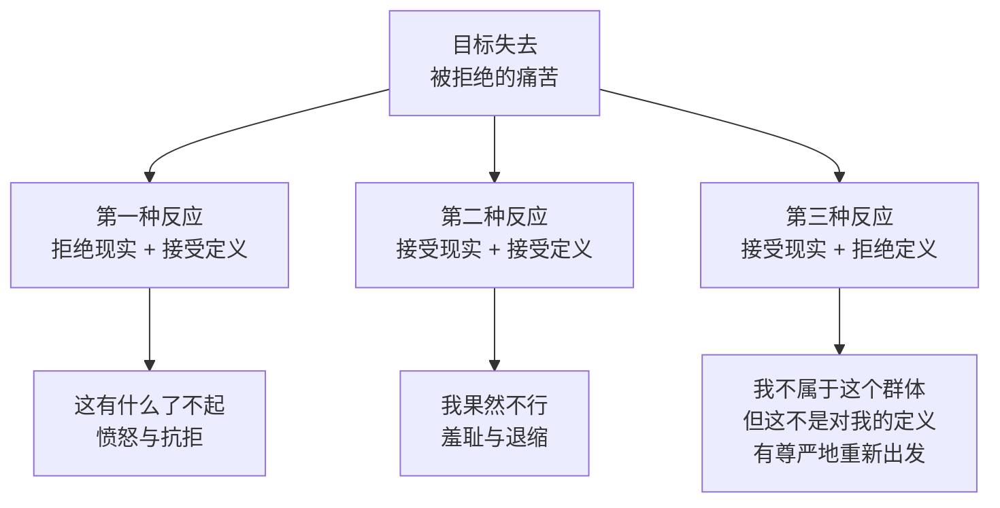
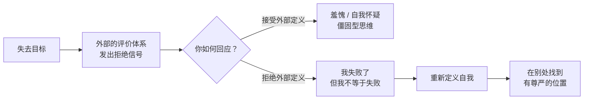

# 第15课：求不得感——如何应对失去目标的痛苦

上一课讲到，接受目标失去的过程，就是突破思维窄化、重新定义自我的过程。可是有时候，失去一个目标背后还有一种更隐秘的痛苦——**求不得的痛苦**。如果你不理解这种痛苦的本质，就很难真正走出失去的阴影。

## 求不得感的本质：被拒绝的羞愧

有一个来访者的故事能帮助我们理解这种痛苦。他高中时成绩优秀，父母和老师都期许他考上名校，他也一直为此努力。然而高考发挥失常，只去了普通高校。从大学第一天起，他就想通过考研去向往的学校，整个大学都在为此准备，最终考研还是差了几分。

这次失败让他陷入抑郁和自我怀疑。后来他几乎是凭着本能找了一份工作，在工作中做得不错，逐渐有了新目标，也开始找到新的自我。

回顾那段时光，他说：

> "当时的我就像在一个狭窄的管道里爬行，前面只有一点点微光，我觉得只有抓住这一点微光，我才有生路。考研失利，眼前那一点点微光就灭了。我以为自己再也不会有希望了。"

有趣的是，当我问他是否还为没考上名校遗憾时，他说："我还是很遗憾的。在需要填简历、填毕业院校的时候，或者别人问我从哪里毕业的时候，我都会有一种习惯性的心虚和羞愧——我觉得自己不如别人。"

他的话揭示了一个关键：**失去目标所带来的痛苦，不仅是投入没有回报，也不仅是失去了定义自己的机会。这种痛苦的本质，其实是一种拒绝。**

无论你的目标是成为名校学生、作家、成功的创业者，还是晋升到某个职位——当你被拒绝时，那种拒绝就像一副冰冷的面孔在告诉你："对不起，你配不上我们这个群体。这是聪明、有钱、有才华的人的俱乐部，你没有资格参加。"而你会为此羞愧，觉得自己错了——错在追求自己配不上的东西。

## 面对求不得感的三种反应

当面对这种被拒绝的痛苦时，人们通常有三种反应：

**第一种：拒绝现实，也拒绝这种定义。** 对曾经向往的群体表现出愤怒和抗拒——"这有什么了不起"，找各种理由证明这个群体并不比自己强多少。这是一种反抗，试图通过否定对方来摆脱被拒绝的痛苦。

**第二种：接受现实，也接受这种定义。** 被羞愧感淹没，觉得失败了就是自己不好。这样的人害怕再去尝试，仿佛再去尝试就会被别人笑话——这正是卡罗尔·德韦克所说的**僵固型思维**。他们接受了自己"不过如此"的评价，从而失去了成长的机会。

**第三种：接受现实，但拒绝这个现实对自我的定义。** 你接受了在现有评价体系下自己不属于这个群体，但你不接受这个事实对你的定义。失败只代表你在这件事上失败了，不代表你这个人不好。就算不属于这个群体，你也会在别的地方重新找到属于自己的位置——**一个有尊严的位置**。

> [!TIP] 核心区分
> 失败 ≠ 失败者。前者描述的是"一件事的结果"，后者定义的是"一个人的本质"。突破求不得感的关键，就是把"我失败了"和"我是失败者"彻底分开。

## 丁老师的故事：重新定义自我的权利

我有一个学员，叫他丁老师。他是一个音乐老师，教了十几年的课，会美声，会弹钢琴，一唱歌整个人都闪闪发亮。他爱教师这份工作，孩子也喜欢他。

唯一的问题是：他没有编制，是一个代课老师。

在学校里，代课老师就像大厂里的外包员工。有一次下课，他看到自己班里的同学和爸爸在看教师布告栏——布告栏里贴着有编制老师的照片和介绍。那个爸爸好奇地问："咦，你们丁老师怎么不在？"他听到以后羞愧地躲进了消防通道。

他尝试过很多次考编制。最开始学历不够，就去补学历；需要心理健康证，就去考了证。最近的一次通过了笔试，可面试还是没过。他的年龄已经大了，那一年是最后一次机会。

他问我怎么办。我叫他"丁老师"，他有些不好意思，让我叫他"小丁"就好。

我说："我一定要叫你丁老师。一个人是谁，应该是由他所做的事情来定义，而不是由他有没有编制来定义。你做的是老师的事，而且做得这么好，我当然应该称你为老师。"

我告诉他，如果只是害怕别人的目光，你应该去参加考试。因为对你来说，你要面对的不只是编制的考试，也是**心理的考试**。心理的考试是：无论外在的评价怎么看你，你仍然有能力去争取自己想要的东西。编制的考试需要成绩来确定，可心理的考试，只要你去参加就通过了。

> [!WARNING] 重要的区别
> 重要的不是你能不能做成，而是你要在别人的目光中**重新找回定义自己的权利**。你也面临着这样的考试——决定是你来定义自己，还是被别人的目光所定义。

有时，失去一个目标反而逼着你用一种新的方式来定义自己。你可以失去工作、失去关系、没有头衔、没有编制，你可以失败、可以被你所看重的群体拒绝——但你仍然可以选择怎么定义你自己。

在追求目标的时候，你需要强化目标的价值、接受目标背后的评价体系，来告诉自己你所追求的东西值得。可是在失去这个目标之后，你需要摆脱它给你的限定，需要重新找到定义自己的方式。很多时候，这是失去固有目标才会有的思考——失去目标，也会摆脱目标带来的束缚感，让你重新认识自己，发现自己原来还有很多丰富的可能性。

> [!QUESTION] 自我检查
> 你曾经或正在为什么目标而努力？如果这个目标最终没有实现，你会如何面对那种"被拒绝的羞愧"？你是否能区分"我失败了"和"我是一个失败者"？

思考方向

求不得感的核心痛苦来自**隐性的社会评价**——你把某个群体（名校、名企、成功人士俱乐部）的标准内化成了自我评判的标准。当你被那个群体拒绝时，你感到的不只是遗憾，而是自我价值的否定。突破的关键在于：**接受现实但不接受定义**。这意味着你能说："是的，我没有考上那所学校/没有进入那个行业/没有达到那个标准——但这不代表我不够好。我只是在这件事上暂时没有成功，而我的价值远不止这一件事。"这不是自我安慰，而是重新夺回定义自己的主权。那个假想的"俱乐部"并不掌握对你价值的最终裁判权——你才掌握。

---

继续学习：[[0016-bei-fang-zhu-gan|第16课：被放逐感——如何面对身份的失去]] | [[reference/glossary|核心术语表]]