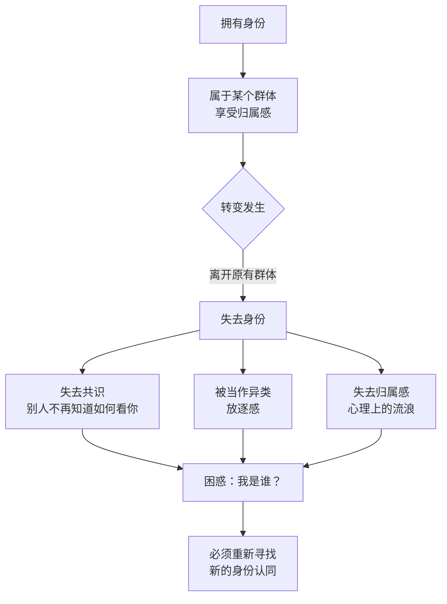
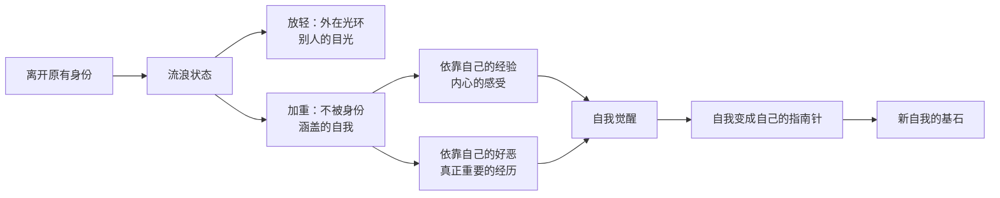

# 第16课：被放逐感——如何面对身份的失去

上一课讲的是"求而不得"——你想获得的身份没有获得。但转变还有另一种情况：你本来就拥有一个让人高看一眼的身份，出于某种原因，你主动放弃了它。这同样会带来巨大的失落，这种失落的本质是**被放逐感**。

## 失去一个身份意味着失去一种"共识"

先讲我自己的一个小事。有次我和家人去青海旅游，包了一辆车。司机闲聊时问我是做什么的，我说自己做心理工作室。他淡淡地说："哦，心理工作室啊，那是很不容易的。"显然他不觉得那有什么了不起。

为了让自己的身份显得"高大"一点，我几乎本能地补了一句："还行，我原来在大学里工作，是大学老师。"

他的眼睛一下子亮了："哦，你是知识分子啊！好厉害！"

我离开那个学校已经很久了，可在那个瞬间，我几乎是本能地用了某个遥远的、过去工作过的机构的招牌——好像那个招牌更优越、更有说服力，好让司机理解我是谁。

身份是自我实实在在的组成部分。它是你与他人达成的**关于你是谁的共识**。当你失去了某种身份，你不仅失去了一个优越的地位，你还失去了这个共识——你不知道别人会怎么看你，你也会困惑自己应该怎么看自己。

> [!WARNING]
> 有身份的时候并不觉得怎样，一旦失去了，才发现原来那个身份是有"光环"的。以前别人高看你一眼，你觉得理所当然——觉得他高看的是"我本人"。失去了以后才发现，别人高看的是你的身份，而你已经失去了它。

## 被放逐的体验：从"自己人"变成"异类"

如果说失去一个目标所引发的痛苦是**被向往的群体拒绝**，那么失去一个身份所引发的痛苦就是**被原来的群体放逐**。

一位从体制内辞职的来访者说：

> "我辞职成了单位里的新鲜事。很多人跟我说客气话——'恭喜啊''祝你有美好的前途''很佩服你的勇气'。可是当他们说这些的时候，我分明从他们的眼神里看出一些让我不舒服的东西。那不是幸灾乐祸，而更像是看一个异类。他们的眼神好像是在说：你不属于这儿了，我跟你是不一样的人。"

这种被当作异类的感觉，就是**放逐感**。

被放逐的恐惧根植于我们的潜意识。人是群居动物，每个人都需要有归属于某个群体的感觉，这就构成了身份意识的一部分。在古代，犯了错误的人会被赶出部落——离开部落的人很难独自生存，所以放逐常常意味着死亡。现代人虽然以自我为单位生存，但对被放逐的恐惧仍然会在特定场合被激发。

一个被裁员的朋友说，裁员给他带来的巨大心理阴影是："原来一个我那么努力投入的公司，是会说不要我就不要我的。"一方面他对公司有愤恨，觉得不该这么无情地对待自己；另一方面他也有深深的自我怀疑——他相信是自己犯了错，或者不够有能力，才会被裁员。这是现代版本的被放逐故事。

## 身份失去后的两种失落

**第一种失落：你无处可去。**

一个朋友曾是房地产公司的副总，工作了十几年，从普通销售做到了副总。他决定离开公司后，看着自己废弃的名片，发现这么多年工作是自己最投入的地方。"现在这个世界好像不需要你了，你无处可去。"

有一次朋友组织了一个高端会议，参会者都是商业精英。很多人给他递名片，问起他的身份时，朋友就用原来的身份介绍他："这是某某公司的副总。"他当时很不自在，事后还生了朋友的气，认为朋友不接纳他的新身份。朋友却说："我主要是怕你麻烦，要不然人家问你为什么离职、现在在干什么，你不是还得解释半天？"

他忽然发现：以前用一张名片就能说明的事，现在需要解释半天，也没有办法说明白了。

**第二种失落：原来的地方开始清理你的痕迹。**

另一位朋友离开公司后，公司完全清除了他的痕迹——他的位置有人替代，他提拔的团队不再跟他联系，去巴结新领导了。公司年会时，他失落地说："以前我是站在这个舞台上发言的人，可是今年换了一个人，也没有人觉得这有什么不对。"

你的功勋会被清除，照片会从网站拿下，项目会有人接手。原来的群体不承认你存在过——但组织已经没有地方安放你的存在了。

## 为什么还要离开：流浪的意义

既然身份的失去让人这么痛苦，为什么还要离开？

一行禅师写的佛陀传记《故道白云》中，佛陀在悟道之前经历了很长一段时间的流浪——失去了王子的身份，失去了王宫，失去了旧有生活的根基。也许你会想：为什么他不能以王子的身份修道呢？那不更好吗？

因为原有的身份给了你归属感和安全感，但也给了你限制。你会用身份赋予的角色来思考和感受，压抑自我中那些跟身份不符合的部分。

有时候你需要先离开原来的身份，才能知道自己是谁。

在流浪的过程中，你会放轻一些东西，又会加重一些东西。放轻的是外在的光环、别人的目光；加重的是原来那个**不被身份所涵盖的自我**。身份给你的指引消失了，现在你只剩下你自己。你只能根据自己的经验、内心的感受、自己的好恶来判断——那些真正属于你的东西。为了不在荒野迷路，你的自我必须觉醒，你必须依赖自己、信任自己、让自己变成自己的指南针。这些自我中慢慢苏醒的部分，就变成了新自我的重要基石。

> [!TIP] 关键理解
> 身份的失去不是"失去"，而是"腾空"。就像王子身份限制了佛陀的可能，原有身份也限制了你——它让你只看到角色允许你看到的自己。失去身份的痛苦，恰恰是新自我开始释放的信号。

> [!QUESTION] 自我检查
> 你是否经历过或正在经历某种身份的失去？你曾经属于什么样的群体？离开那个群体后，你感受到的是解脱还是失落？你如何面对那种"无处可去"的感觉？

思考方向

身份的失去之所以痛苦，是因为身份不仅是"标签"，更是你与世界之间的"契约"——它规定了别人如何看待你，也规定了你看待自己的方式。当这个契约被撕毁，你陷入了一种"社会性的悬空状态"：你不再被旧群体理解，也还未被新群体接纳。这种悬空状态恰恰是转变的核心时刻——你不再被任何现成的定义框住，只能依靠内心真实的感受和判断来重新定义自己。就像佛陀的流浪，不是无目的的漂泊，而是放下旧身份后，让真正的自己浮现出来。

---

继续学习：[[0017-bei-pao-qi-gan|第17课：被抛弃感——如何面对关系的失去]] | [[reference/glossary|核心术语表]]