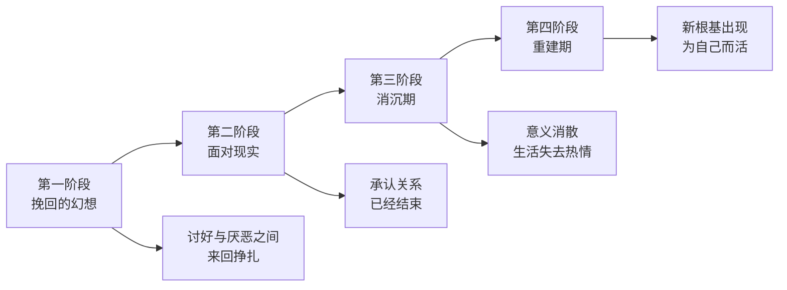
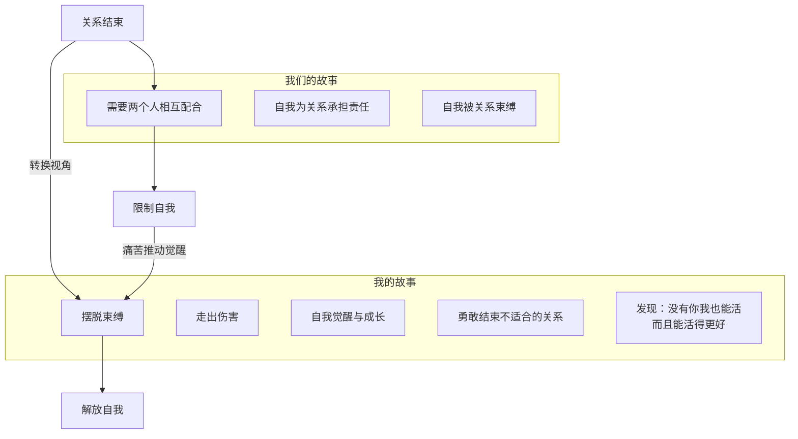

# 第17课：被抛弃感——如何面对关系的失去

前几课讲的目标失去是被向往群体拒绝的痛苦，身份失去是被原有群体放逐的痛苦。而今天要讲的第三种失去——**关系的失去**——更像是被抛弃的痛苦。抛弃我们的，是我们曾经最亲近、最信任的人。

越是亲近的关系，那个关系里的自我就越重要，失去它的过程就越痛苦。可是如果一段关系已经不可挽回，接受它的失去反而是最好的选择。

## 关系失去的四个阶段

一位学员经历了婚姻变故。在婚姻里，他一直是"小鸟依人"的人——做饭、打车、修电脑，什么都不会，都需要先生照顾。直到发现先生出轨，而且出轨了很久。他原以为牢不可破的关系，忽然发现是一个幻觉。

一段关系出现裂痕，并不意味着会马上舍弃。这其中的心理历程，至少经历四个阶段。

### 第一阶段：挽回的幻想

即使造成了伤害，爱不会马上消失。为了挽回关系，他开始讨好——把家收拾得干干净净，端上水果，问他想吃什么。得到热情一点的回应就开心，觉得家还会回来；得到冷谈的回应就怪自己为什么没有骨气。

在挽回幻想阶段，人在**讨好和厌恶、思念和痛恨之间来回挣扎**。前者是对关系修复的幻想，后者是对伤害的本能反应。

更隐蔽的是，他开始不停地反省："如果我不是那么依赖他，结果会不会不一样？"这种归因变成了一种"我也有错"的自我怀疑，同时也满足了"如果我改，也许婚姻还能挽回"的幻想。

> [!WARNING]
> 幻想提供关系存续的希望，但幻想一次次落空，就会变成折磨人的伤害。挽回幻想最大的陷阱是：它让你以为你还有选择，而实际上，结束一段关系只需要一个人决定就够了。

### 第二阶段：面对现实

他问我该怎么选择。我说，也许你应该认真地问一下你的先生：他还会不会回来？

"一段关系如果要开始，需要两个人一起决定；可是如果要结束，只要一个人决定就够了。如果他决定不回来了，那你再怎么挽回也没有用。你不是在留下和分开之间做选择——你一直是选择留下的。你只是在面对现实和不面对现实之间做选择。"

他选择了面对现实。他去问先生，得到了冰冷的回应："有些事过去了，就让它过去吧。我不会回来了。我们之间已经不可能了。"

面对现实也是痛苦的，但至少你有了一个机会——接受关系的结束，腾出空间，为新的自我做准备。

### 第三阶段：消沉期

彻底分开以后，他不再学习，不再看书，不想做饭，不想上班。他觉得人生已经没有了意义，只能每天刷小视频打发时间，逃避无尽的孤独。

其实不是人生没有了意义，而是那些原来附着在这段关系上的意义，已经随着关系消散了。随之消散的还有生活的热情。他就这样浑浑噩噩过了三个多月。

### 第四阶段：重建期

三个月后，他接到一个工作坊的邀请去当助教——这是三个月前就敲定的事。他没有力气去做，但不好推脱，还是去了。

在工作坊看到其他同伴时，他好像忽然清醒了。他发现原来那个学习平台，他最初只是为了挽回关系才加入的，现在却变成了托住他的新的根基。他又开始学习，开始把学到的东西当作副业。这一次不再是为了关系，而是为了他自己。

他学会了修电脑、处理汽车事故、换灯泡——那些原来以为做不了、需要先生做的事，他都学会了。他开始享受那个独立的自己。

## 从"我们的故事"到"我的故事"

失去一段重要的关系，就是**把一个曾经重要的人，变得不重要**的过程。而这个过程，就是我们重新找回自己的过程。

关系的结束常常带来自我怀疑——好像我们经营一段关系失败了，我们被抛弃了。但从另一个角度看，分离并不是失败，而是为了好好做自己。

一段关系结束了，你需要从**"我们的故事"切换到"我的故事"**。

"我们的故事"需要两个人相互配合，有时不仅不支持自我的要求，反而要求自我为经营关系承担更多责任。

"我的故事"是摆脱束缚、反抗压迫、走出伤害的故事——是自我觉醒、成长和转变的故事，是勇敢结束一段并不适合自己的关系的故事，是"原以为我没有你活不了，结果发现没有你我也还能活，而且还能活得更好"的故事。

> [!TIP] 关键转变
> 关系失去的痛苦不在于失去一个人，而在于失去那个"在关系中定义的自己"。重建期的任务不是"忘记他"，而是重新发现"没有他，我是谁"。当你不再用"XX的伴侣"来定义自己，而找到"我自己"的时候，才是真正完成了转变。

> [!QUESTION] 自我检查
> 你是否经历过或正在经历一段重要关系的失去？你处在四个阶段中的哪一个？你有没有发现自己的故事正在从"我们的故事"向"我的故事"转变？

思考方向

关系失去的四个阶段不是线性的——你可能会在幻想和现实之间来回反复多次。重要的是识别出：**挽回幻想并不是真正的选择，而是一种逃避**。真正接受关系结束的标志是：你不再期待对方改变，不再觉得"如果当时我做得不同"就能挽回。当你不再用对方的眼睛看自己，而是用自己的眼睛看自己时——你就在为自己重建一个新的身份。那个"没有你我也能活"的发现，是转变中最有力量的一刻。

---

继续学习：[[0018-you-shi-qu-cai-you-xin-zi-wo|第18课：有失去才有新的自我]] | [[reference/glossary|核心术语表]]