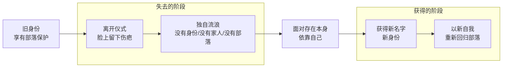
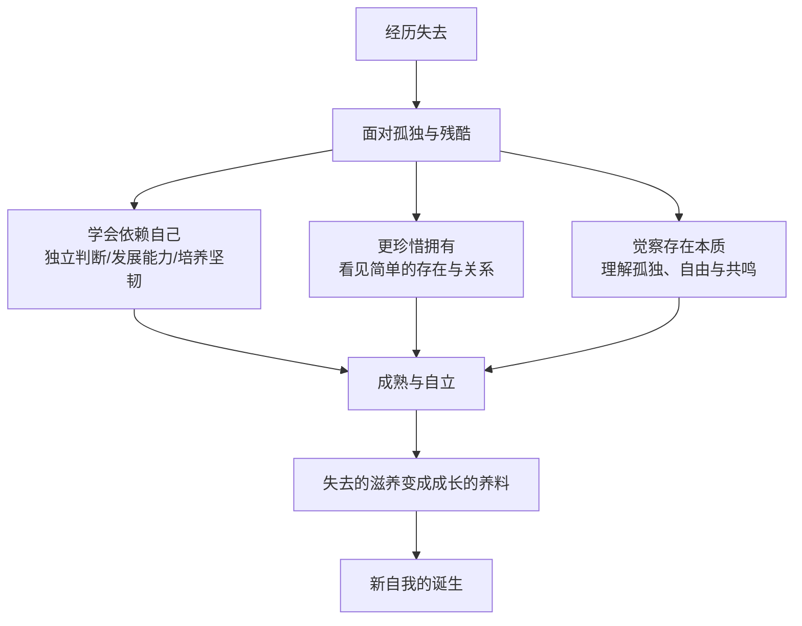

# 第18课：有失去才有新的自我

前几节课讲了三种重要的失去——目标、身份、关系的失去。今天来谈谈怎么面对**失去本身**。

心理学家朱迪斯·维奥斯特在《必要的丧失》中写道："人的成长之路由放弃铺就而成，终其一生我们都通过放弃成长着。我们对生命核心的理解，就是我们对丧失的理解。我们成了什么样的人，以及我们过着哪种生活，都是由我们失去的经历决定的。"

自我转变的过程，正是一个不断失去的过程。

## 面对失去：没有"方法"，只有"接纳"

面对失去有什么办法吗？其实没有什么特别的办法。对于真正重要的东西，寻找一个万能的方法——那太轻巧了。承认没有办法，就是承认失去的东西的重量。

如果你的失去重到需要你痛哭一场，那也许痛哭就是最好的办法。如果你的失去让你一直抱有遗憾，那也许遗憾就是最好的办法。如果你的失去让你黯然神伤，那也许黯然神伤的失落就是最好的办法。

> [!WARNING]
> 有时候我们需要这些和失去对应的痛苦，来确认失去对我们重要。这些痛苦会好吗？人的心灵有自我痊愈的能力。但它大概率会在你身上留下印记——就像一个战士会留下伤疤。这些伤疤并不意味着我们不完整了，恰恰相反，它是我们走向完整的标志。人不是瓷器——完美无瑕、一遇打击就碎成碎片。人是老树——经历风雨后能把失去的滋养变成成长的养料。

## 好的失去 vs 坏的失去

在讲关系失去的时候，曾经说过：**好的分手，是这段关系活在你心里**——关系里美好的部分变成回忆，不好的部分变成经验。**不好的分手，是你还活在这段关系里**——美好的部分变成不肯放手的执念，不好的部分变成不敢重新开始的创伤。

这段话适用于所有的失去。好的失去会让我们学到重要的东西，变成新自我成长的基础；坏的失去会让你以为所有的投入和期待都是错误，因为害怕痛苦，不敢再去投入。

## 原始仪式的启示：离开是为了回归

威廉·布里奇斯在《转变》一书中介绍了原始部落的转变仪式：

夜晚，村民们聚在篝火旁，围着一个即将成年的青年唱歌跳舞。长老为青年唱部落的圣歌，用镰刀在青年脸上留下两道伤疤——象征着生活的残酷。然后青年离开部落去森林里流浪。没有身份、没有家人、没有部落，有的只是他自己，独自面对存在本身。

两个月后，他以新的身份回到村庄。脸上的刀疤变成了成人的标记。他的父母将他从小睡过的席子烧掉。最初一段时间，他不会去认自己的父母，少年的时光变成了遥远的记忆。接着父母给他取一个新名字，长老带他完成转变，直到他习惯自己完全变成了一个新的生命。

这个仪式讲述的就是转变的历程。少年失去了家人和部落的保护，必须以独立自我的身份去面对生活的残酷，直到这个自我足够坚定，才能重新回到部落。

## 从失去中得到的三样东西

失去不仅是失去，也伴随着得到。当我们远离人群独自流浪，究竟得到了什么？

### 1. 学会更依赖你自己

依赖自己，是失去给你带来的最重要的转变。这种转变常常会积聚和释放巨大的能量。

那个想要的群体没有接纳你，你没有令人注目的头衔或身份，没有保护你的关系——现在你只能依靠你自己。如果你也靠不住，那就真的没有人可以依靠了。

为了把自己培养成可靠的人，你需要独立做出判断和选择，发展自己的能力，为自己创造机会，发展面对挫折的坚韧。你能依靠的只有你自己。这个简单的事实——意识到这一点——常常是一个人成熟的开始。

### 2. 让你更珍惜现有的拥有

我有一个朋友，曾在大公司创建了自己的业务，后来因为人事斗争放弃了业务，组建小团队重新创业。从资源丰富的大公司到一切都从零开始，以前是别人求着合作，现在是你求着别人合作。

过了一段时间，他说："我很庆幸我还拥有这么多。现在业务更自由了，以前做什么事都需要看老板的脸色，现在我能自己决定。还有我的妻子，经历这么多挫折但一直在身边支持我。想到这些，我就感谢自己做的那个决定。"

这种"看见"某种程度上是适应失去的结果——是为了不被失落淹没所做的努力。那些最简单的存在、最真诚的关系，真真切切成了新自我的一部分。

### 3. 觉察人存在的本质

一位读者在给我的信中说：

> "我以前受的教育都是预示要乐观、要坚强、要勇往直前。而在经历了一系列变故以后，却发现这一套行不通。在经历失去的迷茫期，我的生命里确实长出了全新的东西——我能够静下心来，看以前看不下去的文学作品。我在自我怀疑、自我否定、远离人群的时候，看到有人把这种痛苦、挣扎和可能的救赎诉诸文字，就觉得自己的孤单有了共鸣。"

有时候人需要经历失去，才会理解存在的本质——理解那种更接近生命本身的孤独和自由。因为这种理解，我们会变得更加宽容。

电影《心灵奇旅》中，Joe终于跟著名的爵士乐手完成了一场完美的演出。演出结束后，乐手问他感觉怎么样。他愣了一下说："我以为会有很大的不同，可是好像也没有什么不同。"

乐手给他讲了一个故事：从前有一条小鱼游到老鱼旁边问："我想要去大海，怎么才能找到大海呢？"老鱼说："你现在就在大海里啊。"小鱼不信："这儿吗？这儿只是水啊。"

发现自己在大海中——这也是我们从失去中得到的。失去会制造一种匮乏，那是目标带来的思维窄化造成的。有时候我们需要失去自己执着的东西，才会发现自己拥有生命本身的富足。这种富足就在一呼一吸之间，就在习以为常的生活中，就在最简单的美食和最朴素的人和人之间的关系里。

> [!TIP] 核心领悟
> 无论我们失去什么，至少我们还有自己。正因为这个发现，我们才开始好好审视和珍惜自己。失去会开阔我们的心胸，增长我们的智慧。有失去，才有新的自我。

> [!QUESTION] 自我检查
> 你人生中印象最深的一次失去是什么？现在看来，它给你带来了什么？你是否能从这个失去中，看到自己成长了什么？

思考方向

失去这件事本身没有"解决方法"——这是一个需要诚实面对的心理现实。但失去中蕴含着成长的种子：1）它逼你依赖自己，这是成熟的起点；2）它让你看见一直存在却被忽视的拥有（健康、简单的关系、日常的美好）；3）它让你接触到生命更本质的层面——孤独和自由是一体两面的存在体验。回顾你经历过的最大失去，试着问自己：如果没有那次失去，我会是今天的我吗？那个失去中，有没有一些东西在失去之后才被你看见？

---

继续学习：[[0019-guan-xi-tuo-li|第19课：关系的脱离——四阶段模型]] | [[reference/glossary|核心术语表]]