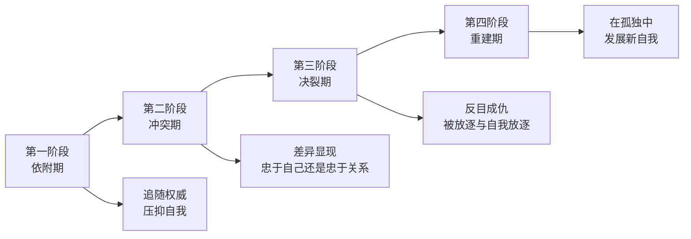
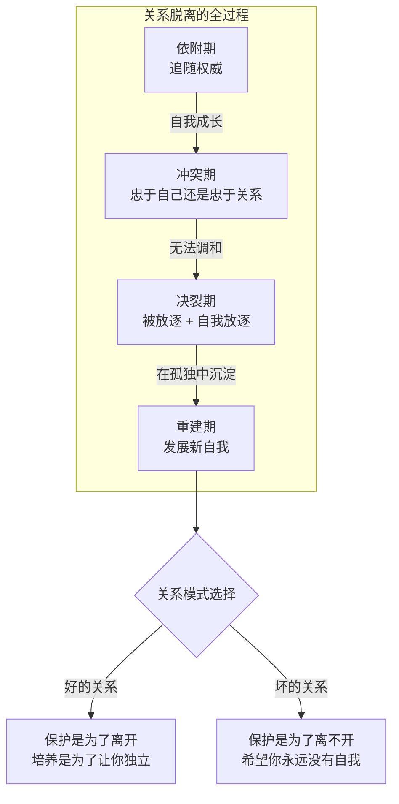

# 第19课：关系的脱离——四阶段模型

前面几节课讲了"如何面对失去"，但这还不是告别的全部。一段关系失去了，故事还没有结束——你还要面对它的后半段：**关系的脱离**。

关系的脱离，既是我们离开一段关系的过程，也是弱小的自我逐渐长大、去寻找新自我的过程。

## 核心议题：忠诚于关系，还是忠诚于自己？

你是否经历过这样的关系？当你还很弱小时，有一个人给了你欣赏、保护和认可。你享受关系提供的归属感。可是随着你的成长，保护变成了控制，认可变成了贬低，感情变成了利益的计算。你鼓起勇气脱离了这段关系，却发现自己仍然受其影响——对方的贬低变成了自我怀疑，曾经的忠诚变成了伤害，伤害又变成了放不下的怨恨。

这种关系的脱离背后有一个核心的议题：当一段关系已经不适合你的自我发展，而你又没有办法改变它——你究竟应该选择**忠诚于关系**，还是**忠诚于你自己**？

> [!WARNING]
> 脱离一段关系是为了重新做自己。可是有时候你会发现，离开这段关系只是其中一小步——你离开了关系，它带给你的影响却一直还在。

## 四阶段模型：弗洛伊德与荣格的故事

心理学历史上最著名的关系脱离案例，莫过于弗洛伊德与荣格。

弗洛伊德是精神分析的创始人。荣格关于内外向、中年危机、集体潜意识的理论至今影响我们的文化（大家熟悉的MBTI就是以荣格理论为基础编制的）。荣格最初是弗洛伊德最欣赏的追随者，弗洛伊德甚至称荣格为"我的长子"，准备让他接手精神分析学会主席的职位。

然而最终两人分道扬镳、反目成仇。正是脱离弗洛伊德之后，荣格才创立了属于自己的理论，成为心理学的另一位大家。

这个过程分为四个阶段：

### 第一阶段：依附期

在这个阶段，后辈依赖强有力的另一方，接受他的保护。保护带来归属感，但代价是必须压抑自己的想法和感受，用对方的眼光来看世界和自己。

弗洛伊德很欣赏年轻的荣格，把他引荐到精神分析学会的核心圈子。荣格也以此为荣，尽力维护弗洛伊德的权威。荣格在自传中写道：

> "当我们的观念有冲突时，我尽可能遏制自己的判断——这是我们能够合作的前提。我告诉自己：弗洛伊德远比你有经验，你现在就听他的。"

从属于我们依附的对象，模仿他、适应他——这在最开始不是问题，甚至是最有效的学习方式。但这样做是在压抑自我中不被这段关系所接纳的部分。随着自我的成长，压抑的部分开始想要独立的表达。

### 第二阶段：冲突期

随着荣格的成长，他和弗洛伊德的差异越来越明显。弗洛伊德是"泛性论"——他认为所有压抑的潜意识都跟性有关；荣格则认为潜意识根植于人类的集体文化。

对弗洛伊德来说，这种差异代表着背叛。对荣格来说，在忠于自己的思考和忠于弗洛伊德之间，他选择了忠于自己的思考。他不再甘心只当一个追随者。

两个人开始努力维持关系，把差异包装成学术争论。但其实每一封关于学术争论的书信背后，都是对背叛的控诉和对控制的反抗。

### 第三阶段：决裂期

在一次激烈争论之后，关系彻底决裂。弗洛伊德把荣格逐出精神分析学会，要求自己的弟子不能再与荣格往来——这是对背叛的惩罚。

对荣格而言，这是他经历的**人生至暗时刻**。他陷入了严重的抑郁，夹杂着愤怒和自我怀疑。他失去了他的团体，失去了那个曾经敬仰的人对他的保护和欣赏。他付出的所有代价都是为了成为自己——可是现在他反而不知道自己是谁了。

荣格去苏黎世周围的乡下隐居，给自己建了一座石头房子，在与世隔绝中重新寻找自己。

关系的决裂会不自觉地把两个曾经亲密的人推到竞争者的位置——"我要比你过得好"变成了人生的目标。可如果这样，你不仅无法从关系中脱离，反而以竞争的方式继续留在这段关系里。

### 第四阶段：重建期

意识到"成为自己不是为了比弗洛伊德更好"——是荣格走出决裂的关键。

在与世隔绝中，荣格开始发展自己的思考、整理自己的理论。那些和弗洛伊德不同的部分，找到并实现新的自我——既是与弗洛伊德决裂的目的，也是适应这种决裂的办法。当这些理论从他的思考中长出来以后，一个新的自我逐渐诞生了。

慢慢地，荣格有了自己的追随者，成立了自己的学术机构，成为了能与弗洛伊德平起平坐的大师。

## 好的关系 vs 坏的关系

关系的脱离是自我成长的必然。当自我逐渐成熟，就会想要摆脱依附关系，渴望更平等的关系。只有这样，才能用自己的眼光去定义自己是谁。

如果你理解这种脱离是自我成长的必然，你就会接受：脱离不意味着你没有处理好这段关系，只是意味着你的自我已经长大，不适合再以弱者的依附者角色留在这段关系里。

- **好的关系**：保护是为了离开。所有的培养都是为你有一天能够成熟、做自己做准备。
- **坏的关系**：保护是为了离不开。希望你永远没有自我，永远追随我。

坏的关系中，保护会变成控制，控制会引来反抗。关系要么变成相互怨恨又离不开的纠缠，要么以撕裂的方式离开——一方觉得自己被放逐了，痛恨自己的忠诚换来这样的结果；另一方觉得自己被背叛了，以前的保护和好心都被辜负了。

> [!TIP] 关键领悟
> 就算心理学大师，在关系的脱离中也需要经历同样的自我怀疑和被放逐的痛苦。这种脱离也许就是我们在成长路上所需要付出的代价。只有经历这样的脱离，人才能成熟，才能找回自己的自信——这种自信不再需要依附于任何人的肯定和认可。

> [!QUESTION] 自我检查
> 你是否经历过或正在经历类似的关系脱离？你现在处于哪个阶段？这段关系是"保护为了离开"还是"保护为了离不开"？

思考方向

关系的脱离四阶段模型的核心洞见是：**脱离不是一次性的决定，而是一个过程**。从依附到冲突到决裂到重建，每个阶段都有它存在的意义。即使在决裂后陷入抑郁和自我怀疑，那也不是"失败"，而是重建的前奏。要判断一段关系是"好"还是"坏"，可以问自己：对方是否允许你拥有自己的想法，即使那些想法和对方不同？当你表现出独立时，对方是鼓励你成长，还是用各种方式让你愧疚、退缩？好的关系为你独立的离开而骄傲；坏的关系把你的离开视为背叛。

---

继续学习：[[0020-tuo-li-bo-zhe|第20课：反复——关系的脱离会经历哪些波折]] | [[reference/glossary|核心术语表]]