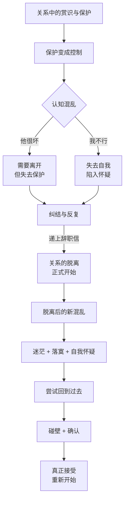
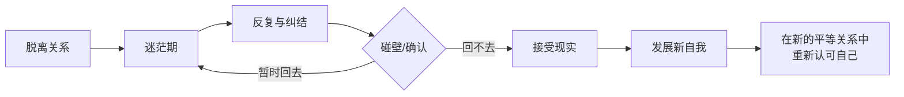

# 第20课：反复——关系的脱离会经历哪些波折

上节课讲了关系的脱离——本质上是因为现有的关系已不适合自我成长，所以需要离开去发展自我。但是当关系脱离发生时，**新的自我并没有马上形成**。你还会留恋过去的保护，关系里的爱恨情仇还会牵动你的神经。有时候你甚至会尝试回到过去——这就是关系脱离中的**反复**。

为什么已经离开了，还想回去？

因为人永远需要归属感。你离开了那个重要的人，可他对你的影响还在——你还会用他的眼光看自己，有时候你还会想念这种归属感。当你受伤时，你会不自觉地以为他还是那个能治愈你的人。所以关系的脱离常常不是一蹴而就的，而是一步三回头。

## 一个职场PUA的脱离故事

一位女士来找我时说的第一句话是："老师你说我是不是遭遇了职场PUA？"

她的前老板是公司里的明星——年轻有为、风度翩翩，她也很崇拜他。当发现老板赏识自己时，她有一种额外的荣耀——"我一定很不错，所以这么好的老板才会赏识我"。老板给了她很多帮助，委派重要工作，当众称赞她，在升职中力排众议支持她。

但是慢慢地，保护有了微妙的期待。有一次加班很晚，老板邀请她一起去散步，她本能地拒绝了。从那以后，关系变得微妙——保护变成了打压和控制。老板开始挑她的刺，当众批评她，否定她的能力。

她陷入了巨大的混乱：究竟是**我不行**，还是**他很坏**？

- 如果相信他很坏，就会失去他的保护——这个答案预示着离开，可你明明对他有依赖。
- 如果相信我不行，就会失去自己——陷入自我怀疑，可你又明明觉得自己没有那么差。

她不停地犹豫，无数次想辞职却又不敢离开。

## 脱离后的三个波折

### 波折一：摘除"虚幻的荣耀"

她终于递交了辞职信。老板的反应很激烈——冲她怒吼，又愤怒又伤心。这让她有些小得意——她通过这个反应确认了自己对老板很重要。

但老板很快恢复了普通同事的客气，甚至还组了一个散伙饭，就像什么事也没发生过一样。

她离开后，忽然发现自己来到了一个荒芜的地方。反抗的对象消失了，连旦消失的是曾经青睐和保护带来的**虚幻的荣耀**——那种曾经让她觉得自己很特别的感觉。前老板还是公司的明星，而她呢？要为自己的前途奔波，重新找工作。

她觉得自己在演一幕独角戏。原本是一个维护尊严、反抗强权的女性，现在变成了一个失去重视的落寞者。

### 波折二：自我怀疑与回头

离开之后，她反而陷入到这段关系中。她开始仔细检验经历的每一个细节，想要弄清楚自己是否真的曾经重要过。幻想和现实融合在一起——她开始怀疑自己的选择，怀疑自己是不是太矫情，是不是错过了好的职业机会。她还想回去找老板谈谈。

这是关系脱离中经常发生的事。脱离的最初带着巨大的迷茫、恐慌和留恋。它会变成自我怀疑，而这种自我怀疑又会让你编织各种理由，想要把你拉回到过去。

> [!WARNING]
> 关系脱离中的反复不是软弱的表现——它是你确认"真的回不去了"的必经过程。有时候你需要碰一次壁，才能彻底断了念想。

### 波折三：失去"英雄故事"

她真的鼓起勇气约了前老板。两人在路边咖啡厅坐下，前老板冷冷地说："我这里不需要你这样的人了。以前是我看错你了。事实证明你离开了，对部门的工作还更好。"

她痛苦极了。这种痛苦不仅来自被拒绝和否定，更在于——她失去了一个故事。

在没去找老板之前，就算再痛苦，她也可以告诉自己：这是一个英勇反抗前老板、摆脱不合适的关系、寻找自我的故事。她所承受的痛苦，是英勇反抗的代价。

可当她去找前老板又被拒绝后，这个故事变成了：一个软弱的人做了冲动的决定，后悔了又被拒绝，却再也回不去的故事。

我告诉她："在你决定离开时，这个英勇反抗的故事就已经开始了，现在它一直都是。也许你去找前老板，只是不想再后悔和纠结，通过让自己碰壁来断了自己的念想。"

## 如何理解反复：正常，而且是必经之路

关系的脱离本身就是这样一个反复的过程——一步三回头。如果你也处在关系脱离的阶段，也遇到这种反复和纠结，要知道**这是关系脱离里正常的反应**。

关系的脱离本质上，是把一个重要的人**变得不那么重要**的过程。你把它变得不重要的过程，就是你失去它的过程。这意味着你会失去原有的保护和温情。可是如果你选择继续成长，这种失去是注定的。

从这个角度：**失去它的过程，也是你重新找回自我的过程。**

故事的结尾：她去了另一家创业公司，新老板把她当做更平等的合作者。她做得不错，而且她不再只是一个受保护的人——她所有的价值不再需要一个上级或权威的认可。现在她可以认可她自己。她获得了一种**踏实的自信**。

> [!TIP] 关键领悟
> 脱离控制型关系最难的不是离开，而是离开之后——你发现自己在一个"荒芜的地方"，曾经的荣耀消失了，需要重新建立对自己的认可。真正的自由不是"摆脱了控制者"，而是"不再需要他的认可来确认自己的价值"。

> [!QUESTION] 自我检查
> 你是否经历过关系的反复——明明决定离开，却又忍不住回头？那段反复的时期里，你经历的是什么样的内心挣扎？你现在如何看待那段"一步三回头"的经历？

思考方向

关系脱离中的反复有三个层次：1）**脱离时**——不舍得离开，害怕失去保护，反复纠结；2）**脱离后**——陷入自我怀疑，质疑自己的决定，幻想回到过去；3）**回头碰壁后**——失去"英雄故事"，觉得自己从一个勇敢的人变成了一个软弱的人。反复不是失败——它是脱离过程中必要的"现实检验"。每一次反复都在帮你确认一件事："真的回不去了。"只有确认了这个事实，你才能真正向前走。你从这段关系中最终需要带走的，不是愤怒或遗憾，而是一种新的自信——这种自信不再依赖于任何人的认可。

---

继续学习：[[0021-li-jia|第21课：离家——如何真正脱离原生家庭]] | [[reference/glossary|核心术语表]]