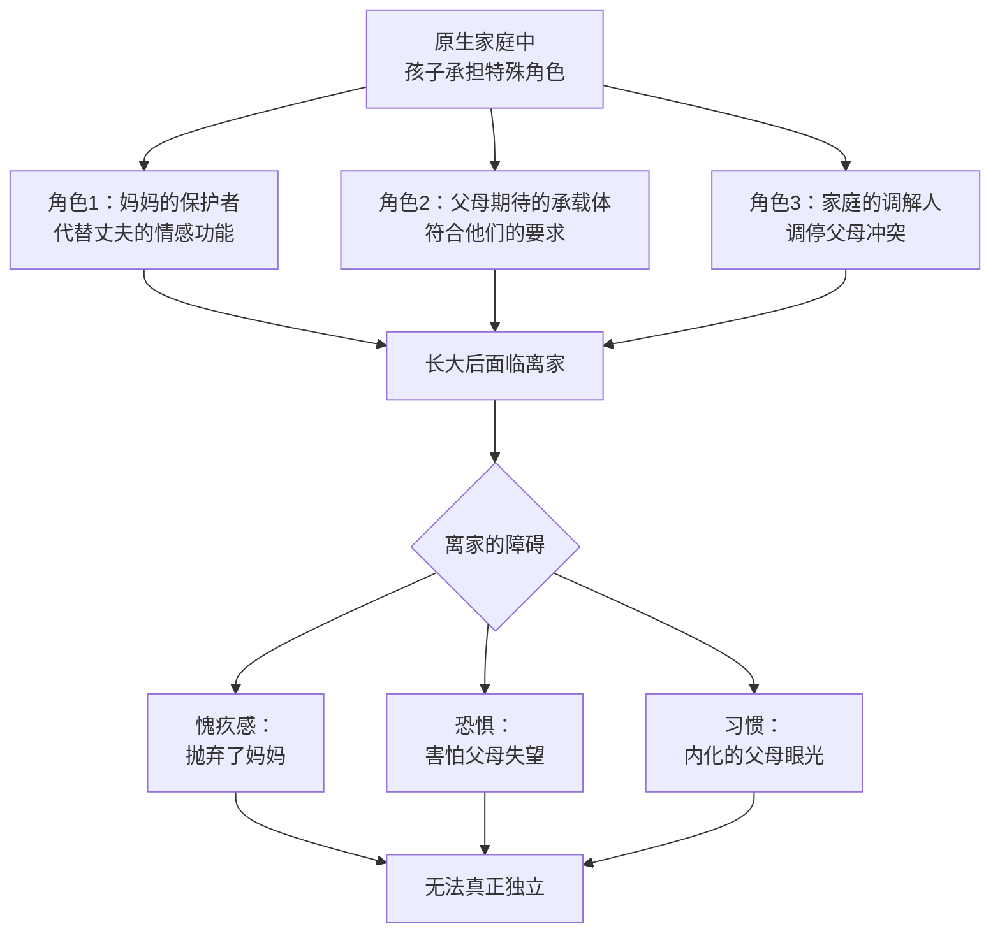
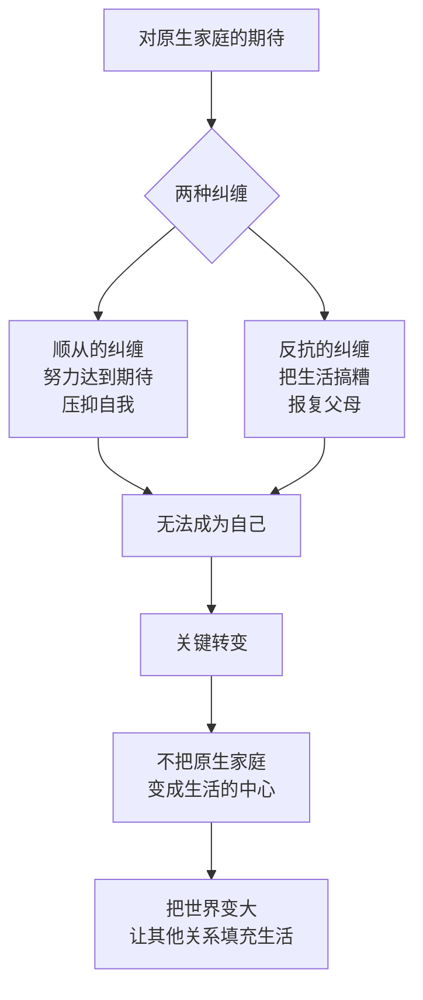
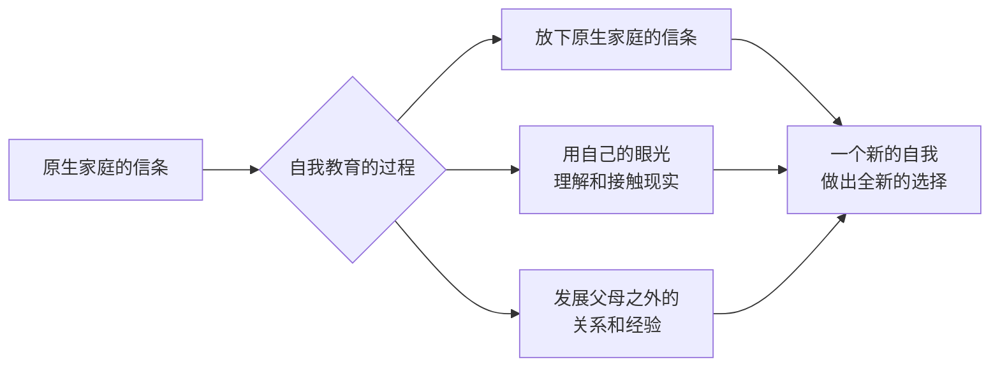

# 第21课：离家——如何真正脱离原生家庭

越深的感情，我们对保护者的依赖越重，关系的脱离就越难。在所有关系中，感情最深最重的，无疑是我们跟原生家庭的关系。

心理学里的**家庭生命周期理论**指出，每个家庭都要经历不同的发展阶段。子女长大离家、独立成长，是家庭发展必然要经历的阶段。可是如果父母和孩子有特别紧密的关系，或者原生家庭需要孩子扮演重要的角色才能维持，那这个孩子从原生家庭中脱离就会变得困难。

## 案例一：当孩子变成妈妈的"保护者"

有一个学员大学毕业好几年了，却还跟父母住在一起。说起原生家庭，她说：

> "小时候我父母经常吵架。妈妈经常跟我诉苦，我从小就知道妈妈的委屈。我很想保护妈妈，总是想方设法让她开心——也不完全是为了她，只有她开心了，我才能得到安宁。我总想长大以后要买大房子，带妈妈离开。"

这是很多婚姻不和的家庭常发生的事——孩子代替丈夫，变成了妈妈的保护者。当这样的角色逐渐巩固，孩子长大离家就会变成家庭的危机。每一个人都会下意识地抗拒这种变化。

长大以后，她慢慢发现父母的问题不只是"爸爸对妈妈不好"那么简单。当她不再完全站在妈妈这边时，妈妈就很生气，觉得她变了，不再听话了。

后来她找到了男朋友，父母不赞成。妈妈说："如果你一定要跟他在一起，你就从家里搬出去，我就当没你这个女儿。"她只好分手了。

表面上看，争论的是这个男朋友好不好。其实争论的是：对女儿找男朋友这件事，父母有没有做主的权利——背后隐藏着父母对孩子离家的焦虑。

她最终还是搬出去了。父母很生气，甚至不愿意跟她联系。孤独的时候，她一边怨父母为什么不谅解自己，一边又想自己是不是服个软道个歉就算了。但她扛过来了。

后来他们又联系了，虽然关系变得疏远——但这种疏远让她忐忑，也让她欣喜。好像有一些新鲜的空气进来了。**空间的距离变成了关系的距离，关系的距离又为情感松绑创造了空间。**

> [!WARNING]
> 对父母的歉疚是一定会有的——这是孩子脱离原生家庭要付出的代价。但如果不去改变这个角色，难道要一辈子做一个长不大、不能离家的孩子吗？

## 案例二：反抗也是另一种形式的纠缠

另一个学员从小就陷入跟妈妈的纠缠。妈妈经常骂她，觉得所有事都是她做得不好——这种辱骂和贬低不代表关系疏远，反而代表关系亲近。因为在过于亲近的关系里，父母理所当然地把孩子当成了自己的一部分。

她最开始努力去够父母的期待，发现怎么也做不到，就开始反抗。她反抗妈妈为什么不能接纳自己。长大以后结了婚又离了婚，她说："我离婚就是为了报复我妈妈。"她通过把自己的生活搞糟来控诉妈妈。

我提醒她：**不要把妈妈变成你生活的中心。** 跟原生家庭的脱离，就是不把原生家庭变成我们生活中心的过程。

难就难在，我们对原生家庭投入了太多感情，很难不把它变成中心。我们对家怀有期待——期待背后是弱小的自己对保护和归属感的渴望。当这种渴望得不到满足时，我们不会轻易放下期待，反而会把它变成满腔的怨恨。

关于这个期待，有一好一坏两个消息：

**坏消息：** 你通常得不到想要的回应。不是他们不给，而是他们没有能力给。如果他们承认孩子受伤了，就要承认自己是伤害孩子的父母——这种内疚会把他们压垮。

**好消息：** 你其实已经长大了——你已经长大到不需要这种保护也能疗愈自己，只是你自己没有发现。而疗愈自己最好的方式，就是**把自己的世界变大**，让其他的关系来填充你的生活，让其他的信息逐渐充实你的头脑。

## 塔拉的故事：教育如何完成脱离

《你当像鸟飞往你的山》讲述的正是主人公塔拉脱离原生家庭的故事。她的父亲反对任何现代文明的东西，哥哥又有严重的暴力倾向。她凭着自学考上了大学，又到剑桥大学读博士。

可就算这样，当她发现自己要脱离原生家庭时，仍然产生了严重的心理危机。她找了学校的心理咨询师，经历了整整一年的疗愈，自己的头脑才开始慢慢接受新的东西。

在讲述这段脱离时，她说：

> "那一刻我做的决定不再是他（父亲）会做的决定。它们是由一个改头换面的人、一个全新的自我做出的选择。你可以用很多说法来称呼这个自我：转变、蜕变、虚伪、背叛——而我称之为教育。"

你也可以把从原生家庭的脱离看作是**自我教育**的过程。在这个过程里，你放下了从原生家庭带来的信条，用自己的眼光去理解和接触现实，去拥有父母以外的关系。虽然父母是不可取代的，但你终将会长大——长大到开始拥有自己的人生。

> [!TIP] 核心领悟
> 从原生家庭脱离，就是把父母"变得不重要"的过程——不是不爱他们了，而是不再让他们成为你生活的中心。当你不再用他们的眼光看自己，不再为他们的情绪负责，不再把他们的是非当作你的是非——你才真正地"离家"了。而让人意外的是，当你真正独立后，你反而能和父母建立一种更健康的关系——不再是依附，而是两个独立成年人之间的平等连接。

> [!QUESTION] 自我检查
> 你完成从原生家庭的脱离了吗？在你的原生家庭中，你扮演了什么角色（保护者、顺从者、反抗者、调解者）？你是否仍在使用父母的眼光来评判自己的生活选择？

思考方向

从原生家庭脱离的核心障碍是**内化的父母眼光**——即使父母不在身边，你仍然用他们的标准来评判自己。脱离不是断绝关系，而是完成两个步骤：1）**区分"父母的课题"和"我的课题"**——父母对彼此婚姻的不满、对自己的失望，是他们需要处理的课题，不是你需要负责的；2）**建立自己的价值坐标系**——你选择什么样的工作、伴侣、生活方式，最终应该由你自己的感受和判断来决定。脱离过程中的愧疚感是正常的——它证明你有爱，不代表你做错了。

---

继续学习：[[0022-ying-dui-tuo-li|第22课：三个思路——如何应对关系的脱离]] | [[reference/glossary|核心术语表]]