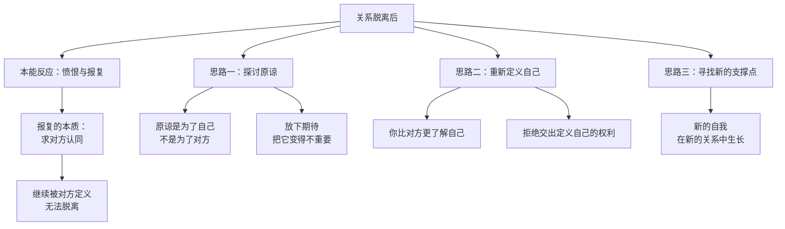
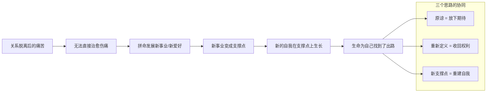

# 第22课：三个思路——如何应对关系的脱离

无论哪种形式的关系脱离，在情感上都有相似的历程——**把那个曾经重要的人变得不那么重要**。这件事之所以艰难，是因为当你把某个人变得不重要的时候，你就失去了他。可是他又有意义——因为原来的关系已经限制了自我的发展。失去他的过程，就是你重新找回自我的过程。

但关系的脱离绝不是在空间上离开那么简单。有时候就算空间上离开了，那个人对你的影响却还在——如果他的影响大到关乎自我定义，那你就还没有完成关系的脱离。

## 自我的封印：关系脱离的陷阱

一位来访者因为失恋而痛苦。他原本是一个自信的人，分手时，男朋友撂下一句话："你脾气这么差，又没有什么魅力，连我都受不了，真正了解你的人是不愿意跟你在一起的。"

这句话深深地影响了他。几年过去，身边也有一些追求者，可是一想到男朋友的评价，他就变得恐惧万分，再也不敢走入亲密关系。

"那周围的人是怎么看你的呢？"

"他们都觉得我挺好的。"

"那你为什么要这么相信前男友的话，而不相信他们的话呢？如果是这样，你也把你的前男友看得太重要了。"

一段关系已经结束了，但自我却被**封印**在对方离开时留下的评价里，无法有新的发展。

> [!WARNING]
> 一只鸟要自由，需要离开笼子两次——物理上的笼子和心理上的笼子。一个人要自由，也需要离开关系两次——肉身上的离开和情感上的放下。只有在情感上放下它对你的影响，你才能解除它给你的封印。

## 报复是另一种形式的求认同

电影《功夫熊猫》里，黑豹太郎原是师父的爱徒。当他发现师父没有选自己当传人时，非常愤怒。他一辈子都想通过打败乌龟——那个被选中的师弟——来报复师父的决定。

报复是另一种形式的**求认同**。即使师父去世了，他还是希望师父能够意识到自己错了，意识到那个决定如何伤害了他。可是如果要去证明对方错了，你永远没有办法离开这段关系。

这很像很多在原生家庭中受伤的孩子，拼命想要父母承认他们的错误。这里的假设是：**我仍然认同那个离开我的人有定义我的权利。** 如果他能改变看法，是不是我们就能被治愈？

答案是否定的。

## 思路一：探讨原谅的可能性

原谅的英文forgive，这个give不是给别人的，而是给自己的——给自己一些空间，把自己从纠缠的关系中解脱出来。

也许你会说"咽不下这口气，我要报复"。其实**原谅也是一种报复**——没有什么比把对方在你的生活中变得不重要更好的报复。当然这样做的目的不是为了让对方不痛快，而是为了能够更好地过自己的生活。

放下，就意味着放弃对他的期待。无论你们之间发生了什么，没有了期待，也许你就有更多的空间给那个对你真正重要的人。

> [!TIP]
> 原谅不是一种要求，更不是一种强迫。只有受伤的人自己才有资格决定原谅或不原谅。但如果选择原谅，要知道那首先是为了自己。

## 思路二：重新定义你自己

你是你自己的裁决者。你比对方更了解你自己，也更知道你是什么样的人。更重要的是，每个人都是有很多可能性的——你有一种责任去为自己创造你想要的可能性。

对方可能对你有一些评价，可是这个评价只能作为"信息的一种"。你可以接受也可以拒绝。如果要接受，也可以把它局限在"在一段糟糕的关系、一个糟糕的阶段，我会这样表现"，而不必把它变成你根深蒂固的自我标签。

关系里的伤害会驱使你不断地想要回到这段关系里，希望他承认看错你了，希望他修正对你的看法——这样你才能从自我封印中解脱。

可如果是这样，你就把**定义自己的权利**给了对方。人最大的权利就是定义自己的权利——你不能轻易把这个权利给别人。

## 思路三：寻找关系以外的支撑点

最开始你会很不习惯失去这段关系，就像青春期的孩子想要独立，但离开父母后仍然会觉得迷茫和脆弱。这时候你需要去寻找新的支撑点——也许是事业，也许是新的关系。在这些地方有你新的自我。

我的一个摄影师朋友就是很好的例子。她原来只是一个普通的全职妈妈，遭遇婚姻变故后，毅然选择了离开。脱离这段关系把她从一个妻子变成了离异的单亲妈妈。但她说：

> "我没有办法去治愈关系的伤痛。我也不知道怎么治愈它。它是慢慢愈合的。我唯一能做的，就是拼命去发展自己的新事业，直到它变成了另一个能支撑起新自我的东西。"

她把自己的摄影爱好捡了起来，学了很多新东西，把摄影跟情感结合起来——她独特的"灵魂摄影"就是这样诞生的。她会在一个很黑的摄影棚里跟人聊天，聊重要的人生经历和故事，在最真挚的情感瞬间按下快门。

有时候我们并不能直接去治愈关系带来的伤痛。可是生命总会为自己找到出路——既然这段关系已经没有出路了，那个新的自我，就是生命为你找到的新的出路。

> [!QUESTION] 自我检查
> 你是否曾经历一段关系的脱离？你身上的"封印"是什么——那个人离开时留下了什么样的评价，至今还在影响你对自己的看法？你可以用什么方式来收回定义自己的权利？

思考方向

关系脱离后最危险的心理陷阱是：你让对方的评价变成了自我定义。三个思路其实指向同一个方向——**重新找回定义自己的主权**。1）原谅是"放下期待"——不是认同对方的伤害，而是不再等待对方改变看法来治愈你；2）重新定义自己是"收回权利"——对方的评价只是他眼中的你，不是全部的你；3）新的支撑点是"重建自我"——在新的关系和事业中，你发现自己不只是那段关系中的角色。这三个思路没有固定的顺序，但有一个共同的前提：你愿意承认"我已经不需要他来定义我是谁"。

---

继续学习：[[0023-gao-bie-guo-qu|第23课：告别过去——为什么这么难]] | [[reference/glossary|核心术语表]]