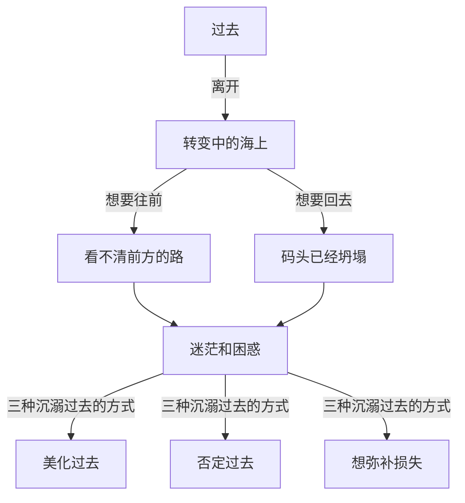
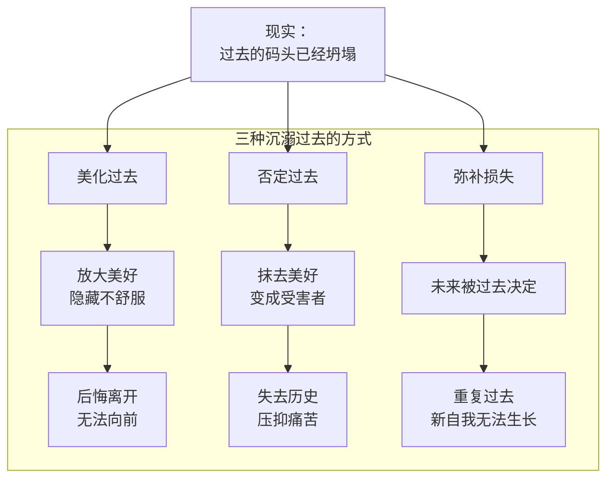

# 第23课：告别过去——为什么这么难

转变是新旧自我的更替。有时候，就算外在的事情已经发生了，内在的转变却未必随之发生。我们还需要另一个维度的脱离——**时间上的脱离**。只有脱离过去，我们才能进入下一个阶段。

这是"告别旧自我"的第三个环节：告别过去。

## 过去变成避难所

不知道你有没有做过这样的梦——在梦里，失去的东西失而复得，离开的人还在那里，一直后悔的决定可以重新选择。梦醒的时候，你有多欣喜，就有多惆怅。

当一些无法接受的失去发生时，过去就变成了我们的避难所。因为失去太痛苦，大脑就用这种方式来帮你止痛，让你产生能够回到过去的幻想。

一位遭遇重大损失的朋友在朋友圈里写："我不要现在，我也不要未来。我要一直停留在过去，因为过去有你。"

留在过去，是人最倔强也最无望的坚持。

> [!WARNING]
> 人愿意生活在过去，是因为过去有我们没有失去的东西、有我们喜欢的自己。可是人又没有办法真的留在过去——因为过去就算有再多东西，它唯一没有的就是**现实**。

## 转变期的"两难困境"

更多的人不是想留在过去，他们也会努力劝说自己"过去的已经过去了，要活在当下，面向未来"。但转变期会出现一种奇怪的两难：

- 从事情上讲，你已经离开了过去——从公司离开，脱离了一段关系，有了新的职位。
- 从自我上讲，你却还停留在旧自我——陷入迷茫和困惑，不知道自己是谁。

威廉·布里奇斯有一个很贴切的比喻：

> 就像一条船离开码头驶向另一个目的地。到了中途遇到狂风暴雨，想要往前走却看不清前面的路，想要回去却发现离开的时候那个码头已经坍塌——它再也回不去了。

这个坍塌的码头就是过去。问题在于，我们的大脑并不知道码头已经坍塌了，或者即使知道，也很难去承认和接受它。

## 沉溺过去的三种方式

### 方式一：美化过去

人们总爱说"过去的好时光"，好像过去的时光更加美好，并为自己放弃这个美好时光而后悔和自责。可现实未必如此。在迷茫中，过去那些失去的美好会被放大，而那些让你不舒服的细节则被隐藏了起来——可正是那些不舒服的细节，才促成了转变的发生。

一位学员原来在中学当老师，觉得工作太细碎，想做一些更有创造性的工作，就辞职去读了博士。但来到实验室后，他有了很大落差——他变成了一个普通学生，收入远不如以前，还要跟比他年轻很多的人一起处理琐事。当他听说系里一个刚毕业的博士去了他原来的中学当老师，更是怀疑起自己的选择。

他反复回想原来的工作有多好——稳定、受人尊重、有寒暑假。他问我："陈老师，我一直在努力追求更好的自己，怎么反而越过越差了呢？"

我想说：如果你正处在转变期，你也要面对这样的现实——**现在的你也许就是不如过去**。一个破碎重建中的自我，怎么能跟过去成形的自我相比呢？你的新自我还没有成形，拿它来跟过去完整的自我相比，是不公平的。就算真的不如过去，你也回不去了——你只有未来可去，没有过去可逃。

### 方式二：否定和贬低过去

这是另一种防御。因为失去太痛苦，就把过去想得坏一点，来让自己更好地完成脱离。

这种方式同样有问题。否定和贬低过去会让失去不那么痛苦，但也可能让你失去一段重要的历史，把你变成一个单纯的受害者。

一位来访者因为父母不同意他的婚事，离家出走，跟父母不再往来。说起父母，他总是恨意难消。当我问他在家时有没有美好的记忆，他说："有肯定是有的，可是我一点都不想提。我感觉我的头脑正在疯狂地篡改过去的记忆，把那些曾经的美好都抹掉。"

忘记美好的过去也许就不会有失去的痛苦。可这也会让你陷入愤怒和失落——你不仅失去了当下的关系，还失去了那段对你来说重要的历史，以及那个历史里珍贵的自己。过去变成一个敏感的伤痛，你会花很多精力不让自己想起它——这种压抑本身就变成了过去对你挥之不去的影响。

### 方式三：想要弥补损失

过去的失去总是痛苦的。为了应对这种痛苦，有时候我们会告诉自己："过去失去的东西，我未来一定会得到。"

如果过去的失去在未来真的有办法弥补，那无疑是一种幸运。可很多时候，遗憾是没有办法弥补的。如果你一直想要弥补它，它就会变成心里一种永久的挫折感。更糟糕的是，你所失去的，未必是你想要成为的自己。

一个在大厂做管理层的朋友，最初几年做得挺开心。后来觉得限制越来越多就辞职了，想做一些新的探索。可每次尝试新工作，他又会怀念高薪和受人尊敬的地位。他告诉自己"没关系，未来的工作我会赚回来"，然后换一个薪资相似的工作——再辞职，再换。这当然是成功，可另一方面，他想要探索的那个新自我，却因为弥补损失的渴望迟迟没有办法开始。

**弥补失去不会造就一个新的自我，它只是过去自我的延续。**

> [!TIP] 关键领悟
> 过去是我们历史的一部分，它塑造了你，但不必定义你。沉溺于过去的三种方式都有一个共同点：把过去视为"更好的选择"或"需要修正的错误"，而不是把它视为"已经完成的一段历程"。承认码头已经坍塌，不代表否定那段航程——它只是意味着你无法再回到那里。前面还有新的海域等着你探索。

> [!QUESTION] 自我检查
> 在转变中，你是否正在美化、否定或试图弥补过去的损失？过去的自我是什么样的？是什么让你不愿意从那个"坍塌的码头"离开？

思考方向

告别过去之所以如此困难，是因为过去不只是时间上的"从前"——它承载着我们定义自我的重要材料。美化过去、否定过去、试图弥补过去，这三种方式背后有一个共同的恐惧：**如果我不再执著于过去，我会是谁？** 面对这个恐惧的关键是区分"记住"和"活在"——记住过去不意味着活在过去。你可以保留那些塑造了你的经历和经验，同时承认那个码头已经坍塌，你需要在新的海域找到自己的航向。转变期的"不如从前"不是退步，而是重建的必经阶段。

---

继续学习：[[0024-yi-kai-mu-guang|第24课：移开目光——如何与过去告别]] | [[reference/glossary|核心术语表]]