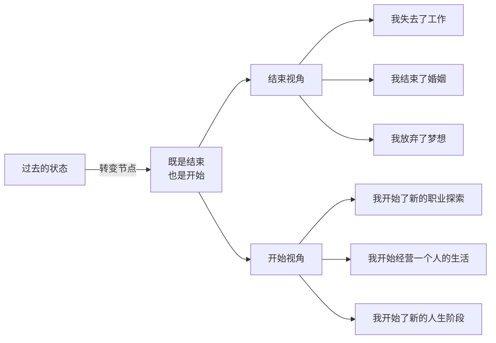
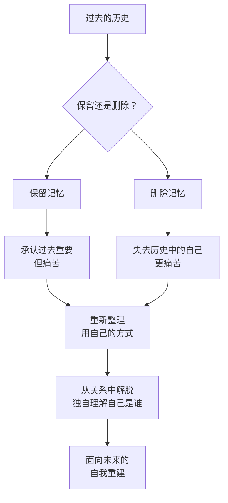

# 第24课：移开目光——如何与过去告别

上一课讲到为什么告别过去这么难——因为过去由我们难以释怀的失去、难以抚平的伤痛、难以割舍的人生经历以及难以放下的自己所组成。正是这些过去不停地牵动我们，让我们很难开启新的未来。

怎么告别过去呢？要完成新旧自我的更替，需要我们把目光从过去**移开**，去创造新的未来。移开目光不只是为了转移注意力，也是为了给新的未来腾出空间。

## 思路一：把结束当开始

转变期是生命特殊的节点，是新旧自我的边界。站在这个节点上，有时候我们只注意过去那些确定的失去，却没有想到它也是新的未来的开始。

心理学家埃斯特·佩雷尔曾做过一个关于出轨的演讲。对于遭遇出轨的夫妻，她会说：

> "无论是好是坏，从出轨这件事被发现开始，你们上一段的婚姻实际上已经结束了。现在你们要一起来决定：是不是要开始一段新的婚姻。"

这句话很有智慧——它提示了一个特别的节点：**既是结束，也是开始**。

当你面临一个转变的危机，你也可以告诉自己：无论过去是好是坏，从某一个时刻开始，过去的某件事、某段关系、某个状态已经结束了。现在你要怎么选择和决定新的未来？



一位男演员的故事说明了这一点。当演员是他从小到大的梦想，为此他放弃了名校保送读研的资格，一心要成为真正的艺术家。他吃了很多苦，碰了很多壁，却只能接到一些烂电视剧里"有钱无脑的阔少爷"角色。当他看到已经退休的父母还需要资助他时，他发现自己再也无法坚持了。

他转行做了带货主播，赶上了风口，赚了不少钱。可他越成功就越失落——他觉得背叛了过去的自己，不知道自己是谁了。

"不再是演员了——那就是你旧梦想的一个结束，也是新梦想的开始。应对梦想结束最好的方式，是重新树立一个新的梦想。这不是对过去的背叛，而是跟过去的和解。"

把结束当开始，有时候能让你看到一些出路。这个出路不一定是现成的，但它面向未来。

> [!TIP]
> 哲学家刘擎老师说："每一天都是余生里的第一天。"每一个结束，都是一个新的开始。既然是一个新的开始，你希望怎么过它？

## 思路二：跟自我和解

关于过去的遗憾，总是把过去变成一个绕不开的参照点。我们拿它来对照现在，觉得自己做错了选择，后悔和自责。

背后隐藏着一个假设：**如果我变得明智一些，我就可能避免过去的错误。** 但这个假设不是现实——它是我们头脑制造出来的幻觉。这个幻觉有时候让我们更难跟过去告别。

一位学员本科毕业后到了一家不错的公司，埋头苦干十年，凭努力做到了总经理。十年后，他感到职业上升天花板，跳槽到了互联网大厂。虽然有些心理准备，但大厂的文化、价值观、工作节奏都让他很不适应。眼前落差让他总是质疑自己的选择——不断回想以前舒适的工作、受尊敬的身份。这种焦灼甚至让他得了焦虑症。

很长时间他都在后悔自己的选择。

我问他当初为什么想出来，他说："那时候我还年轻，不想被限制在一个公司，想到外面闯一闯。"

我又问后面的经历有没有价值。他说有的，后来还是成长了很多，视野也丰富了很多。

"如果没后面的经历，你还在原来的公司，你猜你现在会怎么想？"

"那也许我一定还是不甘心，会想出来。"

"是啊。所以现在的后悔不代表你做了错误的选择，那只代表那时候你没有足够的切身经验来理解这个选择。这个切身经验是后面的经历带来的。现在你觉得还是第一份工作最好——可就算这个看法是对的，这个看法本身也是你后面的经历所带来的，它本身就是成长的一部分。"

> [!WARNING]
> 在转变中，后悔是一件危险的事。它总是引诱你逃往过去，却没有办法带你去往未来。有些事一旦错过就没法回去了——就像我们也觉得童年美好，却不想回到小朋友的状态一样。我们只能接受后面的经验带给我们的改变。它不是错误，是成长所需要经历的必然。

## 思路三：重新整理过去

没有过去，你就没有历史。可是如果只有过去，你就没有将来。

还记得那个与父母闹矛盾的学员吗？说起家里的记忆，他说："我的头脑正在疯狂地篡改我的记忆，让我删掉所有跟父母有关的美好记忆。"

他面临一个难题：如果要保留这些记忆，就要承认父母对自己重要；如果不保留这些记忆，就会失去过去的自己。这是很多人关系分离时面临的难题。



我总是跟他们说：保留过去的美好记忆，不代表你要改变对他们的看法，更不代表你要原谅他们。它只代表人是会变的，关系也是会变的。

从你跟他们分开开始，所有的事都跟他们无关了——连过去的历史也跟他们无关。这是**你的记忆**，不是他们的记忆。既然它是你的过去，你就有权利用自己想要的方式来整理它。

整理过去并不是为了否定过去，也不是为了不断舔舐伤口，而是为了理解我们自己，是为了面向未来。

> [!TIP]
> 过去就像一个遭遇地震后坍塌的房子。你当然怀念那个房子、怀念你的家。但你也需要去废墟里看一下——倒掉的房子里，还有什么东西是你能用的。那些还能用的材料，也许会成为你自我重建的基础。

---

以上三条思路共同指向同一个方向：**把目光从过去移开，转向未来**。结束也是开始，后悔不是错误而是成长的代价，整理过去不是为了回到过去而是为了走向未来。告别过去，不是因为你不再珍惜它，而是因为你准备好开始新的篇章了。

```mermaid
flowchart TD
    A[难以告别的过去] --> B[思路一：把结束当开始]
    A --> C[思路二：跟自我和解]
    A --> D[思路三：重新整理过去]
    
    B --> B1[从"我失去了"到\n"我开始了"]
    C --> C1[后悔不是错误\n是成长的代价]
    D --> D1[这是你的记忆\n你有权重新整理]
    
    B1 --> E[移开目光\n走向未来]
    C1 --> E
    D1 --> E
    
    E --> F[进入转变的下一阶段\n面对不确定与未来]
```

> [!QUESTION] 自我检查
> 你和过去之间是一个什么样的关系？你觉得哪种思路更适合现在的你——是把结束当开始，跟自我和解，还是重新整理过去？

<details>
<summary>思考方向</summary>

告别过去的三条思路有一个共同的出发点：**过去已经发生了，但你如何解读它、如何使用它，是由现在的你决定的。** 1）把结束当开始——这不是自我欺骗，而是重新框定视角：结束同时意味着新的可能；2）跟自我和解——后悔是一种"后见之明"，你用后来的经验判断当初的选择是不公平的；3）重新整理过去——把过去从"别人的故事"变成"自己的故事"：那些记忆是你的，你可以选择把它们安置在哪里、赋予它们什么意义。放下过去不代表忘记过去，而是不再让过去决定你的现在和未来。
</details>

---

继续学习：[[0025-hei-sen-lin|第25课：黑森林——焦虑不确定，是在焦虑什么]] | [[reference/glossary|核心术语表]]