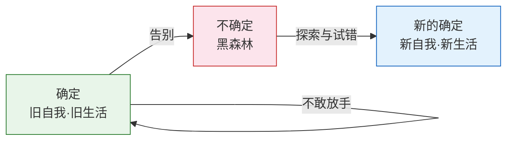
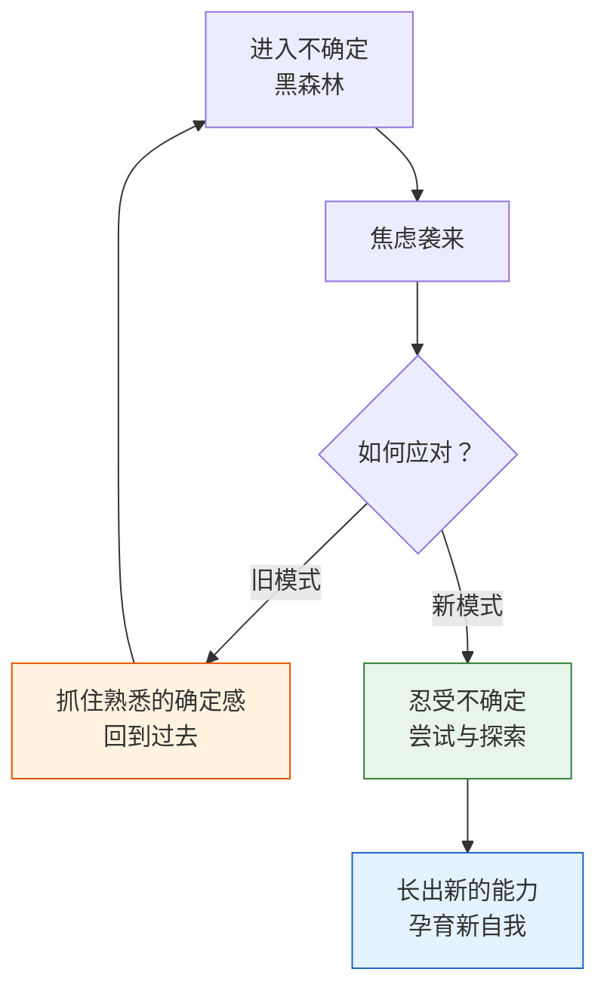

# 第25课：黑森林——焦虑不确定是在焦虑什么

告别旧自我、旧生活之后，我们必然踏入一片未知之地。这片未知之地就是黑森林。黑森林里有什么，我们并不知道，而这种"不知道"正是转变期最让人煎熬的根源。这一课聚焦于转变中的不确定感——它来自哪里，我们为什么如此害怕它，以及这种恐惧如何让我们不断退回旧自我的舒适区。

## 黑森林的隐喻：确定与不确定的辩证

乔丹·彼得森教授用中国的阴阳图案来解释转变的历程，提供了一个极为精妙的视角：

- **白色的那一半**——象征生活中稳定、有序、可控的部分。但如果一直停留在其中，生活和心灵会变得苍白、僵化、无趣。
- **白色中的小黑点**——代表确定中的不确定。它是生活变化的来源，是旧系统里萌芽的新可能。
- **黑色的另一半**——象征危险、混乱、失控。完全陷入黑色部分，人会感到不安全与焦虑。
- **黑色中的小白点**——代表不确定中的确定。那是新的稳定结构正在孕育的种子。

> 黑白之间那条模糊的路，就是我们所谓的"道"。自我转变，正是这样一条模糊的道。

童话故事里经常有这样的情节：主人公离开熟悉的村庄，踏入黑森林，去寻找关于"我是谁"的答案。如果我们太害怕不确定，就只能在黑森林的边缘徘徊，望着回不去的村庄，永远无法开始真正的冒险。

## 两种不确定：事情的不确定与自我的不确定

转变期的焦虑并非单一来源。它包含两个层次，理解这两个层次是应对焦虑的第一步。

### 层次一：事情上的不确定

在原先的生活里，所有事情都是有序的、可预测的，通过努力就可以解决。但进入黑森林之后，事情变得无序、不可预测。你不知道会遇到什么，会有什么结果，需要重新理解这个世界。

> [!EXAMPLE]
> 一位名校毕业的学员加入了一家P2P公司，工作几年后公司随行业泡沫倒闭。此后他花一年脱产考司法考试（只是为了堵住父母的嘴），又尝试了几个兼职，均无疾而终。他花大量时间分析自己的优劣势、找人聊天、学东西，却连做一份简历投出去都做不到。他不断告诉自己："我已经犯过错了，绝不能再犯错。"他希望能有一个权威告诉他"这次一定不会失败"——可是没有人能做这个保证。
>
> 他的出路恰恰就在不确定里。如果不通过尝试去制造一些不确定，那当下确定的结果，就是不停地继续内耗，没有任何转变的可能性。

### 层次二：成为什么样的自己的不确定

这个层次更深。即使理智上知道转变会带来新自我，当这个新自我真正需要我们做出改变时，旧自我的应对模式却会条件反射般地跳出来。

> [!WARNING]
> 过度准备和自责，看似相反，实则同源——它们都是对自己控制力的过度相信，本质上是一种迷信。迷信背后是一种焦虑：不相信自己有能力应对好不确定。

**过度准备**的逻辑是："只要我准备充分，不确定就会消除。"
**自责**的逻辑是："一切不如意的结果都源于我的错误，只要我不犯错，一切就会回到正轨。"

两者都隐含着同一种假设：**我能够控制一切。** 却没有意识到不确定本身就是存在的。

## 旧自我的惯性：抓住确定感的陷阱

当不确定的焦虑袭来时，我们最本能的反应是"抓住某些东西"——抓住任何能带来确定感的东西。但这种抓住往往只是回到了过去。

一位来访者一直焦虑，但也正是这种焦虑帮助他考上了好中学、好大学、找到了好工作。他一边焦虑，一边幻想有一天能过上悠闲的日子。后来他终于在某个时机离职了，想着"终于可以好好休息了"。离职第一天他买花浇花、读文学书；第二天研究厨艺做披萨；但到了第三天，焦虑重新袭来——原来他的焦虑一直有去处（工作），现在却不知道往哪里安放。他很快就找了一份和以前一样快节奏、竞争激烈的工作，再次进入"一边焦虑一边憧憬财务自由"的循环。

这个故事的普遍意义在于：**我们在不确定的焦虑中想要抓住一些东西，却来不及问自己——我抓住这个东西，究竟是因为它适合我，还是因为我现在特别需要一种确定感？**

如果是前者，恭喜你；如果是后者，那它并没有帮你完成转变，只是暂停了转变的历程。

## 学会放手：从黑森林开始真正的冒险

据说缅甸有一种猎猴子的方法：在猴子出没的森林里放一个葫芦，葫芦开口很小，刚好够猴子把手伸进去。葫芦里放一些花生。猴子来了，总是抓一大把花生，手鼓鼓的出不来。猎人走近，猴子急得乱跳，越是着急，手抓得越紧——却不知道把手里的东西放开。

面对不确定，我们也常常像那只猴子一样，拼命抓住手里的东西，却不知道真正的解脱在于学会放手。

> [!TIP] 能力是长出来的，不是先准备好的
> 经常有人问："我很担心自己没有能力应对转变，怎么办？"
>
> 我的回答是：你当然没有能力应对。能力是你面对不确定的挑战时，逐渐长出来的东西。现在因为害怕不确定，你连挑战都还没有面对，能力从何长出来呢？当你真正进入不确定、应对不确定的时候，也许你会发现，自己的潜力比你想象的还要大。

---

> [!QUESTION] 自我检查
> 1. 转变期的焦虑有哪两种不确定？它们分别指什么？
> 2. 为什么说过度准备和自责本质上是一种"对控制力的迷信"？
> 3. 当不确定的焦虑袭来时，我们最容易掉入的陷阱是什么？这个陷阱为什么不能真正帮助我们完成转变？

参考答案

1. **事情上的不确定**：外在事务变得无序、不可预测，你不知道会遇到什么、会有什么结果。**成为什么样的自己的不确定**：旧自我的应对模式在不确定中被激活，让你不自觉地回到过去的习惯和选择中，这是一种更深层的关于"我是谁"的不确定。
2. 过度准备（"只要我准备好，不确定就会消除"）和自责（"一切不如意的结果都源于我的错误"）都隐含着"我能够控制一切"的假设。它们否认了不确定的客观存在，是对自身控制力的夸大，因此本质上是一种迷信。
3. 最容易掉入的陷阱是**在焦虑中抓住任何能带来确定感的东西**——比如离开一段关系后马上找新恋人，或离开不喜欢的工作后马上找相似的工作。这个陷阱的问题在于：我们是因为"需要确定感"而做出选择，而不是因为那个选择真的适合自己。它只是暂停了转变，而非推动了转变。

---

继续学习：[[0026-mian-dui-bu-que-ding|第26课：三种方法——如何面对不确定]] | [[reference/glossary|核心术语表]]