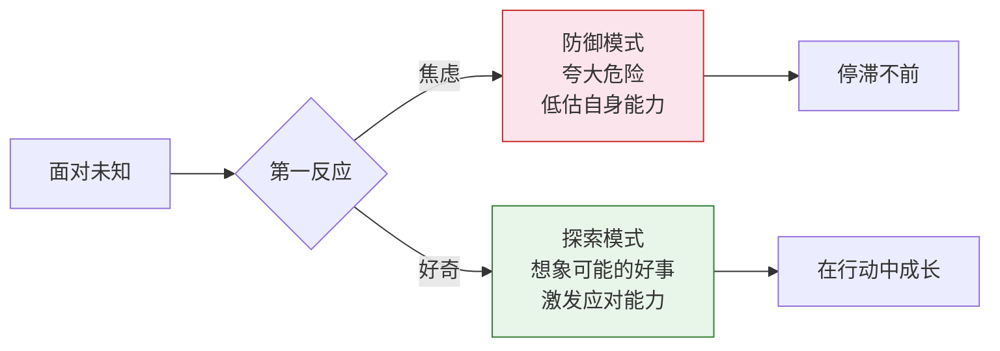
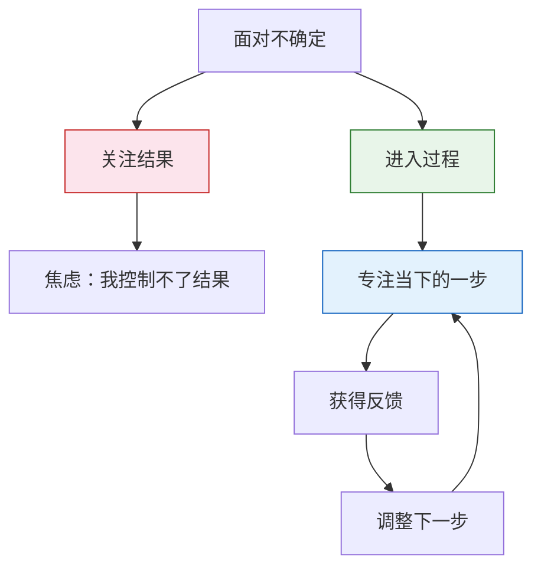

# 第26课：三种方法——如何面对不确定

面对黑森林的不确定，我们本能地焦虑。但焦虑不是唯一的反应方式。这一课提供三种应对不确定的思路：用好奇代替焦虑、在不确定中创造确定性、以及进入过程而非关注结果。它们不是理论上的安慰，而是可以真实操作的行动指南。

## 方法一：用好奇代替焦虑

焦虑和好奇，都是对未知的反应。区别在于：**焦虑用防御来应对未知，好奇用探索来应对未知。**

当你走进黑森林，如果只盯着路上可能冒出来的妖魔鬼怪，自然充满焦虑。但黑森林里也有精灵和宝藏——有你想不到的好事，有你没预料到的能力。你能对那些未知的经历感到好奇吗？

> [!TIP]
> 面对不确定时，我们总是夸大危险的程度，却低估自己适应环境的能力。人只能想象危险，很难想象自己会如何应对——因为应对能力是身处具体情境才会激发的。这不是缺少能力的问题，而是缺少想象力的问题。

一位来访者从国外留学回来，一直做不喜欢的工作，最终决定去申请国外的博士。他非常担心："如果我去国外又抑郁了怎么办？人生地不熟遇到困难怎么办？万一毕不了业怎么办？"我对他说：你只想到了危险，却没有想到——你会不会在一个新城市有新体验？会不会遇到有趣的人？会不会进入让你激动的学术领域？你对这些未知的经历感到好奇吗？

后来他真的去了美国，确实遇到了很多困难，但也遇到了他想象不到的资源和帮助。这段经历把他变成了一个很不一样的人。

## 方法二：在不确定中创造确定性

当你失去工作、目标或一段关系，就像失去了生活中的锚点。外在规则消失了——没有该几点睡的约束，没有该见什么人的安排。生活只剩下不确定，让人觉得做什么都没有差别。

这时候，你需要刻意制造一些确定感，让它们成为生活中的锚点：

- **养一只宠物或植物**——有一个生命需要照顾，本身就是恢复生命力的办法。一位转变期的朋友离开工作后，把养在老家的狗带回来。即使陷入抑郁不想动，狗也需要他去遛。这个强迫的任务帮他建立了基本的日常节奏。
- **固定时间地点的约定**——比如每周一次的心理咨询，或者每天去图书馆看书。公共空间和固定日程能带来结构感。
- **区分可控与不可控**——古老的斯多葛哲学把所有事情分成两类：我能控制的和不能控制的。专注你能控制的事，哪怕它再渺小。这不是为了改变事情的发展，而是为了重新找回内心的确定性和控制感。

> [!WARNING]
> 你一定听过这段祈祷词："上帝啊，让我有勇气去改变我能改变的东西，让我有胸怀去接纳不能改变的东西，让我有智慧去区分这两者。"在转变期，这句话格外适用。你不能控制结果，但你可以控制"是否继续投入过程"——这本身就是一种重要的确定性。

## 方法三：进入过程而非关注结果

面对不确定时，人最关心的是结果：这件事我能成功吗？这么做有用吗？但你会发现，结果是你无法控制的。你能控制的，是进入事情的进程。

就像下棋，你当然想赢，这是结果。但当你真正进入棋局，每次能做的只是下好一步。外部世界会根据你的棋给出它的反应——有时在意料之中，有时在意料之外。你能做的，就是继续下你的一步，等着外界再下它的一步。

> [!EXAMPLE]
> 作家史铁生在《命若琴弦》中讲了一个故事：一个小乐师得了眼病快要失明，万念俱灰。他的师父（一个老乐师）说：这个病有得治，我有个药方，但需要弹断一千根弦才能拿到。徒弟信以为真，不停地弹，不停地弹。当他弹断第一千根弦时，已从少年变成老人，琴艺有了极大长进。他去药房抓药——药方不过是一张白纸。
>
> 这个故事揭示了一个深刻的道理：治愈我们的，不是那个希望所承诺的结果，而是它所引发的、让我们愿意投身其中的**过程**。

老乐师的药方没有治好眼病，却治好了心病。当乐师发现追求一生的目标不过是一个谎言，他的人生荒谬吗？不——因为谎言里的承诺是假的，但那种善意是真的，过程中长出的东西是真的。这就是不确定中的确定性。

## 三种方法的综合运用

这三种方法不是互斥的，可以在不同阶段灵活运用：

| 方法 | 核心问题 | 适用场景 |
|------|----------|----------|
| 好奇代替焦虑 | 除了危险，这件事还有什么可能性？ | 刚进入不确定期，被恐惧淹没时 |
| 创造确定性 | 今天我能做的一件确定的事是什么？ | 生活失去结构，感觉虚无飘散时 |
| 进入过程 | 当下这一步我能做什么？ | 总在想结果、被宏大问题压垮时 |

---

> [!QUESTION] 自我检查
> 1. 好奇和焦虑面对未知时的根本区别是什么？为什么好奇能对冲焦虑？
> 2. 在不确定中创造确定性的核心目的，是"改变事情的发展"还是"找回内心的控制感"？
> 3. 《命若琴弦》的故事说明了一个什么道理？为什么说"谎言里的善意是真的"？

参考答案

1. 焦虑用**防御**来应对未知，它夸大危险、低估自身适应能力，导致停滞；好奇用**探索**来应对未知，它会引导我们去关注可能性，激发身处具体情境才会出现的应对能力。好奇本身就是一种对冲焦虑的反应，因为它把注意力从"威胁"转移到了"可能"。
2. 核心目的是**找回内心的控制感**，而不是改变事情的发展。区分可控与不可控，专注你能控制的事（哪怕很小），是为了恢复内心的确定性，让你从"做什么都没差别"的虚无中走出来。
3. 《命若琴弦》说明**过程比结果更有疗愈力量**。药方的承诺是假的（谎言），但这个谎言所引发的"愿意投身于过程"的行动是真的——琴艺的长进、生命力的恢复、心病的治愈都是真的。所以"谎言里的善意"指的是：那个指向过程的引导本身是善意的，它在过程中长出了真实的东西。

---

继续学习：[[0027-fen-jie-xian|第27课：分界线——如何创造新的可能性]] | [[reference/glossary|核心术语表]]