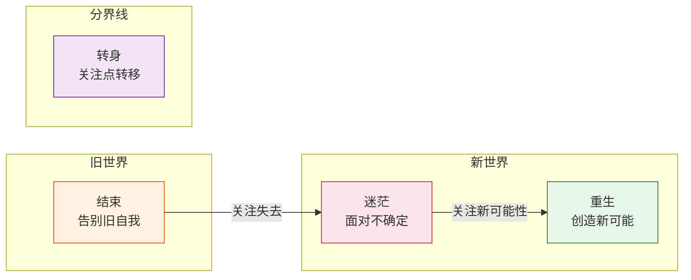
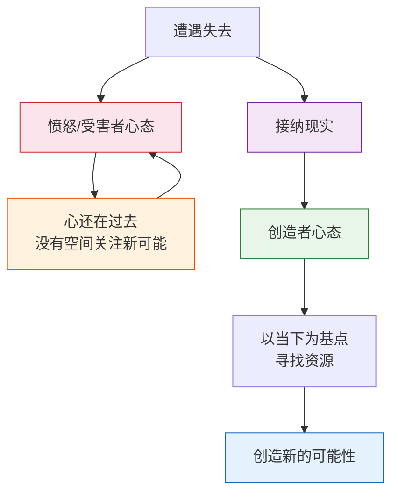

# 第27课：分界线——如何创造新的可能性

威廉·布里奇斯说，转变需要经历三个阶段：结束、迷茫、重生。迷茫和重生之间的分界线在哪里？如何跨过这条线？这一课的核心答案是：**分界线不是由事情决定的，而是由你的关注点决定的。** 当你逐渐从关注"失去的旧世界"转向"在新世界中寻找资源、发挥能力、创造可能性"，你就跨过了这条线，进入了重生期。

## 转身的关键：意识到不能回头了

跨过这条线的转身是艰难的，最难的是意识到自己不能回头了。不能回头，你才会面向未来去创造新的可能性。

前面课程中提到的一位学员，在不错的公司工作了十年做到总经理，跳槽到互联网大厂后很不适应。他很难接受"努力奋斗的未来可能还不如不需要怎么奋斗的过去"，迟迟无法适应新工作，甚至得了焦虑症。

后来他是怎么做到的？他告诉自己：**"我没有选择了。如果我再从这家公司辞职，以后就没有人要我了。"**

这未必是事实，但正是这样的决心让他沉下心来去适应新的工作。人不能总在选择阶段纠结——已经选择了，就要照着自己的选项去努力创造新的现实。

## 第一步：做出选择

选择之所以难，是因为我们害怕错过一些可能性，担心自己所做的不是最好的选择。但很多可能性不是选择带来的，而是选择以后，**通过深入经营这个选项创造出来的**。

> [!WARNING]
> 在事业中不做选择，就会在不同领域浅尝辄止，错过深耕的机会；在感情里不做选择，就会在不同关系里游荡，只能发展浅浅的关系，错过建立深度连结的可能。隐藏在很多选择背后的真正动机，是不想做选择。

### 案例：以"选择"逃避选择

2021年获戛纳大奖的挪威电影《世界上最糟糕的人》中的主人公朱莉，生活在现代西方思想成就的塔尖上——她能自由选择学业和工作。

她考上了医学院，嫌做手术太具象，要改行做心理咨询；没过几天，又觉得自己对视觉表达更有感觉，要当摄影师。当然都没有做成。在两性关系上，她有个事业有成的男朋友想定下来生孩子，而她的选择方式是跑去和另一个男人出轨。

看起来她做了很多选择，其实是在用这些选择逃避真正的选择。**选择是要跟承诺相匹配的**——选择的意义在于愿意深入某一件事或某一段感情，并为此舍弃其他事情。以随意选择的方式不做选择，背后有太多恐惧：对失去的恐惧、对投入没有足够回报的恐惧、因深爱而害怕被抛弃的恐惧、被限制的恐惧。

> 正式因为在这种恐惧下，让我们以"自由意志"的名义拒绝看到现实，而不愿意做出选择。而有时候只有做出你的选择，自我的发展才能进到下一步。

## 第二步：忠于承诺

做出选择之后，需要深入到一个选项，接受它的限制——这是选择时所做的承诺。这并不意味着选择完全不能改变，但随之而来的承诺应该有它该有的重量。

> [!EXAMPLE]
> 一位学员刚结婚不久，正处在婚姻磨合期，先生却查出重病，不好治，甚至有生命危险。她慌乱中不知所措，不敢见同学朋友，也动过离婚的念头。但如果离婚，她也无法接受在危机关头抛下先生不顾的自己。
>
> 在挣扎之后，她做出了选择："无论以前跟我先生的感情如何，现在我都选择跟他共度难关。以前遇到这样的困难，我总是想逃，想重新做选择。但是现在我想清楚了——无论结果如何，这是我的命运，我需要承担。"
>
> 当她选择了承担命运的重量，反而有了一种平静。她开始在治病的间隙为彼此创造快乐，找回了以前的爱情，和先生的关系也更好了。

选择所附带的承诺，本身就是一种力量。忠于承诺所带来的生机和希望——这种希望帮她调动潜力去适应新的生活。

## 第三步：以当下为基点创造新的可能性

接受旧世界的失去，才能去寻找新世界的资源。这种创造新的可能性的冲动不是来自外在要求，而是来自最深层的生命本能。

### 从愤怒到创造：受害者与创造者

一位创业者朋友，公司本来顺风顺水正准备上市，却因外部环境变化陷入危机。他有巨大的愤怒、恐惧和迷茫，不知道未来会怎样，不明白为什么自己这么倒霉。他想过放弃，但想想做这份事业的初衷又舍不得，只能咬牙坚持。

后来公司的经营开始慢慢改善，他忽然萌发了新的兴趣——想在新环境下创造一些新的产品。他说："一种好久没有的冲动在我心里复苏了。我不再只是沉溺于痛苦和愤怒当中，我发现在新世界里还是有很多机会和可能性。"

我问他这一步是怎么跨过去的，他想了想说：**"放下愤怒、接纳现实和看到新的可能性，几乎是在同时发生的。"**

为什么放下愤怒才能看到新的可能性？当我们在愤怒中时，潜意识里还把自己定位成**受害者**。受害者角色的重点是证明自己的伤害有多重——不寻找机会和出路，是因为还不能原谅那个"伤害我们的人"。仿佛新的机会代表伤已经好了，而伤好了就代表原谅了，那是对过去所受伤害的背叛。

我们需要在内心区分伤害和可能性。**努力创造新的可能性，不代表没有受伤害，也不代表选择了原谅——只代表我们从过去的关系中解脱了出来，要为自己去寻找新的未来。**

> [!TIP] 
> 如果跨出了这一步，慢慢你会发现：就算失去了那么多，生活中还是有很多资源可以利用。哪怕跟失去的东西相比这些资源微不足道。没有成功也没有所谓的失败，没有得到也没有所谓的失去——有的只是人不屈不挠的创造力，那根植于生命中、永不停息的创造力。它会一直为你创造新的可能性。

---

> [!QUESTION] 自我检查
> 1. 迷茫和重生的分界线是由什么决定的？跨过这条线的关键是什么？
> 2. 为什么说"以随意选择的方式不做选择"是在逃避真正的选择？选择的本质是什么？
> 3. 受害者心态和创造者心态的根本区别是什么？放下愤怒和看到新可能性之间是什么关系？

参考答案

1. 分界线由**关注点**决定——从关注"失去的旧世界"转向"在新世界中寻找资源、创造可能性"就跨过了线。跨过线的关键是**意识到不能回头了**，只有不能回头，你才会面向未来去创造新的可能。
2. 感觉做了很多选择，其实是在用选择逃避真正的选择。**选择的本质是要与承诺相匹配的**——选择的意义在于愿意深入某一件事或某一段感情，并为此舍弃其他事情。以随意选择的方式不做选择，背后是对失去、投入无回报、深爱被抛弃、被限制的恐惧。
3. 受害者心态的重点是**证明伤害有多重**，因此不寻找出路；创造者心态的重点是**以当下为基点创造新可能**。放下愤怒和看到新可能性几乎同时发生——因为愤怒时心还在过去，没有心理空间关注新可能。区分伤害和可能性是关键：创造新可能性不代表没有受伤害，只代表从过去解脱了出来。

---

继续学习：[[0028-mi-mang-zhao-mu-biao|第28课：我爱问海贤——迷茫的人怎么找到目标]] | [[reference/glossary|核心术语表]]