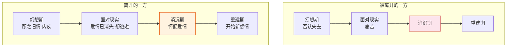
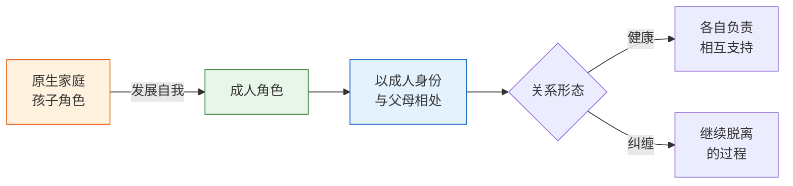

# 第28课：我爱问海贤——迷茫的人怎么找到目标

在告别旧自我的阶段，很多人感到迷茫、挫败、不知道方向在哪。这期的答疑课选取了四个有代表性的问题，涉及目标设定、关系脱离、关系修复和原生家庭。每个问题的回答都可能触及你正在经历的某个困惑。

## 问题一：迷茫的人是否该先设定外在目标？

> 我似乎一直没有外在的目标——赚多少钱、买房买车什么的。人过三十依旧一事无成，孑然一身，思想单纯得像未成年人。对于我这种很容易迷茫的人，是不是明确目标反而能解决问题？

是的，不仅是，而且在这个阶段，最好能树立一个特别明确的外在目标——比如几年内挣多少钱。外在目标有几个好处：

**第一，钱是最好的反馈物。** 它以最直白的方式告诉你：努力方向对不对、努力程度够不够、对别人的贡献有多大。树立赚钱的目标，你就获得了最有效的反馈系统。

**第二，它支持你正当的欲望扩张。** 在佛系的话语里，物欲好像是个坏东西；但在现实世界里，尤其对于年轻人，物欲是一个好东西——它让你有活力去奋斗、有奔头。

**第三，通过认同大家都认同的目标，你参与了大众生活，进入了成年人的世界。** 成年人的世界复杂、势力、辛苦，但也真实——它会锻炼你，逼着你长大。

> [!WARNING]
> 你可能会问：老师，这跟你课程里讲的"尊重内心""突破外在价值束缚"不是冲突吗？
>
> 课程里那些是讲给已经社会化程度很高、却被外在条条框框限制、忽略了自己内心的人听的。而你的阶段不同——**人没有办法离开自己没有到达过的地方，也没有办法失去自己从未拥有过的东西。** 你需要先认同社会规则，才能再突破它去寻找内心的自我；需要先有挣钱的能力，才能讲钱不重要。否则，它就很容易变成一种逃避现实的自我安慰。

真正的问题也许是：赚钱买房太难了，所以潜意识压抑了欲望，告诉自己"这些都不重要"，来避免追求它的挫折感。在上进和上班之间选择了上香。现实的目标让人焦虑，但回避它却会让人陷入另一种迷茫和挫折。

还记得课程中那个问题吗？"在'不知道自己想要什么'和'知道自己想要什么却面临求不得的痛苦'之间，你会选择哪一个？"如果宁可面临求不得的痛苦，也想知道自己想要什么，那就把那种年轻人的欲望找回来——追求它的过程，会让你更有活力。

## 问题二：关系脱离中，离开的一方会经历什么？

> 课程里讲的是被离婚的女性经历的四个阶段，请问她的配偶会经历哪些心理变化？他该如何减少对对方的伤害？

和被离开的人一样，**离开的人也会经历幻想期、面对现实、消沉期和重建期**。就算一个人离开了，也很少对另一半完全没有感情——对于那些还爱着对方、却实在无法相处才选择离开的人，这种痛苦会更强烈。

**幻想期**：虽然做了离开的决定，还会顾念旧情，希望在对方心里还有重要位置，想尽量减轻伤害以减轻自己的内疚。所以在对方需要时，还会表现出关心——哪怕这种关心是出于习惯和内疚。

**面对现实**：悲哀地发现爱情已经消失了。哪怕还有内疚，也没有办法真心满足对方的需要。当对方表现出脆弱需要保护时，自己无动于衷——这绝情的时刻就是两个人真正远离的时刻。

**消沉与重建**：也会消沉、怀疑爱情，但消沉期比被离开的人短很多。内疚引发的痛苦比被抛弃的痛苦小得多。然后开始重建新的感情。

> 最关键的是：就算你选择了离开，尤其在那些前任想依赖你的关键时刻你也离开了——这种离开的伤害已经够了。不要再去纠结"对方也有错"，不要再去给对方的伤口雪上加霜。在感情平淡以后，保持基本的善意，这是能做到的最好的事。

## 问题三：关系出现问题就一定要脱离吗？

> 是不是有可能一方成长以后，把依附关系变成平等的、相互包容、允许各自发展的关系，而不是一定要离开？

**太对了。不是所有的关系都要以脱离和决裂作为结局。** 事实上任何一段关系都会遭遇波折——如果一遇到波折就认为需要脱离，最终会发现跟所有人都只是浅浅之交。

脱离一段关系，有时候也会变成一种逃避——对我们无法面对和解决关系矛盾的逃避。

当关系出现问题时，如果能面对和调整，把依附关系变成平等包容、允许各自发展的关系，那当然是最好的解决。这考验的是两个人对关系的珍惜程度和应对关系的勇敢与灵活性。经历过这些波折的关系会变得更牢固，对彼此的了解信任会更深。

> [!TIP]
> 关系会产生伤害，但关系里的伤害也是可以修复的。如果有可能，不要害怕修复它。只有经历波折后修复的关系，才会发展出一种由浅到深的深度关系。
>
> 应对关系的脱离，最好是在确认关系已经无可挽回的情况下。否则，你们的感情值得你去沟通、去调整。

## 问题四：如何把握脱离原生家庭的度？

> 我和妈妈生活在一起，相处很舒服，相互帮助、互不干涉，这需要脱离原生家庭吗？
>
> 把原生家庭变得"不重要但又不是完全的疏远"，这个度具体怎么把握？

我们没有办法真的脱离原生家庭——父母永远都是我们重要的人。与其说是脱离原生家庭，不如说是**脱离原生家庭里自己作为孩子的角色，去发展自己成人的角色，然后再以成人的角色来和父母相处**。

脱离的"度"要看：**你的情感中心是不是还在原生家庭。** 成年人的情感世界不能止在原生家庭里，否则就很难往外发展自己。

原生家庭最好的位置是一个**港湾**——在你远航的时候，你知道有地方可以回。它最好不要变成**解不开的缆绳**——在你需要远航的时候，却仍然把你固定在岸边。

> 第一位朋友，你和妈妈相处舒服、相互支持又互不干涉——那很好，你已经不知不觉完成了对原生家庭的脱离。但不要因为妈妈太好了，就把她变成生活里唯一的情感支撑。你还是要有自己的朋友、自己的亲密关系、自己的生活——那是你的未来。

---

> [!QUESTION] 自我检查
> 1. 对于还没有确立清晰目标的年轻人，为什么说先设定外在目标（如赚钱）是有必要的？这和"尊重内心"的课程主旨矛盾吗？
> 2. 在关系脱离中，离开的一方会经历哪些心理阶段？要注意什么才能减轻对对方的伤害？
> 3. 如何判断自己是否完成了对原生家庭的"脱离"？健康的脱离和与父母断绝关系的区别是什么？

参考答案

1. 不矛盾。课程中"尊重内心"是讲给已经高度社会化、被外在框架束缚的人听的。对于还没有充分进入社会的年轻人，先设定外在目标有三个好处：获得最直接的反馈、激发欲望和活力、通过认同社会目标进入成年人的真实世界。人需要先拥有、再放下——"没有到达过的地方"和"从未拥有过的东西"无法成为突破的对象。
2. 离开的一方也会经历幻想期（顾念旧情、内疚）、面对现实（发现爱情已消失、想逃避）、消沉期（怀疑爱情）和重建期。关键注意事项：离开本身的伤害已经足够，不要再去强化"对方也有错"，不要在关键时刻表现出过度的绝情或冷漠，在感情平淡后保持基本的善意。
3. 脱离的度看"情感中心是否还在原生家庭"。健康的脱离不是断绝关系，而是**脱离孩子的角色，发展成人的角色**，以各自负责、相互支持的方式相处。原生家庭应是一个"港湾"（远航时有地方回），而非"缆绳"（把你固定在岸边）。

---

继续学习：[[0029-jiu-zi-yuan|第29课：旧能力的新应用——如何整理旧自我的资源]] | [[reference/glossary|核心术语表]]