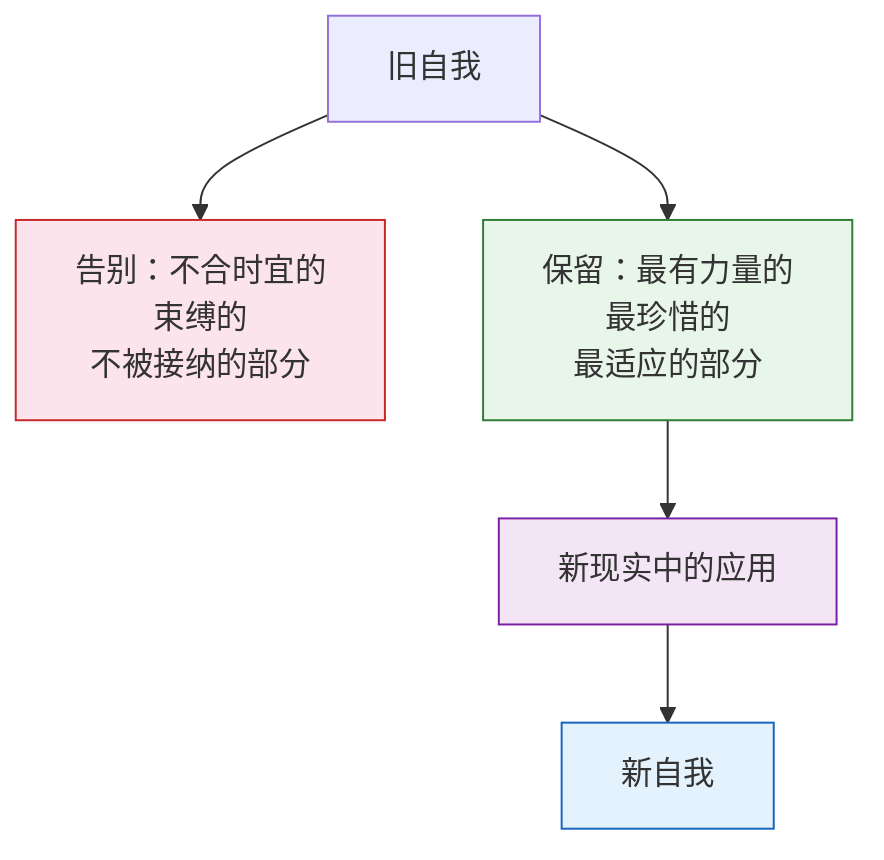
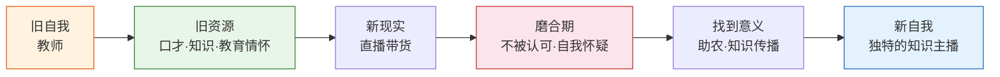

# 第29课：旧能力的新应用——如何整理旧自我的资源

从这一课开始，我们进入自我转变的第三个阶段：**踏上新征程**。前面两个阶段——响应召唤和脱离旧自我——你已经做了最艰难的选择，告别了旧的自己。现在新自我开始萌芽，就像大病初愈，身体还很虚弱，但元气正在恢复。

踏上新征程的第一步，是**整理旧自我的资源**。转变是新旧自我的更替，但告别旧自我并不意味着完全抛弃原来的自己。你告别的只是自我里最不合时宜、最束缚你、最不为现实所接纳的部分——而让原来自我中最有力量、你最想要、最适应现实的那部分长起来。它们是隐藏在旧自我中、新自我的种子。

> 新自我是从旧自我的土壤里长出来的。新自我的成长可以归纳为一句话：**旧自我的资源在新现实中的应用。**

## 什么是旧自我的资源

旧自我的资源包括你原来的经验、能力、才情、抱负、关系、理念等等。它是你在旧自我中最珍惜的部分，是你经历转变却仍然想要保留的部分。你舍不得丢弃它们——甚至你经历转变就是为了保留这部分的自我。

如果没有适应新的现实，自我不会成长，你就不知道自己是谁；如果没有与旧自我的连结，自我没有来处，你同样不知道自己是谁。

## 案例一：董宇辉——从教师到主播

董宇辉跟随公司从教育行业转型到直播带货。直播行业要么被帅哥美女把持，要么被本来就有名气的网红把持——他闯入直播界，像个行业外的陌生人。他唯一拥有的是旧自我的资源：**英语好、口才好、教师身份寄托的独特情怀。**

他失去了教师的身份和讲台，但旧自我中最重要的作为教师的口才和情怀保留了下来。他带着这个旧资源进入新现实——不像很多主播努力卖货，他会讲很多知识、教大家英语。

但这个过程并不一帆风顺。最初很多人不欣赏他——有人觉得不够帅，有人嫌话太多不好好卖货。**旧自我和新现实需要磨合。** 这种磨合不只来自主播自己，也来自听众。行业已经建立的标准主导着大家对主播的认知，他不符合这个认知的部分在被接受之前也会被诟病。

后来，旧自我和新现实擦出了奇妙的火花。很多人说去直播间逛逛却学到很多英语知识，莫名其妙下了单——买的东西好像变成了一种知识付费，直播间变成了另一个独特的课堂。

> 他并不能那么轻易接受自己只是一个销售。直到有一天，他了解到农产品的故事——甘肃的一个村里，年轻人都走了，留下来的老人仍然在照顾田地、苦苦维持生计。那一刻他知道：这就是我做这件事的意义。经由这个意义，他重新找回了自己。

**旧自我中最被珍视的部分——情怀、知识、才华、能力——并没有消失。** 在新的场景中，它们创造了新的意义。当用到它们的时候，人们认出来：没错，那就是你。

## 案例二：褚时健——从亚洲烟王到种橙人

褚时健曾是亚洲烟王、风光无限的企业家。在经历了女儿离世、身陷牢狱、因严重糖尿病保外就医之后，已经是75岁高龄。生命似乎再也没有留给他足够的时间东山再起。

他和老伴回到了当年做知青时的哀劳山——他起步的地方。人在绝境中，总会回到过去寻找原点。他想做些事，却不知道该做什么。很多烟草厂请他去当顾问，他都拒绝了——那不是他想要的自己。

他为什么想到了种橙子？

**偶然的原因**：一个亲戚去看他时带了自家种的橙子，他觉得好吃，留下了印象。
**必然的原因**：他在经营红塔山时有过烟草种植的经验，这是他工作中最有成就感的一部分，也是他旧自我中重要的资源。相比于烟草生意的经验，**种植是他更珍惜的旧自我的资源。**

在失落的时候，人总是想亲近自然，而种植本身就有重生的象征意味。对于经历过挫折的人来说，还有什么比播下种子、收获果实更有希望和重生的意义呢？

> 王石去哀劳山看他时，他意气风发地指着面前的一大片小树苗说："五年以后，这些树就能挂果了。"他好像一点都不在乎五年以后他已经是八十多岁的高龄了。那一刻，他想的未必是褚橙以后的成功——那一刻他只是重新找回了自己。

不是红塔山那个看起来风光无限的自己，而是哀劳山那个开始奋斗的自己。

## 旧资源的核心作用：重新发现你自己

你可能会问：如果旧自我的资源和新的情境不匹配怎么办？

你不需要匹配，你也做不到完全匹配。董宇辉不会马上了解电商直播的逻辑，褚时健不会知道水果种植的知识。从本质上，**旧自我的资源不是为了让你适应新的环境**——新情境需要的新能力和资源，是你进入这个行业以后逐渐发展起来的。

> [!TIP]
> 我讲的不是简单的能力和资源迁移的故事，也不是如何成功的故事。我讲的是**如何重新发现自己的故事**。
>
> 旧自我的资源最核心的作用，是帮助你重新发现你是谁。它通过给你一个线索，帮助你把新的场景和原来的自我联系起来。旧自我的资源，就是为了让你重新找回你自己——那个和原来一样，但又不一样的自己。

自我的重生，就是我们重新找回自己的过程。它与我们过去那个最深层的、最有力量的自我遥遥相望。也许你走过了很多路以后，逐渐忘记了它、迷失了它——现在在新的情境中，你反而有机会把它找回来。这时候，重生就开始了。

> [!WARNING]
> 不要把旧资源的整理理解为"把旧技能搬到新岗位上"的功利操作。它的真正用意是回答一个更深的问题：**在所有这些改变中，什么是我最珍视的、不愿意丢掉的？** 那个东西，就是新自我的种子。

---

> [!QUESTION] 自我检查
> 1. "新自我是从旧自我的土壤里长出来的"——这句话的含义是什么？告别旧自我意味着完全抛弃原来的自己吗？
> 2. 董宇辉和褚时健的转变中，各自旧自我中最核心的资源分别是什么？
> 3. 旧自我的资源在新自我重建中发挥的最核心作用是什么？如果旧资源和新情境不匹配该怎么办？

参考答案

1. 告别旧自我不是完全抛弃原来的自己，而是**告别自我里最不合时宜、最束缚自己、最不为现实所接纳的部分**。旧自我中最有力量、最珍惜、最适应现实的那部分保留下来，成为新自我重建的基石。没有新现实的挑战，自我不会成长；没有旧自我的连结，自我没有来处。
2. 董宇辉的核心旧资源是**作为教师的口才、知识储备和教育情怀**；褚时健的核心旧资源是**种植经验**（而非烟草生意经验）——种植是他工作里最有成就感的部分，是他更珍惜的旧自我资源。
3. 最核心的作用是**帮助重新发现你是谁**——它通过一个线索把新场景和原来的自我联系起来，让你在新的情境中重新找回那个最深层的、最有力量的自己。如果旧资源与新情境不匹配，不需要强求匹配——新情境需要的新能力是在进入行业后逐渐发展起来的。旧资源的作用不是"适应新环境"，而是"提供自我认同的连续性"。

---

继续学习：[[0030-zhong-xin-zi-wo|第30课：中心自我和边缘自我——如何切换]] | [[reference/glossary|核心术语表]]