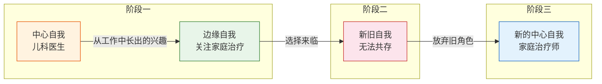
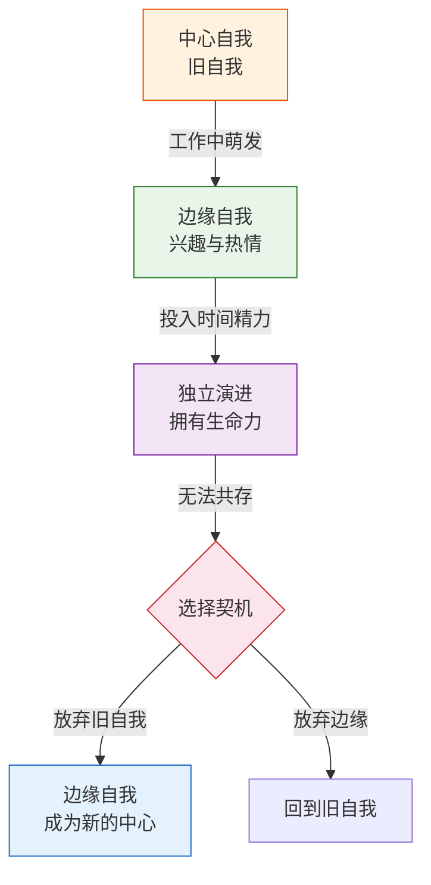

# 第30课：中心自我和边缘自我——如何切换

整理旧自我的第二条思路，是理解**中心自我与边缘自我的切换**。人有很多个自我，在某些时段，某些自我占据了舞台中心，另一些则变成了舞台边缘的配角。中心自我代表最适应现实的那个"我"，而边缘自我则寄托了现实以外的"我想要"。在转变期，当长期处于中心位置的旧自我消失，某个边缘自我就有潜力成长为新的中心自我。

## 边缘自我从哪里来

边缘自我是"我想要的"从现实这个容器中溢出来的部分。如果说灌溉而成的中心自我是一棵大树，那边缘自我就是树荫下的花花草草——最开始伴随大树而生，但随着生长，它们会变得五颜六色、越来越显眼。当大树不在的时候，我们发现还可以把这一片改造成一个比原来更美的小花园。

### 案例一：从儿科医生到家庭治疗师

有一位家庭治疗师，原本是儿科医生。他在门诊时发现，很多过敏、高热、惊厥的孩子，治疗效果与父母的表现有很大关系——父母镇定，孩子就很快镇定；父母慌张，孩子就更加慌乱。他第一次意识到父母和孩子之间存在一种情绪链。

这个发现让他开始关注父母的情绪。他进一步发现，父母的情绪背后常常是多年未解决的矛盾——这些复杂的矛盾是他不理解的。于是他开始关注家庭治疗领域。

**最初的边缘自我是从中心自我长出来的**——他对家庭治疗的关注，只是为儿科医生工作服务的补充。但这个边缘自我一旦长出来，就舍不得丢掉了。他觉得只开药而不顾孩子的家庭系统太简单了，可是又没有能力治疗整个家庭。

他开始用调休的时间参加各种培训——这是在"构造一个容器"来培育新自我。但儿科医生很忙，加上培训奔波，他慢慢吃不消了。当新旧自我无法共存时，选择的契机来了：必须要在儿科医生和家庭治疗师之间做出选择。

他发现原来只是边缘的家庭治疗师自我变得不可放弃了。他离开了医院，成为一名家庭治疗师。但这个转变也不是一蹴而就的——他经历了长时间的失落和痛苦，客源不足，靠着医院同事介绍才挨过了最难的一段。

### 案例二：从IT男到作家

采铜（你可能听过他的名字）心理学博士毕业后到IT公司做用户研究。他的兴趣是写作和研究，曾经想当大学老师。但当他进入另一种现实时，研究和写作的需要有了另一种表达——他把用户研究领域的经验整理成心得分享，慢慢变成了业界小有名气的大神。

这种写作和分享的习惯迁移到了新兴的分享网站，领域也逐渐扩大——从用户研究变成了学习心得和职场感悟。写作和分享本身脱离了原来的工作，有了自己的生命力。直到新的现实需要他在原来的工作和专职写作之间做出选择，他开始写"精进"系列的书。写作帮他完成了从边缘自我向中心自我的切换——从一个爱分享的IT男变成了一个作家。

## 边缘自我的演化规律

从这两个故事可以看到一个共同的模式：

1. **萌发**：边缘自我从中心自我的工作中或生活中萌发，回应内在的兴趣和价值取向
2. **独立**：随着它进入现实、不断添加新材料，开始有了自己演进的进程，拥有了独立的生命力
3. **选择**：当新旧自我无法共存时，选择的契机到来，边缘自我变得不可放弃
4. **切换**：边缘自我成为新的中心自我

> [!TIP]
> 边缘自我演进的动力来自我们自身内在的需要，而非外在的要求。当它变成中心自我时，你更愿意投入时间和精力，更有行动的可能——而这些行动正是新自我成长最关键的因素。

## 如何寻找你的边缘自我

当旧自我逐渐不合时宜时，去哪里寻找边缘自我？很多线索都指向它：

- 你曾经的梦想
- 你做过的最有成就感的事
- 你最敬佩、最向往的人
- 你原来工作中最让你享受的部分

可以问自己两个问题：

> 1. 在我曾经做过的事情里，哪些是就算一时看不到回报，我仍然愿意去做的？
> 2. 这个事情背后有一个怎样的"我自己"？

新自我的种子早已在旧自我中种下，就在那些你在原来的自我中最热情、最愿意投入的地方。

> [!WARNING]
> 对很多处于转变期的人来说，边缘自我并不代表新自我——它们只是值得探索的起点。那位转行的家庭治疗师面临训练不足、客源不足、别人是否信任他的难题；半路出家的采铜也面临写作技法和题材的难题。边缘自我只是新自我一个值得探索的开始，想要变成新的中心自我，还需要克服很多难题。
>
> 但对于身处转变的人来说，拥有一个开始就已经足够了。

---

> [!QUESTION] 自我检查
> 1. 什么是中心自我？什么是边缘自我？它们在转变期各自扮演什么角色？
> 2. 边缘自我最初是如何产生的？它和中心自我是什么关系？
> 3. 为什么说"边缘自我并不代表新自我"？从边缘自我到新的中心自我需要经历什么？

参考答案

1. **中心自我**是最适应现实的那个自我，长期处于舞台中心；**边缘自我**是寄托了"现实以外的我想要"的那些部分，位于舞台边缘。在转变期，当中心自我消失时，某个边缘自我有机会成长为新的中心自我。
2. 边缘自我最初是从**中心自我中长出来的**——在从事中心自我的工作时，有一些兴趣、热情超越了工作本身的要求，回应了内在的价值取向。它最开始像是大树下的花草，伴随中心自我而生。
3. 边缘自我只是一个**值得探索的起点**，要真正变成新的中心自我，还需要克服很多现实难题：能力不足的怀疑、外部资源的缺乏、他人信任的建立等。转变需要经历从"萌发"到"独立演进"再到"选择切换"的完整过程——拥有一个开始已经足够，但实现它还需要耐心和行动。

---

继续学习：[[0031-shen-ke-ti-yan|第31课：深刻体验——自我的内核从哪里来]] | [[reference/glossary|核心术语表]]