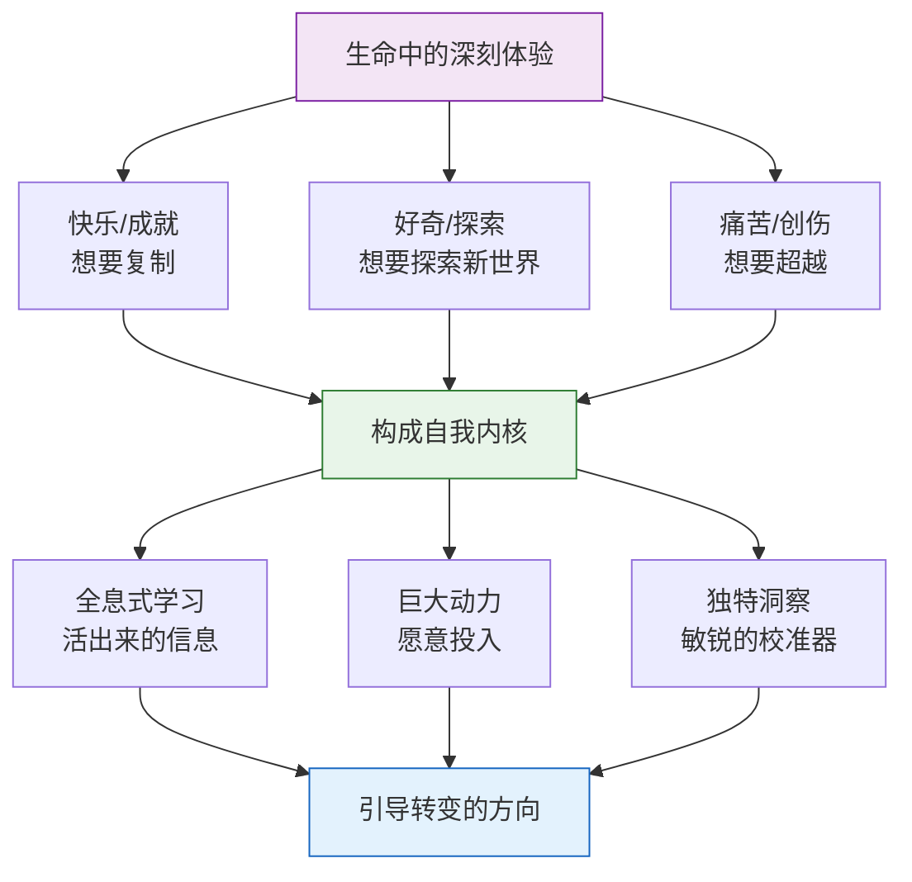
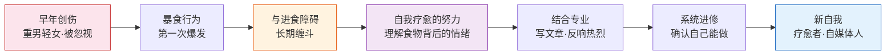

# 第31课：深刻体验——自我的内核从哪里来

前两课讲了整理旧自我的两条思路——旧能力的新应用和中心自我与边缘自我的切换。你可能会问：旧能力很多，究竟哪个会变成新自我重建的基础？边缘自我也很多，究竟哪个会成长为新的中心自我？选择背后的依据是什么？

答案是：**你生命中的深刻体验。**

这些深刻体验，或是带来巨大的快乐和成就（让你想要复制它），或是带来强烈的好奇（让你想探索新世界），或是带来巨大的痛苦（让你想要超越它）。它们构成了自我的内核。

## 为什么深刻体验是最重要的资源

### 第一，全息式的学习

深刻体验不同于外在知识或理论。它是完全通过生命历程"活出来"的信息。你在其中感受到的东西，远远比你能说出来的要深刻得多。它深深地嵌在你的自我里，变成了某种潜意识的反应，引导着你的选择。

### 第二，连接着巨大的动力

深刻体验让你愿意投入去做一件事，并觉得它有意义。尤其是当体验包含着巨大痛苦时，人会有很大的动力去关注这些痛苦、超越这些痛苦——而这些超越的努力，引导着我们的选择。

> [!EXAMPLE]
> **阿德勒**——提出自卑补偿理论的心理学大师。幼年患佝偻病、又矮又丑，而哥哥又高又帅，让他深感自卑。五岁时差点因肺炎去世。自卑变成了他奋斗的动力，也变成了他研究的主题。
>
> **埃里克·埃里克森**——以身份认同理论闻名于世。生父在他出生前就离家出走，母亲改嫁一位儿科医生。他童年时不知道自己并非继父亲生，但总有一种"不属于这个家庭"的感觉。他在德国人的学校被视为犹太人（异类），在犹太人的圈子里被视为异教徒（异类）。这种困惑驱动了他对身份认同的研究。

### 第三，提供独特的洞察和校准器

生命中重要的深刻体验，为你带来了跟这种体验相关的洞察。经验变成了一种敏锐的校准器——你可以通过它来判断什么对、什么不对。一旦具备了把经验整理成知识和理论的能力，你就有了一种别人无法匹敌的洞察。

## 深刻体验如何引导转变：一个完整的故事

一位朋友在做关于"正念饮食"的自媒体，针对进食障碍人群。她是如何走上这条路的？

她出生在重男轻女的家庭。妈妈自己过得很苦，也要求女儿和自己一样为家庭牺牲——女儿穿哥哥穿剩下的、玩哥哥玩过的玩具，剩菜剩饭总是让女儿来吃。哥哥去县城上初中后，每周末回家妈妈都会做一桌好菜。等她也去县城上初中，第一个周末回家，满心期待妈妈也会如此——结果回到家，什么都没有，家里人已经吃过了，只留下冷饭剩菜。

**这种巨大的失落让她开始了第一次暴食。** 她说那时第一次有一种"想把自己吃窒息"的念头。

她无法表达的失落和愤怒，通过暴食来表达。进入青春期，进食又和自我形象结合起来——为了减肥开始极端节食，遇到挫折又开始暴食。进食障碍成了贯穿整个成长进程的主题。

> 与进食障碍相伴的，是她不断尝试治愈自己的努力。从说不出自己的委屈，到能说出自己的委屈；从冲动性的暴食，到慢慢能控制自己的情绪。与进食障碍的缠斗，就这样过了很多年。

研究生毕业时她发现，自己对所学的专业毫无兴趣。她唯一真正熟悉和感兴趣的领域，是一直让她痛苦的进食障碍。为了生活她进入一家新媒体公司做数据分析——慢慢地了解了新媒体背后流量的秘密，但也觉得无聊。

正当她寻找出路时，她结合自己的经验写了几篇关于进食障碍的文章，发现流量不错，有很多有相似问题的人来找她。重要的经验开始指引她：**我能不能把这个当作自己的事业？**

她去医院的进食障碍中心进修，发现长期与进食障碍斗争的经验让她理解这些人微妙的心态，甚至比讲课的老师更知道什么对他们有用。于是她专心做起了自媒体，开发针对进食障碍的训练营。

> 最初寻找出路是为了疗愈自己。当积累了足够多改变的经验，这种经验不仅疗愈自己，也可以疗愈别人。这是最大的转变——**角色的变化：从患者变成疗愈者，从受惠者变成施惠者。**

我问他什么时候觉得自己走出了作为患者的门、走进了作为疗愈者的门。她说：

> "我从来没有走出过这扇门。我一直在同一条路上。我所经历的进食障碍是这条路的一部分，我现在跟很多进食障碍者工作也是这条路的一部分。我甚至不确定自己是否已经疗愈了——从暴食发生的频率看，我已经好了，但我也不确定有一天情绪崩溃会不会重新开始暴食。只是我已经不再那么害怕这件事了。"

她不想把患者和疗愈者的角色分开，因为这都是她重要的经验，都在她的转变中起重要作用。

## 在转变期激活深刻体验

当我们处在被社会规范的旧自我中时，很多重要的生命体验，尤其是那些与现实无关的体验，会一直沉睡。可是当转变期来临，它们常常被重新激活，指引着你去接近它、克服它、与它产生连结。

当你所做的事与这种深刻的体验结合起来，你就会觉得：**我这是在"做我自己"。**

很多转变都与自己的深刻体验有关——赚钱的动力来自童年贫困带来的窘迫感，想当医生来自面对疾病的那种无力感，想当老师来自学生时代遇到的好老师带来的正向经验。这些经验让我们想以不同的角色，重新去经历和体验它。

> [!WARNING]
> 当然，只有这些重要的经验不会帮你完成转变。你还需要专业技能，以及在现实中实现它的方式。但是在转变期，这些重要的经验会变成一种有用的指引——告诉你哪个方向值得探索，什么对你真的有意义。

---

> [!QUESTION] 自我检查
> 1. 为什么说生命中的深刻体验比外在知识或理论更重要？它具备哪三个特点？
> 2. 阿德勒和埃里克·埃里克森的例子说明了什么？他们的研究主题与个人经历有什么关系？
> 3. 进食障碍的案例中，主人公从"患者"到"疗愈者"的转变，最本质的变化是什么？她是否真正"走出"了患者的身份？

参考答案

1. 三个特点：(1) **全息式学习**——通过生命历程"活出来"的信息，深深嵌在自我里；(2) **连接巨大动力**——让人愿意投入并觉得有意义，尤其是超越痛苦的动力强烈地引导选择；(3) **提供独特洞察**——经验变成敏锐的校准器，能判断什么对、什么不对，一旦结合专业能力，就有别人无法匹敌的洞察力。
2. 这两个心理学家的研究主题都直接源于他们自身的生命经历。阿德勒的自卑驱使他研究自卑补偿；埃里克森因身份困惑（既不属于德国人也不属于犹太人）而研究身份认同。他们的个人创伤变成了学术创造力的源泉。
3. 最本质的变化是**角色的变化**——从"被问题困扰的人"变成了"帮助别人解决同样问题的人"。但她并没有真正"走出"患者的身份——她说自己一直在同一条路上，两种角色都是她重要经验的一部分。关键变化是：她已经不再那么害怕了。她与痛苦经验的关系从"被它控制"变成了"与它共存并利用它帮助他人"。

---

继续学习：[[0032-bang-yang-dao-shi|第32课：榜样和导师——谁是你的守护者]] | [[reference/glossary|核心术语表]]