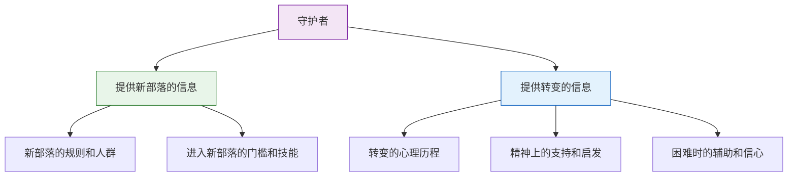
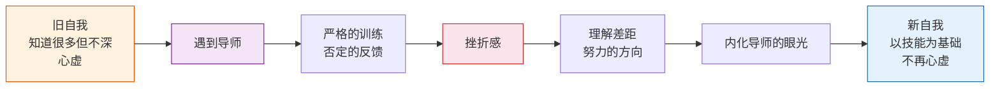

# 第32课：榜样和导师——谁是你的守护者

踏上新征程并非孤身一人。你需要一个守护者。

"守护者"这个概念借鉴自神话学家坎贝尔的英雄之旅。在神话故事中，当一个英雄要踏入新世界的领域，总会有一个领路人告诉他新世界的信息——就像哈利波特里的海格，或魔戒里的甘道夫。他们熟悉新世界的规则，也熟悉一个人进入新世界所要经历的心理历程。

为什么需要守护者？你可以把新旧自我的更替理解为**在不同部落之间的迁徙**——进入一个新的、更能接纳和认可你的部落，需要有一些引领者。

## 守护者能为你做的两类事

守护者既可以很近，也可以很远；既可能来自现实，也可能来自幻想。最重要的是，他能够提供一种**认同的对象**，让你跟更遥远的部落发生联系。

## 榜样：理想化自我的具象化

在转变期，我们对自己的理想有一些模糊的印象，还没有确定的形状。榜样就是这样一座桥梁——你通过认同特定的对象，与他产生特别的情感联系，而这种联系又与你内心想要成为的自己遥相呼应。

榜样会激发这种感觉：**"对，这就是我想要活出的样子。这就是我想要成为的人。"**

> 你寻找一个榜样不是为了看清这个榜样，而是为了看清你自己。

### 如何寻找榜样

带着三个问题，不断去寻找能打动你的人：

1. **如果可以，我希望能像谁一样活？**
2. **你从他身上看到了哪部分的自己？**
3. **如果他在你所在的境遇，他会怎么做？**

### 一个榜样的故事

在我自己离开高校、经历迷茫的时期，我读到了威廉·布里奇斯的《转变》这本书。其中一个情节深深打动了我：他离开大学以后，他的孩子问他——"你不是大学老师了，那你是谁呢？"这种困惑和我所经历的太像了。这种感受的共鸣，让我觉得自己好像跟他建立起了某种特别的联系。

我觉得他像我，我也能读懂他。这可能是理想化的产物，但这种理想化让我愿意接受他的启发和影响。

威廉·布里奇斯后来做了一个转变的课程。我看了他做的事以后就想：这件事也同样吸引我——我也可以做一个转变的课程，把我所经历的转变的经验，交给正处在转变期的人。这个想法就变成了新自我的种子，又变成了这门课的雏形。

> [!TIP]
> 其实我并不认识他，不知道他在现实中怎么样。现在关于转变的知识也不完全来源于他，而有很多自己的理解。可是当你遇到一个这样的榜样，他的选择就会启发你，他所经历的困难也会提示你。当你遇到相似的困难，你会想"这道题我见过"——就好像他的经历代替了你的经历，于是你就变得不那么害怕。这时候，他就变成了你的守护者。

## 导师：现实中的领路人

如果说榜样代表的是遥远的、理想化的自我，那导师就是**现实生活中的领路人**。他常常在一个比你更高的位置，不仅能告诉你新世界的信息，还能协助你完成从旧自我向新自我的转变。

### 专业技能与身份认同

如果你想进入某个新的领域，常常需要学习很多专业技能。专业技能是身份认同很重要的一部分——有时候你只有会这件事，才能是这个人。你不会写作就不能说自己是作家，不会做心理咨询就不能说自己是心理咨询师。

如果你的新自我与某种特定的技能相联系，你就需要找一个导师。

### 关于我自己的导师

虽然我在大学里也做心理咨询，但所受的专业技能训练是不够的。我参加了各种培训，学到了很多知识和技能——但这些知识是外在于我的，远远没有变成我的一部分，更没有真正改变我。从学校出来，我还是很心虚的。知道的东西很多，但是不深。

直到我遇到我的老师——一个业内公认的大师。我观察她的家庭治疗工作，那些家庭总能在咨询室里表露他们最深的情感，这些情感深深地打动了我。

她的训练非常细致，常常从一句话开始引申。指导我的方式就是从每一句话里听出思维不足的地方。最开始，我回答她的每一句话、每一个问题，得到的都是否定的反馈——这当然引起了很多挫折感，好像什么都不会了。可是如果抛开这种自我情感，去理解她否定的内容，就会发现：**我的反应和她要求的反应之间确实有差距，而这正是需要努力的方向。**

> 跟他学习了很多年，我开始学习用她的眼光看来访者，也学习用她的眼光看我自己。慢慢的，这些专业技能长成了我自己的一部分。跟这些专业技能相连的是我的身份认同——她把我引到了一个新的部落，一个以专业技能为身份标签的部落。因为我真的会了，我就不再心虚。我知道自己已经成了一个新自我。这个新自我以你会的东西为基础——任何人都没有办法剥夺，你也不会再失去它。

### 培训 vs 导师

如果只是接受专业培训，缺少一个最重要的东西：**人的影响**。影响是发生在人和人之间的。如果你有一个导师，把他看得足够重，他对你的影响也会足够深——慢慢的，他的眼光会变成你的眼光，他的思考会变成你的思考。这样你才能说你学到了他的一些东西。如果他对你不够重要，你就很难接受他的影响。

> [!WARNING]
> 找一个好导师不容易，但其实导师找一个好学生也很不容易。如果遇到了一个好学生，他也很愿意把自己的东西传承给你。

### 如何寻找导师

问自己三个问题：

1. **在你想要去的领域，你最愿意视谁为你的导师？为什么？**
2. **你可以从哪里接近他，跟他产生联系？**
3. **你能为他提供一些什么样的信息和帮助？**

第三点很重要。你当然希望他为你提供帮助，但最开始也不能只把自己定位为一个求助者。如果你能跟他有其他形式的合作，这种合作也许会成为更深的连结的开始。

---

> [!QUESTION] 自我检查
> 1. 什么是守护者？守护者能为我们做哪两类事情？
> 2. 榜样和导师有什么区别？各自的核心作用是什么？
> 3. 为什么说"专业培训"不能完全替代"导师"？导师最不可替代的东西是什么？

参考答案

1. **守护者**是引领你进入新领域的人——就像神话故事中引领英雄进入新世界的领路人。他做两类事：(1) **提供新部落的信息**——规则、人群、门槛、所需技能；(2) **提供转变的信息**——心理历程、精神支持、困难时的辅助和信心。
2. **榜样**是遥远的、理想化自我的具象化——你通过认同榜样来"看清你自己"；**导师**是现实中的领路人，他在更高的位置，通过传授专业技能帮你完成从旧自我到新自我的转变，并把你引入一个新部落。
3. 培训可以传授知识和技能，但缺少**人的影响**。导师最不可替代的是：他的眼光会变成你的眼光，他的思考会变成你的思考——这是一种深刻的内化过程。只有当你把一个人看得足够重，他的影响才会足够深，专业技能才会真正"长成你自己的一部分"。

---

继续学习：[[0033-xin-qun-ti|第33课：新群体——如何拥有新的归属感]] | [[reference/glossary|核心术语表]]