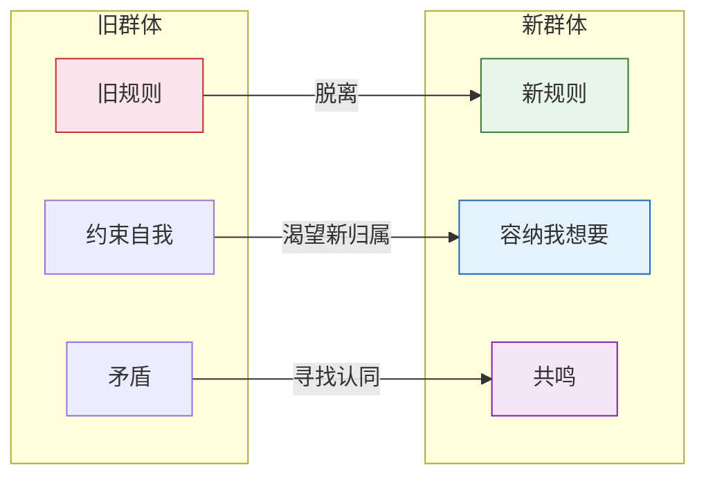
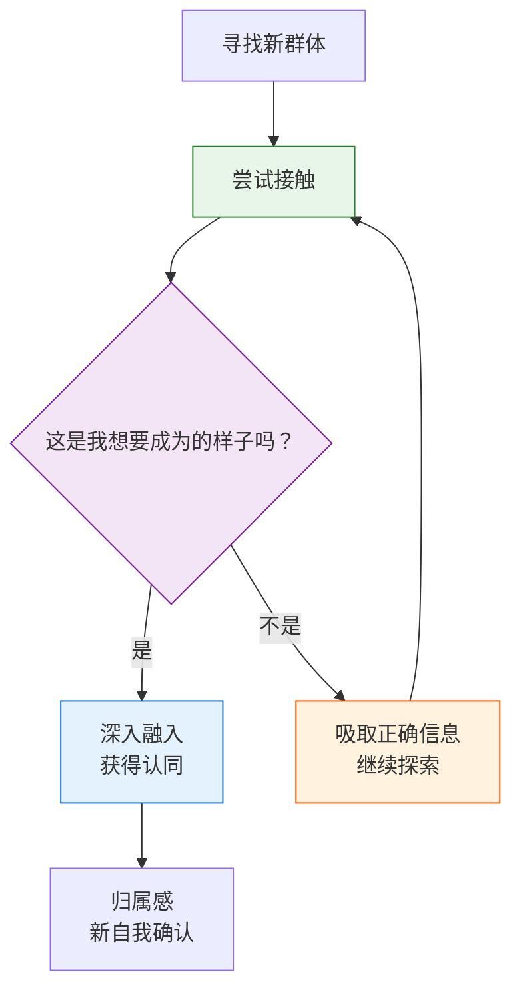

# 第33课：新群体——如何拥有新的归属感

前两课讲了两种认同对象——榜样和导师。今天讲第三种：这不是一个具体的人，而是一群人。当你跟这群人在一起时，会深刻地感觉到与他们之间有情感的共鸣。你觉得自己属于他们，并想以这种角色和身份继续生活。

**人需要一种归属感。** 哪怕是一种抽象的归属感，它也能提示你是谁，让你安心。

## 新群体 vs 旧群体

同样是归属一个群体，新群体和旧群体的区别是什么？

> 旧群体常常基于旧的规则，这些规则与我们内心自我的需要相矛盾；新群体会为更多的"我想要"留下空间。寻找新群体的过程，就是寻找新自我的过程。

当你一个人走一条路的时候，你会怀疑。可是如果看到一群人一起走一条路，你就会相信这条路是能走通的。榜样的作用是"点亮前方"，导师的作用是"带着你走"，而新群体的作用是**提供归属感和安全感**——让你知道，你不是唯一走这条路的人。

## 寻找新群体的三条原则

### 原则一：去尝试接触

这句话很直白，但很多人做不到。他们被困在自我怀疑里：这真的是我想要的吗？我配吗？他们这么忙会搭理我吗？如果我被拒绝了怎么办？

很多时候进入以后就会发现，新群体并没有那么高不可攀。你的自我怀疑，只是因为你对这个新群体陌生，只是因为你觉得自己的"我想要"是微不足道的。

> [!TIP]
> 托尼·法德尔——iPod的发明者、硅谷知名大佬——关于如何联系圈内大咖，他在书里写了一个最简单的办法：通过自媒体账号联系他们。当然联系时不能只是简单地说"我想要怎么样"，不能只做一个求助者，也要做一个连结者和贡献者——认真告诉他们你对他们的作品的看法。
>
> 他说这种连结其实比我们想象的容易。很多转变过来的人也给了我同样的经验：真正的难点在于你要主动去联系他们。当你真的去做了，常常会发现这种接触比你想象的容易。

一位学员原本在学校当老师，想转行做手势设计师——这是一个很小的领域，大家都觉得转型不现实。但他梳理资源时发现，当地大学的设计系就聘请了一位知名的手势设计师。他很忐忑地托朋友约人家见面，本来只是想打听去哪里学习比较靠谱——结果那个设计师说："我愿意亲自教你。"这为他打开了新世界的大门。后来我联系他时，他已经在意大利学习了，他说："看到这么多世界各地的同学，我觉得自己就是他们中的一员。"

### 原则二：从错误的群体中吸取正确的信息

当你去一个新的领域，很难一开始就找到让你完全认同的新群体。这是一个曲折探索的过程。虽然错误的群体无法带给你身份认同，但它们常常会提供一些正确的信息。

> [!EXAMPLE]
> 一位朋友最初做人力资源工作，想转行做心理咨询师。他先考了心理咨询师资格证——通过考证认识了一些同样想转型的朋友，了解了圈内认可的培训项目。他又去参加心理咨询师的年会，还去一所大学心理系读了在职研究生——但又失望了，因为那边的培训主要是做调查和研究，不是他想要做的临床咨询。招生的老师甚至劝他："你原来做的工作多好，可别误入歧途。"
>
> 但这些经历同样提供了信息：通过跟这个群体接触，**给了他一种反向的身份认同**——他确认了自己绝不仅仅是要一个文凭，而是要学习真正的咨询技能。他由此知道了自己真正想要追求的是什么。

### 原则三：不断问自己"这是不是我想要成为的样子"

无论是榜样、导师还是新群体，都是寻找自我认同的过程。当你跟新的人群接触时，会不停问自己：这些人是不是我要活成的样子？如果是，他们的状态在哪里吸引我？如果不是，那我要活成的样子跟他们的不同在哪里？

这条原则让所有信息都有了校准的基础。在转变期，你对这个问题的感受会变得分外敏感。

## 归属感的瞬间

故事的结尾：这位想做心理咨询的朋友，兜兜转转做了很多探索。有一次在培训中，他见到一位八十多岁的德国老师——严谨、认真、咨询技能精湛，谈到来访者时有一种特别深的爱和热情。

在课堂里，他遥远的经验——那些回想和渴望——得到了某种共鸣。他心里忽然有了一种确定感：他很想成为像那个老师那样的人，希望自己能像他那样活着——等到八十岁的时候，也可以这样面对自己曾经帮助过的人。

那天晚上培训完，他去食堂吃饭。打饭的师傅问："你们是做什么的？在上什么课啊？"

他回答说：**"我是心理咨询师，上心理咨询的课。"**

说出口以后，他才发现这个回答意味深长。这是他第一次把自己跟"心理咨询师"这个角色连在一起。有一点陌生，但并不违和。也许从那时候开始，他就觉得自己属于了新群体的一员。

> [!WARNING]
> 归属感的确认，不一定是一个隆重的仪式。它可能就发生在某个平凡的瞬间——当你脱口而出一句"我是……"的时候，你发现自己已经准备好用这个新身份来定义自己了。

---

> [!QUESTION] 自我检查
> 1. 新群体和旧群体的根本区别是什么？为什么在离开旧群体之后还要寻找新群体？
> 2. 寻找新群体的三条原则分别是什么？其中"从错误的群体中吸取正确的信息"具体指什么？
> 3. 那位想做心理咨询的朋友，他是从哪一刻开始觉得自己属于新群体的？这对我们有什么启发？

参考答案

1. **根本区别**：旧群体基于旧规则，这些规则常常与内心自我的需要相矛盾；新群体会为更多的"我想要"留下空间。离开旧群体后需要新群体，是因为人需要归属感——归属感提示你是谁，让你安心。看到一群人走同一条路，你会相信这条路能走通。
2. **三条原则**：(1) 去尝试接触——主动联系，不要被自我怀疑困住；(2) 从错误的群体中吸取正确的信息——即使不匹配的群体也能提供有用的信息和反向的身份认同；(3) 不断问自己"这是不是我想要成为的样子"——让所有信息都有校准的基础。
3. 归属感的瞬间发生在他**第一次自称"我是心理咨询师"**的时候——在回答食堂师傅的提问时脱口而出。这启发我们：归属感的确认往往不需要一个隆重的仪式，它可能就发生在某个平凡的瞬间，当你发现自己已经准备好用新身份来定义自己的时候。

---

继续学习：[[0034-shi-cuo|第34课：试错——如何基于实践进行思考]] | [[reference/glossary|核心术语表]]