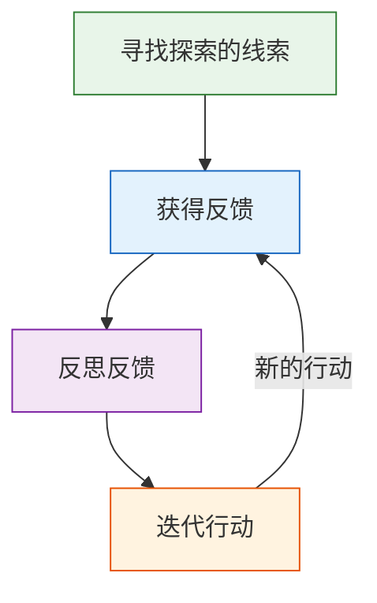
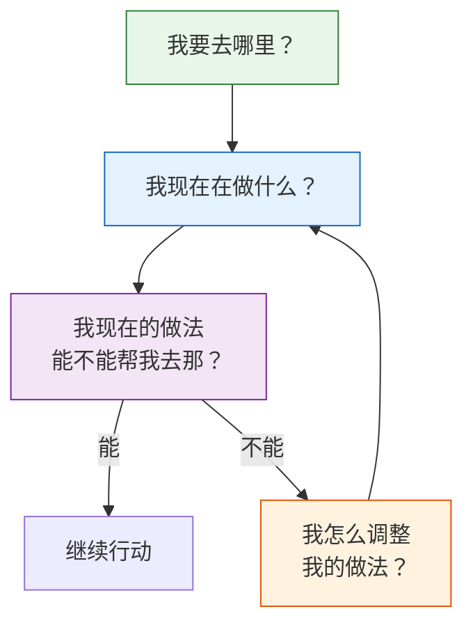

# 第34课：试错——如何基于实践进行思考

前面我们讲了重建自我的前两站——整理旧自我的资源和寻找守护者。从这一课开始，进入踏上新征程的第三站：**创造新经验**。这一站会讲一些具体的行动方案。

## "答案不在你的头脑里"

当旧自我逝去，人们总是很快想要找到一个新自我。经常有人问："老师，我怎么才能找到新自我？是不是我去整理旧自我的资源、发现自己的特长和兴趣，就能找到答案？"

我理解这种急迫。在急迫中，人们总是希望很快有一个答案。我们假设关于新自我的答案已经形成了，只是被藏在某个地方，只要找到那个地方就能找到答案。但事实并非如此。

> 如果说自我是一个故事，这个故事才进行到一半，很多关键的情节还没有发生，你怎么可能知道完整的故事呢？除非你能推动一些关键的情节，让它在现实里发生，否则你也很难知道自己是谁。

我的老师经常跟我说一句话：**"答案不在你的头脑里。"**

世界上90%以上的事不是靠想能想出来的。弹钢琴或编程这类技能，靠的是刻意练习形成的肌肉记忆；别人的反应或想法，不会通过你自己的思考知道，而需要在关系中碰撞才会理解；一件事会怎么发展，需要在实践中不断地得到反馈。

> [!WARNING]
> 过度的思考有时候是一种逃避——为了逃避艰难的实践，逃避与现实的碰撞，逃避可能的失败和他人的拒绝。如果思考变成一种逃避，现实中的难题就变成了头脑中的难题：不同的想法在头脑中打架，让你充满矛盾；你不断追求虚无的平静，做不到时又不停地怪自己。
>
> 你有没有想过——也许问题不是出在你没有想明白一件事，而是因为你想得太多了？

## 实践的四个环节

如果答案不在你的头脑里，那它在哪？它在我们与世界的互动中。你需要通过一系列包括"思考-行动-反馈"的连续实践环节来完成。这个过程包括四个环节：

### 环节一：寻找探索的线索

线索和答案的区别：**线索是一个开始（探索过程的起点），答案是一个结尾（探索过程的终结）。**

很多探索的线索常常包含偶然因素：
- 那位转行当心理咨询师的朋友，最开始探索的不是心理咨询，而是考注册会计师——只是身边有朋友去考心理咨询师证，他觉得可以试试，才跟着去考了
- 那位转行做手势设计师的朋友，最开始尝试过绘本和自媒体——后来跟家人旅游，看到海边的海螺很漂亮，才想到做成手势
- 褚时健最开始想的也不是种橙子，而是做云南米线——发现餐饮费体力不适合自己，才放弃

> [!TIP]
> 经常有人问"我怎么才能找到真正的热爱？"——他们还是在找一个**答案**，而不是一个**探索的线索**。他们把热爱看得太重了，重到好像要承载整个新自我，要把他从无力中拯救出来。一旦选错就好像满盘皆输。
>
> 探索应该是**轻的**。线索常常是偶然的，你需要抱着试错的心态去做。只要尝试的代价在你可承受的范围内，就完全可以试着去做。

### 环节二：获得反馈

每个尝试的行动都会获得一些反馈。这个反馈综合了两个方面：

- **外在的可能性**——这条路径是否现实？是否有可持续探索的基础？
- **内心的感受**——你做这件事的投入程度，以及由此获得的成就感

外在的反馈和内心的感受常常相辅相成——取得更大的进步、被更多人看见，也会影响内心的感受。但如果一定要选，**内心的感受**（你愿意投入一件事的程度）要大于对外在可能性的判断。

> 因为当你投入做一件事的时候，你更会觉得自己是在做自己。这种"做自己"的感觉，常常与我们过去的重要愿望遥相呼应。

那位转行做手势设计师的朋友说：他从小梦想画画，初中时看到意大利服装设计师范思哲的传记，"完全迷晕了我，原来世界上还有这样不可思议的艺术世界。由此我找到了人生理想——成为一名服装设计师。"但这个理想被父亲严厉打压，最终破灭了，他找到了稳定的工作。当开始做手势设计时，那种投入专注的快乐让他意识到：**那个童年没有完成的理想，现在又回来了。**

### 环节三：反思反馈

当反馈不如意时，需要思考它意味着什么。不同的情况需要不同的判断：

| 反馈情况 | 可能的含义 | 应对 |
|----------|------------|------|
| 完全没法投入 | 探索方向可能错了 | 调整方向 |
| 投入了却没有效果 | 时机可能不对 | 保留种子，等待合适契机 |
| 愿意投入且时机合适，但缺少技能 | 需要学习和训练 | 投入学习新技能 |

这种反思不是逃避，而是对实践经验的总结——它的目的是让我们进入下一个环节。

### 环节四：迭代行动

带着反馈带来的思考，开始新的尝试，再根据现实给予的反馈，做出新的行动。

## 四个问题

实践的四个环节可以简化成四个问题：

> 1. **我要去哪里？**
> 2. **我现在在做什么？**
> 3. **我现在的做法能不能帮我去那？**
> 4. **如果不能，我怎么调整我的做法？**

这四个问题的循环，就是从"寻找一个确定的答案"到"进入一段探索的过程"的思维转变。

正是从"寻找一个确定的答案"到"进入一段探索的过程"的这种思维转变，会把你带到一个新的自我。

---

> [!QUESTION] 自我检查
> 1. "答案不在你的头脑里"——这句话的含义是什么？过度的思考可能变成什么？
> 2. 实践的四个环节是什么？线索和答案的区别在哪里？
> 3. 获得反馈时，为什么要优先关注"内心的感受"（投入程度）而非"外在的可能性"？

参考答案

1. 关于新自我的答案不是藏在某个地方等着被找到，而是在你与世界互动中逐渐生成的。你无法在关键情节还没发生之前就预知完整的故事。过度的思考可能变成一种"逃避"——逃避艰难的实践、与现实的碰撞、可能的失败和疼痛。这会让你在头脑中原地打转，而不是在现实中前进。
2. 四个环节：(1) **寻找探索的线索**——偶然的、轻的、试错性的开始；(2) **获得反馈**——综合外在可能性和内心感受；(3) **反思反馈**——判断方向、时机、技能的问题；(4) **迭代行动**——带着反思继续尝试。**线索是探索过程的开始，答案是探索过程的终结**——前者是开放性的、轻的，后者是封闭性的、重的。
3. 因为当你投入做一件事时，你更会觉得自己是在"做自己"。这种做自己的感觉常常与你过去的重要愿望遥相呼应——它不仅是"这件事能不能成"的判断，更是"我借着这件事重新找回了自己"的确认。在重建期，后者比前者更重要。

---

继续学习：[[0035-xiao-bu-zi-yuan-li|第35课：小步子原理——如何迈开行动的小步子]] | [[reference/glossary|核心术语表]]