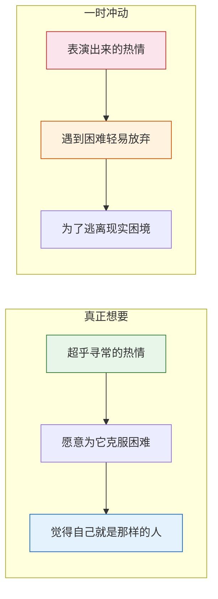
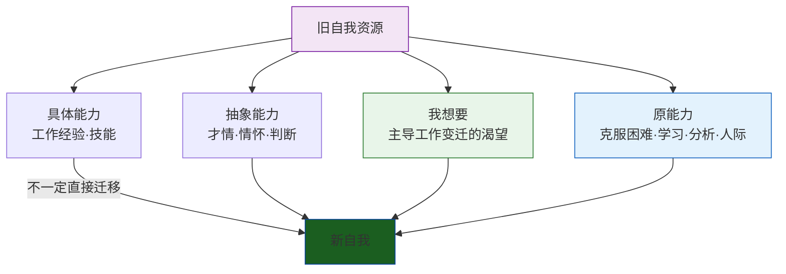

# 第36课：我爱问海贤——爱好可以作为边缘自我吗

踏上新征程的第三阶段已经完成——我们走过了三个站点：整理旧自我的资源、寻找守护者、创造新经验。在开始行动之前，或多或少都会有一些顾虑。这期的答疑课选取了四个有代表性的问题，涉及边缘自我的判断、爱好与技能的关系、榜样的寻找、以及旧资源的整合。

## 问题一：如何区分边缘自我是"一时冲动"还是"真正想要"？

> 怎么判断边缘自我是一时冲动，还是确实是自己想要的？现在年轻人有"上"的文化——去卖咖啡、送外卖、卖唱、当画家之类的——怎么判断能不能成为中心自我？

简单的判断标准是：**他做这件事时，是不是有一种超乎寻常的热情？**

这种热情表现为——愿意研究它、深入理解它、愿意为它克服困难，哪怕暂时看不到回报。他把投入这件事看作享受而不是负担。

这种热情从何而来？因为这个热情背后有一个**他喜欢的自己**。这个自己对他意义重大，他心心念念、舍不得放下，所以愿意为之付出和牺牲。

一时冲动则不同：它是因为"需要有一个爱好"——因为这个爱好有好处，可能带来成功，或者帮他逃离现实的困境。哪怕内心没有这样的冲动，他也要表演出这种热情。但本质上这是一种内心恐慌做出的表演——一旦真的遇到障碍、需要投入研究、克服困难时，就很容易放弃。

> 我们对一件事有热情，是因为这件事背后有一个自我——这个自我不仅是我们渴望成为的，而且是我们隐隐约约觉得自己**应该**成为的。我们觉得"我就是那样的人"，后来的投入只是为了慢慢实现它。这种热情最可贵的地方在于：它能帮你克服前进路上的障碍，让你走得更深更远。每一条路要成功都不容易，没有这种热情和渴望，就很容易放弃。

至于年轻人的"上"文化，如果是对现状不满就随心所欲地做一些事——他们想要的不是怎么深入做一件事，而是借着做这件事获得某种常规生活中难以获得的**自由**。自由是他们想要的，但自由没有附着在某个地方，它就会是轻的、空的，没有那种生命可以寄托其中的深度。

## 问题二：爱好可以作为边缘自我吗？

> 我喜欢做手工，但想着这些不能维持自己的生活，又去学别的东西。想做的事情很多，学习也花费了大量时间，结果都只学到了皮毛。我感觉是在以学习为借口逃避真正的问题。这算是边缘自我吗？

你说感觉在以学习为借口逃避真正的问题——这个反省很重要。你要进一步想：为什么你这么觉得？所逃避的真正问题是什么？

最开始的边缘自我，承担不起这么功利的任务——好像它要帮你完成真正的转变、成就一个新的自我。如果一开始就这么想，这个边缘自我会因太沉重而发育不良。

> 最开始的边缘自我一定不是负担，而是一种**消遣**，是沉重生活中你为自己保留的空间。

边缘自我就像一个孩子——因为他是你的孩子，你就会爱他、尽全力去养育他、希望他健康长大。你不会每天看着他问："长大了你能养家吗？如果不能，那我养你有什么用？"更不会觉得他没有养家的希望，就赶紧再换一个孩子养。

无论是手工还是别的事，要掌握一门技能很难——需要热情投入、名师指点，和很多的运气。一门技能要变成能养家的事，需要走足够远才可以。如果不是有那种热情，你很难有这样的决心。

> [!WARNING]
> 你以学习为借口所要逃避的真正问题，也许是不想面对技能学习的艰难和痛苦，又不想面对没有一技之长的自己的平庸。如果是这样，你要选择一条路：要么**勇敢地面对艰难，去掌握一样真正的技能，把你的生命跟它相连**；要么**接受自己的平庸，在这个基础上享受自己的生活**。技能和爱好恰恰是生活中留给自己的空间。不要一边保持着"通过技能学习超越平庸"的幻想，一边逃避深入其中的难题——那样你会一直飘在空中。

## 问题三：榜样和导师需要主动寻找还是等待缘分？

> 喜欢的人很多，但要说到榜样和导师，目前好像没有。小时候有榜样——字写得好或歌唱得好的——那会儿是真的有动力，结果真的发展成了加分项。可是现在好像没有这样的动力了。榜样和导师需要主动寻找，还是依靠缘分？

找榜样和导师有点像找对象——当然要主动，但也不是病急乱投医；当然要靠缘分，但不能完全无所作为。至少在心态上要做一些准备。

**首先，要有想加入某个群体的冲动。** 对某一份职业、某一类人、某一种特质，需要有一种憧憬——无论这种憧憬来自现实还是幻想。这种冲动背后是自我实现的某种渴望，会变成寻找榜样和导师的指南针。

**其次，带着这种冲动去跟很多人接触。** 让它成为潜意识里的指引。当你碰到一些人时，不停地问自己：他是我希望成为的那种人吗？如果是，那他是怎么做到的？我怎样才能成为和他一样的人？

> 所谓的榜样或偶像，不过是你想要加入的群体的具象化。你需要通过认同他们，和他们所在的群体产生某种深刻的联系。

如果你做好了心态的准备，当这个人出现，你就会认出他——他既是你主动寻找的结果，也是缘分的产物。

> [!TIP]
> 为什么不保持小时候学习写字、唱歌那样的单纯呢？那时候你有榜样，是真的有动力去学、去练。这种单纯本身，就有可能带来新的发现。

## 问题四：旧自我中有什么可以整合到新自我？

> 我想不明白旧自我中有什么是新自我可以整合的，看起来好像没有。我似乎选择了一条与从前职业生涯绝缘的路径。

自我是一个持续发展的过程。从旧自我继承的不仅有具体的工作经验和技能，也有抽象的才情、情怀、判断和职场经验。就算选择的是完全不同的工作，还是有很多旧自我的资源可以整合到新自我中。

给你一些线索：

**继承你的"我想要"。** 它主导着工作的变迁——如果不是原来的工作中有你不想要的东西，你怎么会离开？如果不是新工作中有你想要的，你怎会选它？别小看这种渴望，它会推动你去发展自己。

**继承你的"原能力"。** 原能力不是一种具体能力，而是一种**产生具体能力的能力**——比如克服困难的能力、在新领域中学习的能力、分析和判断的能力、与人打交道的能力。不同于具体的工作技能，原能力是一种更底层的创造力，来自我们跟困难打交道的经验。

为了发现自己的原能力，可以问自己：

- 原来的工作和生活中，最有成就感的事情是什么？这种成就感跟哪部分的自我有关？（你会发现这部分的自我仍然在你的生活中）
- 你克服的最大的困难是什么？这个过程反映了你哪部分的能力？
- 你在原来的工作中学到的最有用的东西是什么？你是如何学到它的？它反映了你哪些能力？

> 这些能力都还在你身上。不要害怕——带着你的原能力去学习，去创造新的经验。

---

> [!QUESTION] 自我检查
> 1. 如何区分对一件事是"真正想要"还是"一时冲动"？两者在遇到困难时有什么不同的表现？
> 2. 为什么初期的边缘自我"不能太功利"？如果一开始就要求边缘自我"能养家"，会有什么问题？
> 3. 什么是"原能力"？它和具体的工作技能有什么区别？如何发现自己的原能力？

参考答案

1. **真正想要**：有超乎寻常的热情，愿意克服困难、深入研究，觉得"我就是那样的人"，投入是享受而非负担。**一时冲动**：表演出来的热情，内心恐慌驱动的行为，遇到真正的障碍时容易放弃。关键区别是：真正想要背后有一个"喜欢的自己"——心心念念、舍不得放下；一时冲动背后是"需要这个爱好的好处"——逃离现实或期待成功。
2. 边缘自我在初期是一种**消遣**和**为自己保留的空间**，如果一开始就要求它"能养家"，它会因太沉重而发育不良。就像养孩子——你不会每天问"你能养家吗"，而是先爱他、养育他。技能的掌握和变现需要走足够远才能实现，没有热情支撑很难走那么远。
3. **原能力**是一种"产生具体能力的能力"——更底层的创造力，来自与困难打交道的经验。与具体工作技能不同：具体技能是某个岗位需要的外显能力（如编程、会计），原能力是跨领域通用的底层能力（如克服困难、学习能力、分析判断）。可以通过回访最有成就感的事、克服的最大困难、学到的最有用的东西来发现自己身上的原能力。

---

继续学习：[[reference/glossary|核心术语表]]