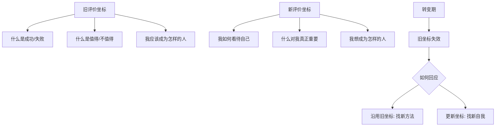
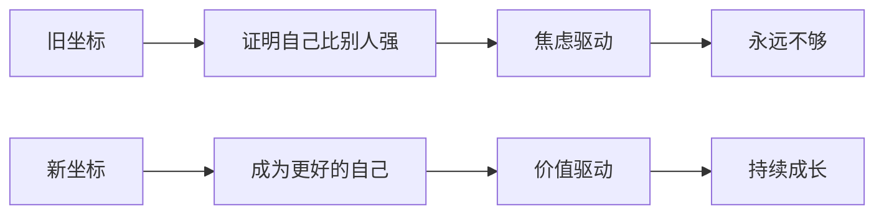

# 第37课：新旧评价坐标——自我转变的指南针

一个成功的转变，常常意味着新旧自我的顺利更替。但究竟什么是"新自我"？它有两层含义：表面上，你可能找到了一份新工作、开启了一段新关系、获得了新的身份认同；更深层地，它发生在你的心灵层面——你获得了一种**新的评价体系**、一种**新的信念系统**、一种**与现实的新关系**、一种**新的意义感**。而建立新的评价坐标，就是新自我诞生的起点。

无论你处在什么阶段，你都有一套评价坐标告诉你什么是成功、什么是失败，什么值得、什么不值得。它是你做选择的依据，也是你自我价值的核心。但在转变期，你忽然发现原来的评价坐标不适用了——迷茫由此产生，而这份迷茫恰恰成为你寻找新坐标的动力。

## 新自我从何而来

所谓评价坐标，就是那一套你用来衡量自己和世界的内在标准。它无处不在：好学生要成绩优异、职场人要不断晋升、成年人要稳定体面——这些标准塑造了你的行为，也限制了你对可能性的想象。

在转变发生时，最痛苦的不是失去某个具体的人或事，而是你赖以安身立命的评价坐标失效了。你不知道什么是"好"、什么是"对"，你失去了方向的参考系。但正是这个时刻，给了你一个机会——去追问那些从未被质疑过的标准，是否真的属于你自己。

## 两种应对转变的方式：逆袭还是成长

面对转变，人往往有两种不同的反应。它们的区别不在于努力与否，而在于**你是在旧的坐标系里找新方法，还是在新的坐标系里重新定义自己**。

### 沿用旧坐标：逆袭的故事

有一位来访者，高中时一直是优等生，如愿考上名牌大学后却因一门课不及格陷入巨大焦虑。他最怕的是别人的目光——原来学校拿他当榜样的同学会怎么看他？焦虑越重，越学不进去，最终不堪重负休学了。

经过一段时间咨询，情绪稳定后准备复学时，我问他："你会因为别人的目光而觉得自己失败吗？"

他说："不会失败，这只是暂时的挫折。我还是会努力学习，赶上进度。我会通过其他方面的成就来证明我自己。"

这个回答有进步——他把"失败"重新定义为"暂时的挫折"，从而获得了新的动力。但本质上，他仍然在用旧坐标衡量自己：好学生的标准没变，向别人证明自己的目标也没变。这是**逆袭故事**的逻辑——你拿回曾经失去的东西，甚至得到更多。

逆袭故事很燃，但它强化了你对原有评价体系的认同。有时问题恰恰出在那个评价体系本身——对他而言，困境不在于不够努力，而在于太受困于外在的评价标准。

### 更新坐标：成长的故事

一个月后，我又问了同样的问题。这一回他说：

> "没有别人的目光。重要的是我自己看待自己的目光。我只是想做好我自己。无论怎样我会努力，就算我不是一个好学生了，我至少还可以做一个好人。"

这句话背后，评价坐标已经切换了。他开始放下"我必须是个优等生"的执念，转而追问一个更高维度的问题：**如果我不是优等生，那我能是谁？**

这才是**成长和转变的故事**。你不是在原地找回失去的东西，而是换了一个全新的角度重新审视自己。新的坐标不再是外在的排名和认可，而是你与自己的关系。

> [!TIP] 关键区别
> 沿用旧坐标是"我怎么实现旧目标"，更新坐标是"我应该有什么新目标"。前者帮你解决现实问题，后者帮你实现真正的转变。

## 别把新坐标误认为躺平

有些人对"新评价坐标"有顾虑。一个经历过多次跳槽的学员向我描述了他的模式：一旦在某家公司稳定下来，他就恐慌焦虑，担心落后于别人；可一旦跳槽到新公司，他又懊悔自责，怪自己为什么这么折腾。十年过去，他成了中年人，最怀念的却是第一份工作。

表面上看他很努力，薪水涨了，履历也丰富了。但问题在哪里？他一直沿用旧的评价坐标——**要通过不断努力来超过他人**。他缺的不是努力，而是对"我想要成为谁"的思考。

情绪不好的时候他也想过躺平，但又觉得这是阿Q精神，"明明自己不够好，却不想努力，还自己骗自己"。这不是他的个例，而是很多人的共同疑虑。

新旧评价坐标的区别从来不是努力和不努力的区别，而是：

- **为别人的目光努力，还是为自己的价值努力**
- **为比别人优越而努力，还是为成为更好的自己而努力**
- **为别人觉得"我应该"而努力，还是为自己真正想要成为的自己而努力**

> [!WARNING] 常见误区
> 建立新评价坐标不等于放弃努力，更不是失败的自我安慰。它只是让你重新审视：那个让你拼命奔跑的目标，到底是谁设定的？

新的坐标需要你从内心寻找答案。而转变正是这样一个契机——当旧坐标行不通时，你才有机会停下来问自己：我现在选择的这条路，究竟是在走向别人眼中的成功，还是在走向我自己想要的人生？

> [!QUESTION] 自我检查
> 回想你最近一次感到迷茫或焦虑的经历：你的困境是因为旧方法行不通，还是因为旧标准本身出了问题？试着写下一句"如果是新坐标，我会怎么看这件事"。

参考答案

当你发现自己在说"我得证明自己""我不能落后""别人会怎么看我"时，你很可能还在用旧坐标。当你说"我真正看重什么""这对我意味着什么""我想成为谁"时，你已经开始建立新坐标了。转变的关键不是换方法，而是换标准。

---

继续学习：[[0038-ping-jia-biao-zhun-da-zhong|第38课：评价标准——如何从大众切换到自我]] | [[reference/glossary|核心术语表]]