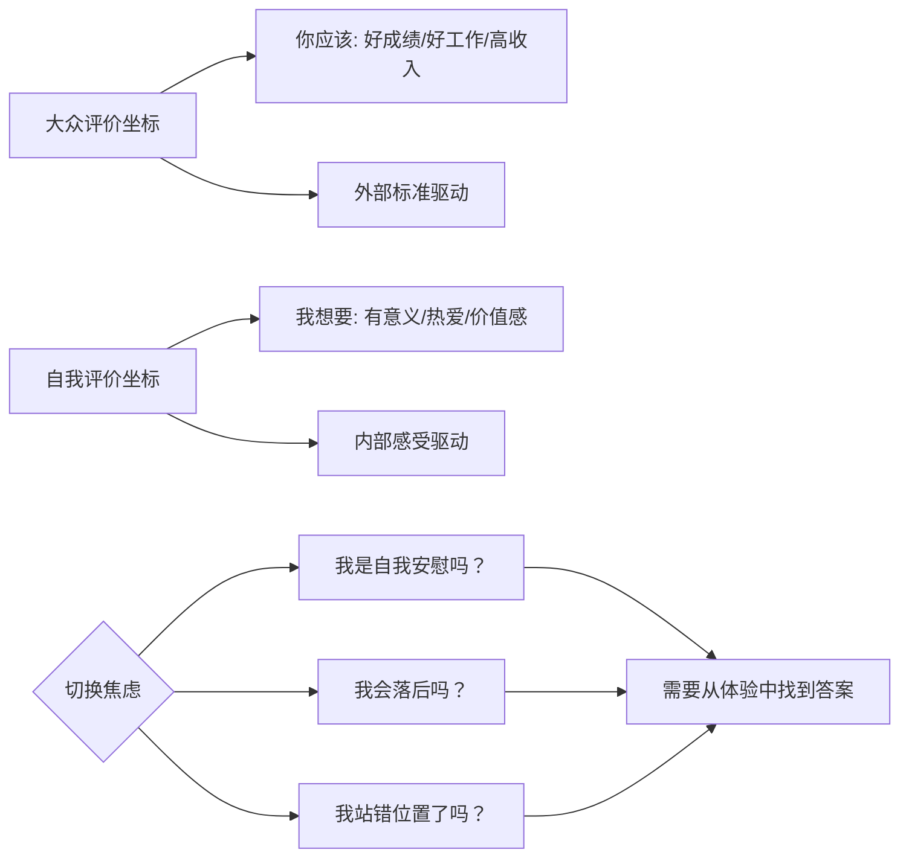
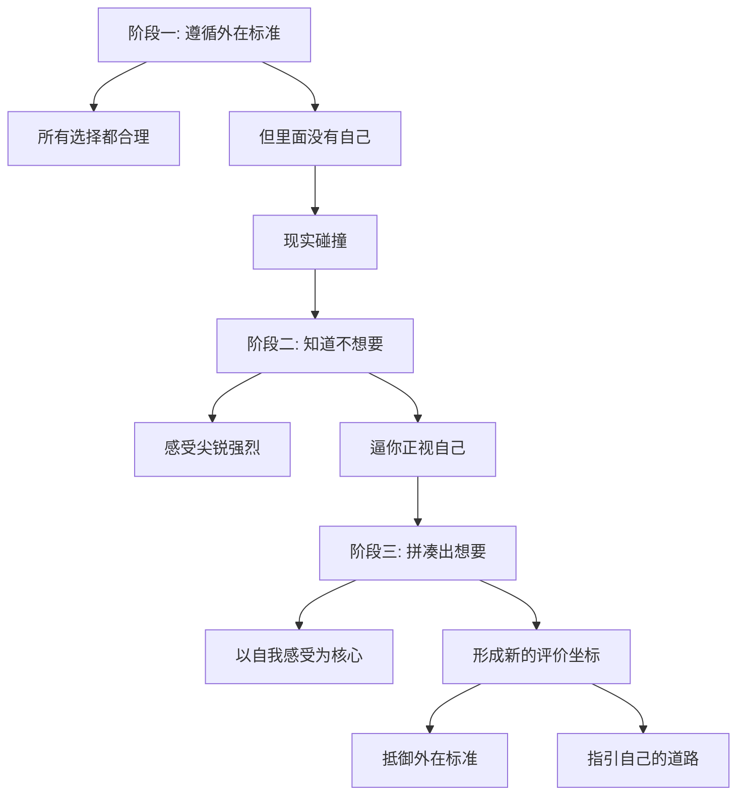

# 第38课：评价标准——如何从大众切换到自我

上节课我们区分了新旧评价坐标——最核心的区别是遵循外在标准，还是追求"我想要成为的自己"。外在标准主要有两个来源：**他人的看法**和**现实的要求**。这一课我们聚焦第一个维度：如何从**大众的评价标准**切换到**自我的评价标准**。

社会习惯根据你挣多少钱、在哪里工作、地位高低、有没有结婚、房子有多大来评价你。而当你对自己的人生有自己的看法时，不仅别人会质疑，连你自己都会怀疑：我这是不是自我安慰？就像一堆人站在一边，你刻意站到人群之外——你会有一种恐慌，担心自己是否站错了地方。

## 所谓"大众"只是想象的共同体

首先有两个好消息，能帮你减轻切换时的焦虑。

**第一个好消息：所谓的大众，其实只是想象的产物。**

一个创业者曾问我："我是不是一个不典型的创业者？"我说没有典型的创业者。如果你仔细看，每个人都有不同的故事。同样，没有所谓的"大众"——每个人既是大众标准的一部分，也在以各种方式违背大众的评价体系，并为此烦恼。

**第二个好消息：追求自我本身，现在也日益成为一种被广泛接受的价值观。**

所以你并没有远离人群——你只是从一个想象的群体走进了另一个想象的群体。

当然这也带来了新的问题：追求自我会不会也成为一种群体压力？会不会变成逃避现实的借口？这些问题我们留到后面的课程来回答。

## 切换三阶段之一：遵循外在标准

一位学员的经历清晰地展示了切换的三个阶段。他硕士毕业后进入一家研究所工作，周围都是教授和博士。院长说可以读在职博士，将来转研究岗。他渴望成为专业人士，满怀憧憬。

可真到了现实中，他发现大家做的东西让他失望了——那些研究立场先行，拼凑材料来证明预设的结论。这里面没有他想做的事，也没有他想成为的人。当他跟老师交流疑惑时，他们没听懂他的失落，只是鼓励他："这些东西并不难学，好好学，多发论文，将来评职称。"

他心里憋着一句话，一直说不出口：**不是我不能，是我不想。**

在第一阶段，他所有的选择都遵循外在标准：

- 高考报什么专业？"我爸说考的分数不能浪费，所以我压着分数线选了现在这个专业。"
- 为什么读另一个专业的硕士？"因为录取我的是名校，我还是保送的。虽然我不知道那专业做什么，但那可是名校啊。"
- 为什么选这份工作？"因为这个单位解决北京户口。虽然我完全不知道北京户口有什么用，但既然大家都觉得重要，那一定重要。"

每个选择听起来都合理——唯一的问题是：**这里面没有你自己。**

## 切换三阶段之二：知道"我不想要"

按照外在标准走，你总有一个自我在悄悄生长，在与外界的碰撞中想要生根发芽。当你发现现实并非你所想要的时候，就进入了第二阶段。

这位学员说：

> "在那一份工作里，我才知道我不能这样过下去了。我做的所有事都让我难受。我感觉自己的脾气越来越差，跟家里人打电话的时间越来越长，身体也越来越不好，头发一把一把地掉。我感觉我越来越不认识自己了。"

"不想要"的感觉是尖锐而强烈的。它让人不愉快，但它也开始逼着你正视自己。最初你会想方设法压抑它、忽视它、适应它——可如果与现实相背的是你自我很核心的部分，你很难一直忍受下去。因为如果一直忍受，你就没了自己。

从遵循外在标准到知道"我不想要"，不需要特别的方法，只需要**对自己的感觉足够诚实**。

> [!TIP] 转折信号
> "我不想要"的感觉带来的不是追求，而是逃离。但这种逃离中蕴含着自我的种子——相比只遵循外在标准，这里面已经有了"你"。你的感受在告诉你：有些东西不对。

## 切换三阶段之三：从"我不想要"到"我想要"

当"不想要"的感受足够多了，你会慢慢进入第三阶段——从"我不想要"中拼凑出"我想要"。

这个阶段的评价坐标，核心是你的感受：什么是我讨厌的、什么是我喜欢的、什么是无聊的、什么是有趣的、什么是我抗拒的、什么是我想投入的。它开始是模糊的，但随着感受的增加和对感受的重视，新的评价坐标逐渐成型。

那位学员决定辞职去读博士，做自己想做的研究。周围的人摇头惋惜，有人提醒他："博士毕业都不一定能进现在的单位。"他心里想：

> **"我去读博士不是为了回来工作，而是为了做我自己想做的研究。"**

我问他，当别人说就业形势多糟糕时，他怎么抗拒这个声音？

他说："他们说得对。可是我做这个决定不是为了回来工作——这不是我出发的理由。"

我又问他那出发是为了什么。他说：

> **"我希望能够去做自己的研究。如果我能用我的研究帮一部分人讲出他们的感受，让他们被看见，我就会非常开心。"**

我让他记住这句话——什么时候都别忘了它。它会变成你做选择时很重要的依据。也许这句话会让你经历很多痛苦和困难，但记着它，你就不容易迷路。

> [!WARNING] 警惕"伪自我标准"
> 追求自我本身也可能成为一种新的群体压力——"大家都在追求自我，所以我也应该追求自我"。请区分：这是你真实的感受，还是另一种形式的"应该"？

## 三阶段回顾

知道自己想要什么，不代表你就不害怕了。你还是会害怕、会犹豫、会纠结。但你会多一些勇气去面对害怕——而慢慢地，你会越来越知道，自己想要的是什么。

> [!QUESTION] 自我检查
> 回顾你人生中一个重要的选择（工作、关系、城市等）：
> 1. 做这个选择时，你处在哪个阶段——遵循外在标准、知道不想要、还是拼凑出想要？
> 2. 你能否清晰地回答"我出发的理由是什么"？如果暂时回答不了，可以从"什么让我感觉不对"开始找。

参考答案

切换到自我评价标准不是一个一蹴而就的过程。很多人会长时间停留在"我不想要"的阶段，这是正常的。"不想要"已经是一个巨大的进步——它意味着你从麻木中醒了过来，开始听见自己的声音。从"不想要"到"想要"，需要持续的尝试、体验的积累，以及根据自己的经验做出选择的勇气。如果你暂时说不出"我到底想要什么"，不妨先诚实地承认"我知道自己不想要什么"——这本身就是坐标切换的起点。

---

继续学习：[[0039-guan-xi-shi-jiao|第39课：关系视角——如何从重要他人切换到自我]] | [[reference/glossary|核心术语表]]