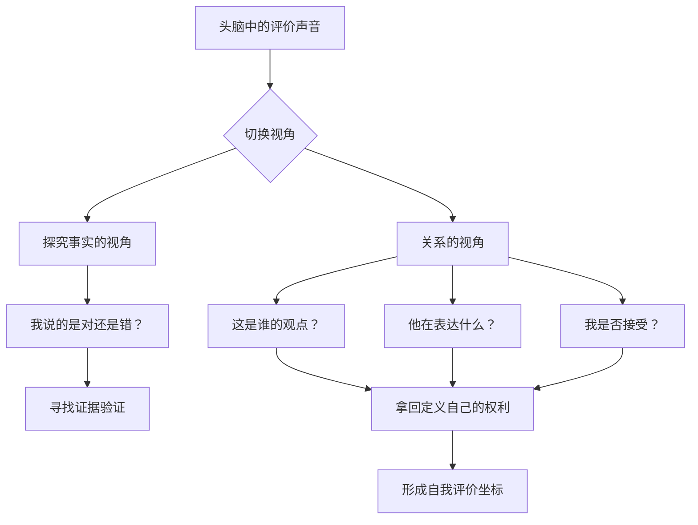
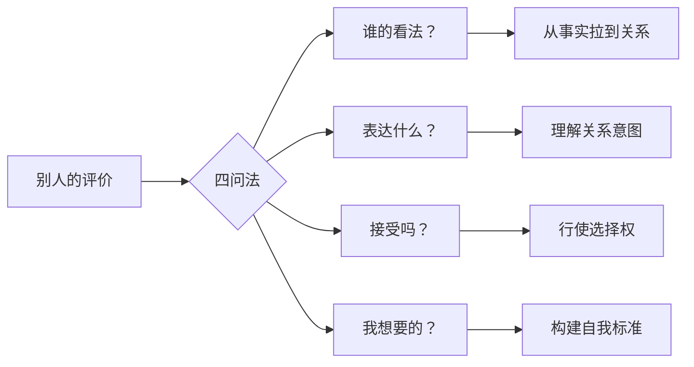

# 第39课：关系视角——如何从重要他人切换到自我

上节课我们讲了如何从大众的评价标准切换到自我的评价标准。这一课我们聚焦另一种切换——从**重要他人的评价坐标**切换到自我的评价坐标。这里的"重要他人"可能是你的父母、伴侣、导师，或任何在你心中有分量的人。

转变期，不同的声音会在你脑海中拉扯。你的头脑是一个观点的战场，这个战场比拼的是影响力。在这个战场上，你自己的想法并没有什么特别优势——除非你意识到：**它发生在你的主场，你有权利决定谁的影响有多大。**

而最重要的权利，是定义自己的权利。

## 关系的视角 vs. 探究事实的视角

一位女士失恋后再也没谈恋爱。她本是个自信的人，但分手时男友撂下一句话："你脾气这么差，又没什么魅力，连我都受不了，真正了解你的人不会愿意跟你在一起。"

分开几年后，她身边不乏追求者，可一想到前男友的评价，她就觉得恐惧。我问他周围人怎么看，她说他们觉得我还挺好的。我又问："那你为什么相信前男友的话，而不相信他们的话？"

她说："我也不想把他看得这么重要，可我总觉得他说的是对的。"

这背后有两种思考方式。

**探究事实的视角**假设关于"我是谁"存在一个绝对客观的真理，我们只需要从各种证据中拼凑出这个真理。前男友说她脾气差，我们就找证据来验证她脾气到底差不差。

**关系的视角**则完全不同——关于"我是谁"这个问题，并没有唯一的答案。你可以说我有很多发脾气的时候，但也可以说我有很多没发脾气的时候。我发了脾气，既可以说"我脾气不好"，也可以说"你是一个很能惹我发脾气的人"。

既然这些都不确定，那什么是确定的？**谁是这么想的、他为什么这么想、我要不要接受他的想法。**

当你这么想的时候，你已经拿回了定义自己的权利。

## 四问法：拿回定义自己的权利

当你发现头脑中有很多否定自己的声音时，可以问自己四个问题，从探究事实的视角切换到关系影响的视角。

### 第一问：这是谁的看法？

这是一个反常识的思考方式。探究事实的视角是"对事不对人"，而关系视角是"对人不对事"。定义"我是一个什么样的人"本身就是一种权力，权力只有放到关系中才能被理解。

当你问"这是谁的看法"时，你已经把那个观点从"确定无疑的事实"位置拉了下来——它只是某个特定的人的看法，你可以根据和这个人的关系来处理它。

### 第二问：他在通过这个看法向我表达什么？

看法被表达出来，常常有特定的意图。是善意的提醒、委屈的抱怨、不满的愤怒，还是隐秘的控制？

就像那位前男友对女士说的话，明显带有愤怒。问题不在于他说得对不对，而在于他在生气。当一个人告诉你"你是什么样的人"时，有时候他是在彰显一种权力——**我比你更客观、更有影响力，所以我比你更有资格定义你。**

如果你不接受这种观点，那它只代表了他影响你的努力——而因为你的拒绝，这种努力失败了。

> [!TIP] 关键洞见
> 任何一个关于"我是谁"的看法，都可以找到相应的证据来支持或反驳。既然如此，真正的问题就不是"这是否是事实"，而是"我是否接受这个人的影响"。这个区别，是拿回定义权的一把钥匙。

### 第三问：你是否接受他的影响？

这个问题在提醒你：你有权利决定是否接受他的影响。如果那个人已经没那么重要了，那最好也把他对你的影响放到不那么重要的位置。

但这不是说一定要拒绝。它只是提醒你：**你有选择。** 意识到自己有选择，你就把自己放在了决定者的位置——这本身就是创建新评价坐标的一部分。

当然，情感上你可能会纠结——你既希望保持与这个人的情感联系，所以自然看重他对你的影响，可你又不想接受他对你的否定。我的建议是：你可以在情感层面理解你对他的需要，但不要轻易让渡定义自己的权利。

### 第四问：什么是你想要的看法？

只是接受或拒绝别人的看法还不够。如果你要形成自己的评价坐标，还需要寻找你自己的答案——关于"你是谁"的答案。

很多人会说"我不知道"。不知道，也比不假思索地接受别人的观点要好。因为这是你需要给出的答案，而给出答案的过程，就是获得新评价坐标的过程。

## 重构关系，重构自我

切换评价坐标的过程，本质上是**重构和他人关系**的过程——只不过这个过程发生在关于"我是谁"的观点的战场上。

这并不意味着你要完全拒绝别人的影响。知道你是谁，也需要别人的客观反馈。区别在于：从不假思索的、从属的地位解脱出来，在关于"你是谁"这个问题上，没有人比你更清楚，你才是最大的权威和专家。

你可以选择：

- **接受谁的影响**，**不接受谁的影响**
- **在哪些方面接受**，**哪些方面不接受**
- **在多大程度上接受**

那位受前男友影响的女士，最终在日记里写道：

> **"我曾经把你当作很重要的人，所以我才愿意接受你的影响。哪怕你仍然很重要，可是我要收回这种影响。我要去新的关系，重新寻找我自己。"**

> [!WARNING] 关系视角的边界
> 关系视角不是为了否定所有外部反馈。事实上，健康的自我需要他人的反馈来校准。关系视角要破除的，是无意识地、不加选择地接受某个重要他人对你的定义——尤其是那些否定性的定义。

> [!QUESTION] 自我检查
> 回想一个来自重要他人（父母、伴侣、前上司等）的评价，至今仍在你脑海中挥之不去：
> 1. 试着区分：这是"事实"还是"他对你的影响"？
> 2. 问自己：如果从关系视角看，他在通过这个评价向你表达什么？
> 3. 你在这个问题上，有选择不接受的权利——你意识到了吗？

参考答案

重要他人的评价之所以有如此大的影响力，恰恰因为他们在你心中有分量。你越在乎一个人，他的评价就越容易被你当成"真理"。但请记住：**再重要的人，也只是你人生中的一个声音，而不是你的裁判。** 关系视角不是教你拒绝所有批评，而是教你：在定义自己这件事上，你可以选择性地接受影响——你始终拥有最终决定权。那份"我不知道自己是谁"的困惑，也比无意识地接受别人的定义要好——因为它意味着你已经意识到：答案需要由你来寻找。

---

继续学习：[[0040-xin-nian-fa-zhan|第40课：信念发展——如何从现实标准切换到自我标准]] | [[reference/glossary|核心术语表]]