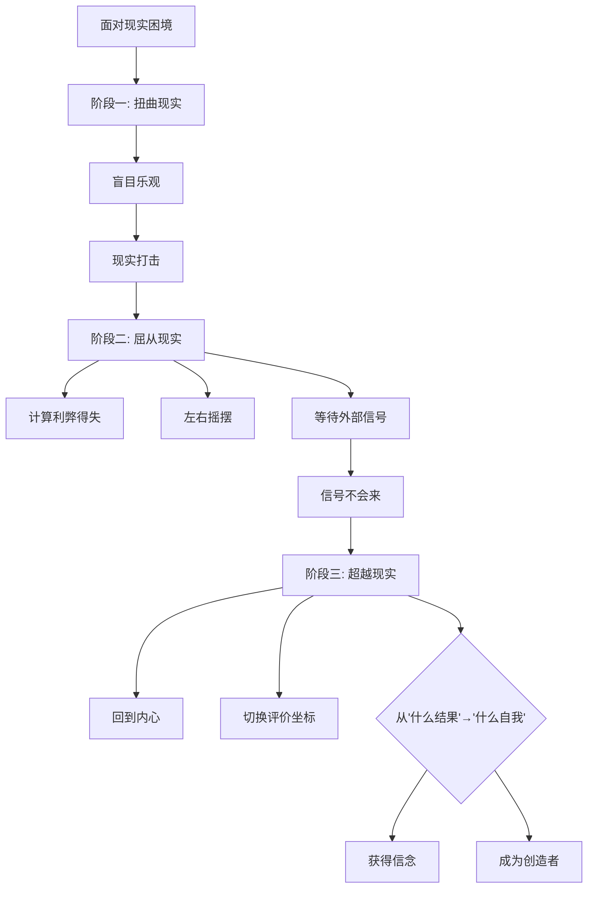

# 第40课：信念发展——如何从现实标准切换到自我标准

前两课我们讲了从大众和重要他人的标准回归自我标准。但很多人会说：我的问题不在关系里，我面对的是很难的现实。现实在不断地挤压着你，让你陷入纠结和痛苦。可是你有没有想过——摆脱这种纠结和痛苦的过程，本身就是切换新旧评价坐标的过程，也是新自我诞生的过程。

从评价坐标的视角看，**现实是一种我们自动采纳的评价标准**——它遵循的是"可能的结果"。你反复计算利弊得失，在选项之间摇摆。而当"结果"这条路走不通时，你才会被迫切换到"我想要成为什么样的人"。这种切换常常带来巨大的勇气和行动力。

## 信念发展的三个阶段

电影《至暗时刻》是关于丘吉尔的一段历史，也是信念发展三部曲的完美写照。丘吉尔上台时正值二战最危险的时刻——英军精锐被围困在敦刻尔克，前任首相张伯伦的势力还在，跟国王的关系也不好。他要做的决定关系着大英帝国的生死存亡。

### 第一阶段：扭曲现实

丘吉尔上台时说："我要再斗。"听起来很有信心，但此时他并没有真正认识到事态的凶险，只是简单地认为"敌人没有这么强大""我能赢"。当他跟法国总理讨论对德反击、说德军不够强大时，法国总理觉得他得了妄想症。

人在压力下，有时候会用一种盲目的、罔顾现实的乐观来支撑自己。这种乐观会遮住你面对现实的眼睛，让你转向幻想中寻求安慰。这个阶段的人看起来也很坚定，但那只是防御性的、封闭的固执。

但盲目的乐观不会成功——现实会逐渐显露它的强大，让所有忽略它的人受挫。

### 第二阶段：屈从现实

现实显示出强大、似乎不可战胜的力量。在现实面前，人们开始趋利避害，不停地思考每个选项的利弊得失——哪个选择有更大的概率带来好结果？

电影中，丘吉尔面对被围困的英国陆军可能全军覆没的命运，不得不在战斗和和谈之间纠结。在这个阶段，**可能的结果**成为决策的唯一依据。新的信息、遇到的意外困难、别人的意见，都会随时改变你的决策。

你的心态随着外在结果不断变化、不断摇摆、无法安宁。你看不清未来，也没有办法做出坚定的选择——有时候觉得这样对，遇到挫折时又觉得另一个选项才对。你好像在等一个信号，一个来自未来的隐约许诺——"你的付出必有回报"——好让你下定决心。

但痛苦在于：没有谁能给你这个信号。

> [!TIP] 关键转折
> 你一直在等的那个"来自未来的信号"，只能来自你自己，不会来自外界。这个认识，是通往第三阶段的入口。

### 第三阶段：超越现实

在痛苦和纠结中纠缠得足够久，有些人会达到第三个阶段。他们终于摆脱了趋利避害的限制，不再从外在线索寻找行动依据，转而回到自己的内心。

丘吉尔经历了痛苦挣扎后，去接触普通民众，倾听他们的声音。在议会演讲中，他没有从"胜利还是失败"的前景来讲这件事，而是完全从"**国家会变成什么样的自我**"来讲——他讲到纳粹的旗子会在白金汉宫飘扬，讲到英国人民会成为希特勒的奴隶。他说：

> **"如果大英帝国的悠久历史势必终结的话，那就让这个国家的历史，随着我们在自己的土地上前仆后继的牺牲，彻底地终结吧。"**

重点不是他在战斗和投降之间选择了战斗——重点是**他做选择的判断依据变了**。从"是否能赢得这场战争"变成了"**英国要成为一个什么样的国家**"。这个依据甚至超越了胜负和生死。

## 新坐标带来的力量

完成从"现实的利弊得失"到"可能的自我"的切换，意义在哪里？

### 从摇摆中解脱

大部分人的内耗来自左右摇摆的纠结。旧的坐标下，你的精力都放在"该怎么选择"上；切换后，你的精力放到"该怎么把这件事做成"上。当你不用再考虑选择、只想方法时，你会激发出更多的创造力。

电影中，丘吉尔正是完成了新旧评价坐标的切换后，才想到了征用民船从敦刻尔克撤回士兵的办法——这不是偶然。

### 获得信念的锚点

信念，某种程度上就是切换到新评价坐标的产物。外界会变，但你想成为一个什么样的人，是相对稳定的。你获得了一种定力——**无论外界环境如何动荡，我都不会轻易动摇的信念**。

当你有了这种信念，在面对艰难的判断时，你就知道如何做选择。

### 从被塑造者到创造者

现实不再是能完全左右你的力量。你有了自己追求的东西。未来也许依然是模糊的——但你终于发现，你并不需要完全看清未来再行动。相反，**是你的信念给了模糊的未来以形状**。通过你的行动，你塑造了未来的样子。

由此，你变成了一个创造者，开始创造你个人的历史。

> [!WARNING] 别混淆"超越现实"和"逃避现实"
> "超越现实"不是不面对现实——恰恰相反，它是在充分认识现实的艰难之后，选择不再被结果牵着走。它和"扭曲现实"（第一阶段）的本质区别在于：前者是经过了现实的碾压后做出的主动选择，后者是还没有真正碰触现实时的盲目乐观。

> [!QUESTION] 自我检查
> 回想你人生中一个艰难的两难选择，试着用三个阶段来分析：
> 1. 你有没有经历过"扭曲现实"的阶段——用盲目乐观来逃避真正的困难？
> 2. 你有没有经历过"屈从现实"的阶段——在选项之间反复计算利弊、左右摇摆？
> 3. 你最终是否完成了坐标切换——从"什么结果对我有利"到"我想成为什么样的人"来判断？

参考答案

信念不是凭空产生的，它是在现实的重压下、经过反复的纠结和挣扎后才诞生的。如果你正在经历"屈从现实"的摇摆期，不必自责——这是必经之路。重要的是意识到：你等待的那个确定信号不会从外界来。唯一能给你答案的，是回到内心问自己：**无论结果如何，我想成为什么样的人？** 当你问出这个问题，你已经开始向第三阶段迈进了。切换评价坐标的过程艰难，但正是这种艰难，才让你最终抵达一个更高的精神层次。

---

继续学习：[[0041-xin-zuo-biao|第41课：新坐标——如何带来新道路]] | [[reference/glossary|核心术语表]]