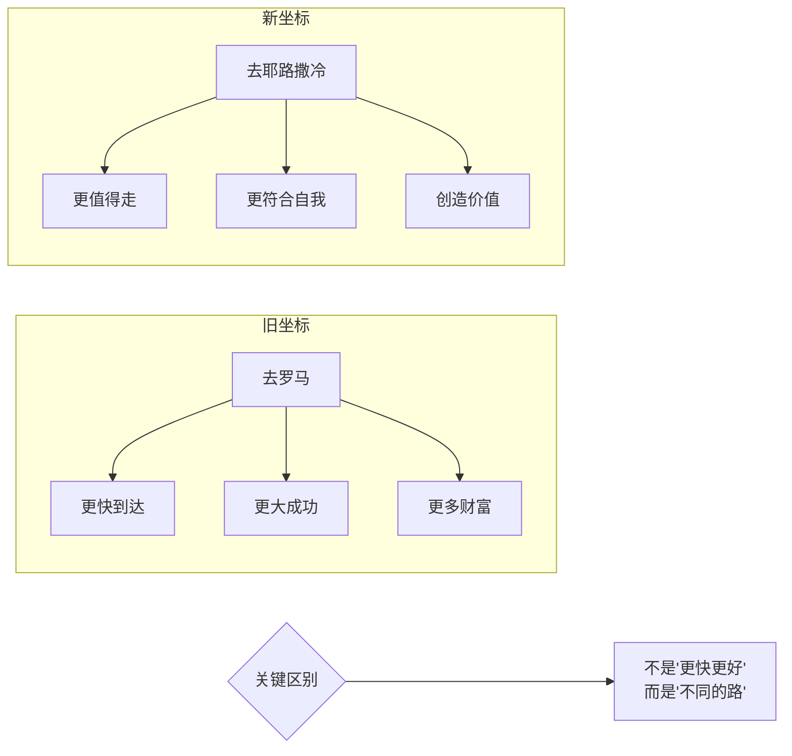

# 第41课：新坐标——如何带来新道路

前面几课我们讲了如何从大众标准、他人标准、现实标准切换到自我标准。这一课我们聚焦一个根本问题：**这种切换对自我发展意味着什么？**

如果说结束和告别有什么意义，最重要的意义就是把我们从旧的评价标准中解脱出来。就像离开部落的人，到了新的荒原，原来指导生活的条规戒律都不能用了——他需要去寻找新的指南针。这个指南针正是新的评价坐标。而他发现，这个指南针最终指向了他自己。

可是很多人开始转变时只有一个模糊的概念——"现在的生活给了我太多束缚，我只是想要更自由"——但他们并不知道这个自由意味着什么，也不知道自己在追求的又是什么。

## 出发的理由 vs. 评判的标准

一位朋友正处于艰难的转变期。他之前在大平台为老板开拓海外市场，克服万难把业务做起来了，但老板只愿意兑现承诺的一半。他一气之下放弃即将到手的财富，离开公司准备白手起家。

和很多转变故事一样，他英勇地离开了熟悉的环境。但离开只是故事的开始——他忍不住惦记自己的损失：放弃巨大财富的失落、新事业开始的挫折和自我怀疑、对老板背信弃义的愤怒，都在深深折磨着他。

我问他："当初你为什么出来？"

他说："表面上是我跟老板的矛盾，本质上是我想当一个创业者。我的偶像是乔布斯、马斯克这样的人。我想要成为一个更自由的创造者，去创造自己的事业，为世界创造更大的价值。"

他说这些时，热情溢于言表。我说："记住你说的话——它是你的故事。**人最大的迷思，就是忘了自己的故事，忘了自己为什么出发。**"

我又问他："你选择了一条特别的路，你觉得这条路值得走吗？"

他说："当然值得，它是我的信仰。"

当一个人做了选择，即使选择了新的评价坐标——从"赚更多的钱"变成"我要创造更大的价值"——这个新坐标也不会马上成为你的一部分。你还会对它充满怀疑，还会用旧坐标来评价新选择带来的利弊得失，并为损失而痛苦。

> [!TIP] 关键洞见
> 做选择的人需要亲自去理解发生在自己身上的事。旧坐标的坍塌和新坐标的成型，需要时间——选择是在这个过程完成后才真正完成的，而你才能真正放下。

## "去耶路撒冷"还是"去罗马"？

有一次我做演讲，一个同学问我："我很佩服你当初离开学校的决定。你现在过得不错，所以一定觉得当初的选择很正确。但设想一下——如果你离开以后赚的钱没有原来多，发展也没有原来好，你会不会后悔？"

这个问题让我思考：**当我们在做人生重要的选择时，我们究竟选择了什么？**

起初我也在想这个问题。后来我明白了——这个同学可能问错了问题。这个问题本身就是旧评价体系的产物。在旧体系下，"挣更多的钱、取得更大的成功"是选择最重要的依据。**可这不是你当初做出选择的理由。**

当初做选择时，你不是选择了一条更可能成功的捷径，而是选择了一条完全不同的道路。就像一个原来要去罗马的人，转而要去耶路撒冷了——你不能问他："耶路撒冷啊？那能更快到罗马吗？"

你只能问：**"去耶路撒冷，相比于去罗马，这是一条更值得走的路吗？"**

## 新坐标的意义：自由

切换评价坐标的意义在于**自由**。

我很喜欢今敏导演的动画片《千年女优》。女主角受了对她又爱又恨的巫婆的诅咒，不停地追寻一个只有一面之缘的爱人，穿越千山万水却怎么也追不到。这样的故事在不同时代不停轮回。最后她明白了——这是她的命运，打不破的诅咒。

最后一个时代，那个触不到的爱人在太空遇险了，她也义无反顾地坐上一去不返的宇宙飞船。别人劝她："没有用的，你知道追不到的，一去就回不来了。你明明知道结局，为什么要豁出性命去做这件事？"

在飞船点燃的那一刻，她说：

> **"因为我喜欢那个追求爱情的自己。"**

这个电影看起来是悲剧，但你看不到某种力量吗？当女主角说"我喜欢那个追求爱情的自己"时，她获得了一种自由——**从外在成败的评价标准中解脱出来的自由。**

当初我从学校离开时，我跟自己说："我选择离开是为了自由。"但那时我并不理解什么是自由。我以为自由就是减少琐事、减少外在环境的束缚。后来我才明白——真正的束缚来自你的内心，那些外在的评价标准早已变成你内心的一部分。

自由的本质，不是离开一个外在的关系或环境。**自由的本质，是你从外在的评价体系切换成内在的评价体系。** 你慢慢有了空间来决定什么对你重要，你想把自己塑造成什么样的人。当这种决定变成了习惯，谁也没有办法再剥夺你的自由。

> [!WARNING] 自由的误区
> 不要以为"新坐标"就是自由，"旧坐标"就是束缚。新坐标也可能变成一种新的束缚——比如"我必须追求自我""我必须与众不同"。真正的自由在于你有选择，而选择的标准来自你的内心，而不是任何外在的应该。

## 通往自由的两个问题

纪录片《斯图茨的疗愈之道》里，治疗师斯图茨说人生有三样东西无可避免：**痛苦、不确定和持续不断地工作。** 大部分人的生活都建立在这三样东西之上。

但如果生活把你带离了常规，带到了另一种转变的可能性，那你不妨问问自己这两个问题：

1. **你喜欢现在的自己吗？**
2. **你能做些什么，让你更喜欢今天的你自己？**

不要小看这两个问题——它们的答案提示着通往自由的道路。

> [!QUESTION] 自我检查
> 回答上面的两个问题，进入细节：
> 1. "喜欢现在的自己"——哪些部分你喜欢？哪些部分你不喜欢？你的不喜欢来自你内心的标准，还是来自别人的标准？
> 2. "让你更喜欢今天的自己"——这个行动是为了取悦别人，还是为了靠近你想成为的自己？
> 3. 试着分辨：你现在走的这条路，是"去罗马的路"，还是"去耶路撒冷的路"？

参考答案

新坐标不是告诉你什么是对的，而是让你有能力问"什么对我重要"这个问题。那个朋友问"如果创业没赚更多钱怎么办"，这个问题的陷阱在于它还在用"赚更多钱"来定义成功。真正的出发理由是"我想成为一个创造者"。所以检验你是否真正切换了坐标，很简单：当你为自己的选择感到不安时，你是担心"这条路会不会失败"，还是在思考"这条路是不是更值得走"？前者是旧坐标，后者是新坐标。新坐标带来的自由不是"不会被评价"，而是"我知道用什么标准来评价自己"。

---

继续学习：[[0042-zhong-xin-guan-cha|第42课：重新观察——如何重新理解现实]] | [[reference/glossary|核心术语表]]