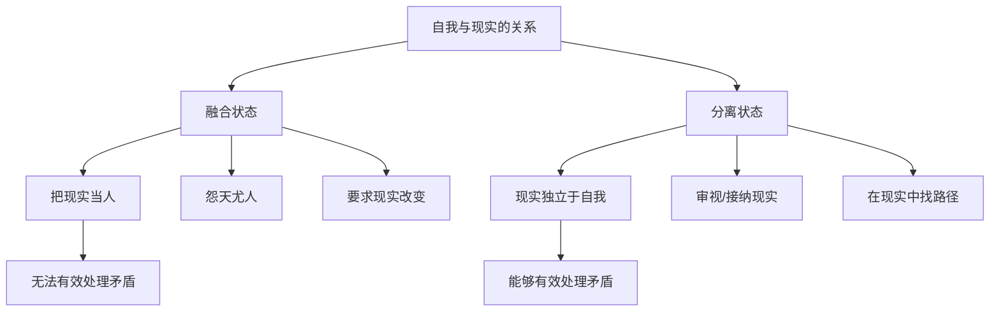
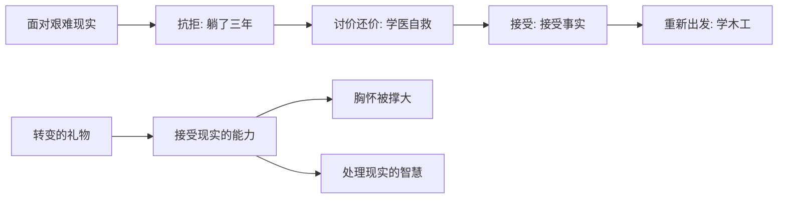

# 第42课：重新观察——如何重新理解现实

前面几课我们讲了新自我的第一个重要内涵——从旧的评价坐标切换到新的评价坐标。但有人会问：如果只是从外界回到自身，会不会太理想化、太不切实际了？

其实不是。新自我的成长不仅不会让我们逃避现实，反而会让我们**更有能力去理解和接纳现实**，从而以一种更有创造性的方式去处理现实。

从这一课开始，我们进入建立新自我的第二个环节——**改变与现实的关系**。转变的契机常常发生在"我想要"和现实的矛盾中。当面临一个与以往完全不同的现实时，无效的转变是扭曲现实、逃离现实，而有效的转变则是接纳现实，慢慢发展出更有效的处理方式。

新旧自我的更替，意味着自我与现实关系的改变。这发生在两个层面：
1. 从**与现实融合**到**与现实分离**
2. 从**顺从和反抗**现实到**理解和利用**现实

这一课我们先讲第一个层面。

## 融合：把现实当成"人"

在发展心理学中，你并不是一开始就知道世界跟你是两个不同的东西。婴儿时期，你哭了会有人喂奶，你笑了会有人逗你开心——因为你的反应总能引起外在现实的回应，这让你形成了一个有趣的误解：**你跟世界是融为一体的。** 精神分析理论甚至认为，这种融合一体的状态就是神话里伊甸园的原型。

慢慢地你发现，并不是所有的举动都会得到回应，并不是所有的需要都能得到满足。随着这种不一致的情况越来越多，你才意识到：原来现实是独立于你的东西。伴随着自我和现实的分离，自我诞生了。

可是在转变期，当你面对一个很难接受的现实时，这种残留的融合反应会反复出现。最典型的表现，是对现实有一种**拟人化的倾向**。你觉得现实像是一个威严的长者——遇到不公时你问"老天爷为什么这么对我"，遇到好事时你感谢"老天眷顾"。当现实不如意时，你像幼儿园小朋友对老师说"我不要这个，请换一个新的现实给我"。

这种反应，就是"怨天尤人"——把天当作人来看待。它让你很难有效处理自我和现实之间的矛盾。

> [!TIP] 核心洞见
> 对于融合的人来说，现实像一匹高大生动的骏马，在不断变换方向和位置，而你手里有的只是玩具套索。你用玩具套索去套这匹骏马，怎么也没法成功。问题不在于你的预期对不对——问题在于：当现实不如预期时，你是怨天尤人，还是改变想法去处理它？

## 艰难的礼物：二舅的故事

去年有个视频刷屏了——《回村三天，二舅治好了我的精神内耗》。它讲述的其实是一个转变的故事。

二舅原来是个天才少年，人很聪明，成绩也很好。按正常轨迹，他应该上大学，有一个美好前途。可是十几岁时发烧，被村医打了一针后，忽然变成了瘸子。

这是一个极难接受的现实。接受它，意味着你要跟那个"前途光明的天才少年"告别，接受一个完全陌生的、无法接受的自己——你没有做错任何事，却需要承担这一切。

最开始，二舅在床上躺了三年不肯下床——因为一下床，他就要面对自己是个瘸子的事实。这是对现实的抗拒，甚至愤恨。

后来他拿起一本医书，想通过学医来治疗自己——这是与现实讨价还价的努力，也是一种徒劳的幻想。

当现实并不跟他讨价还价，他才慢慢接受了现实。他让爸爸买了木工工具，开始学习木工。他接受了自己不再是天才少年、也不再是健康人，变成了一个瘸子的事实，并在这个事实上重新寻找出路。

视频后来讲到二舅遇到其他生活困难，都被他以一种宽容和豁达的态度应对过去了。他为什么有这种宽容和豁达？**正是因为他经历了如此艰难的接受现实的过程，改变了自己和现实的关系。**

## 不要用心理难题代替现实难题

转变期人们会编织各种理由来逃避现实。作为心理咨询师，我知道连心理咨询本身也可能变成逃避现实的理由。在咨询室里，人们获得无条件的接纳和理解，感受被放大变成焦点——这本身不是问题，我们需要被关注和理解。

可是如果它变成了一种习惯——当你用这种方式去要求咨询室以外的世界和他人，你就会发现别人不会提供那么多理解和认可给你。这时候你会觉得外面的世界错了，然后习惯性地躲回咨询室。

所以我总是提醒：**不要用心理的难题代替现实的难题。** 你当然应该关心自己的心理和感受，但最后你还是要回到现实，去处理现实的难题。你要关心粮食和蔬菜、工作和早餐、前途和身边的人——否则你想要成为的自己也会变成空中楼阁。

### 另一个故事：没有时间悲伤

有一位年轻的女士，先生是创业者，年纪轻轻就取得了不错的成就。她一直生活在养尊处优的环境中。忽然有一天，先生意外去世了——因为先生去世，很多人怕自己的资产受影响就来挤兑，公司破产了。她从贵太太变成了欠了一屁股债的女人，还有一大堆烂摊子等着收拾。

很多人去采访她，问她："这么大的生活变故，你悲伤吗？"

答案当然是肯定的。可她说：

> **"我没有时间悲伤。我不能依靠社会，不能依靠婚姻，不能依靠老天保佑一切顺利。当一切都变得不可靠的时候，我发现我能依靠的只有我自己。我有这么多现实的难题要去处理，我没有时间留给自己悲伤。"**

遇到这么大的变故却没有时间悲伤，这本身就是一件让人悲伤的事。但这位女性教给我们的，是一种面对现实的态度：**当你意识到现实不会因为你的喜怒哀乐而有任何改变，你就学会了把自己和现实分开。**

你可以让周围的人理解你的痛苦——唯独不需要让现实理解你。

> [!WARNING] 警惕"融合幻觉"
> "融合"不只是抱怨和怨天尤人，也包括一种隐秘的期待——你觉得自己足够痛苦了，现实就应该因此对你网开一面。但现实不会。认识到这一点很残酷，但它也是力量的起点——当你不再向现实索取理解和同情，你才能真正把精力用来处理现实。

> [!QUESTION] 自我检查
> 想一想你现在面临的最棘手的现实难题：
> 1. 你是否对现实有某种"拟人化"的期待——觉得它应该理解你、照顾你？
> 2. 当现实不如意时，你的第一反应是抱怨现实不该如此，还是思考"既然如此我该怎么办"？
> 3. 你有没有用"自我探索""心理成长"之类的理由，来回避某个现实的决定或行动？

参考答案

接受现实不是认命，而是意识到现实就是现实——它不因你的喜怒哀乐而改变。当你停止跟现实较劲，你就解放了大量的能量。二舅的故事之所以治愈，是因为它展示了一个人如何在无法选择的现实中，重新找到了自己的路。转变的礼物之一，就是接受现实的能力——艰难的现实的撑大了你的胸怀，也给了你处理现实的智慧。**接纳了现实，你也就接纳了你自己。**

---

继续学习：[[0043-ying-dui-xian-shi|第43课：应对现实——你选择顺从还是反抗]] | [[reference/glossary|核心术语表]]