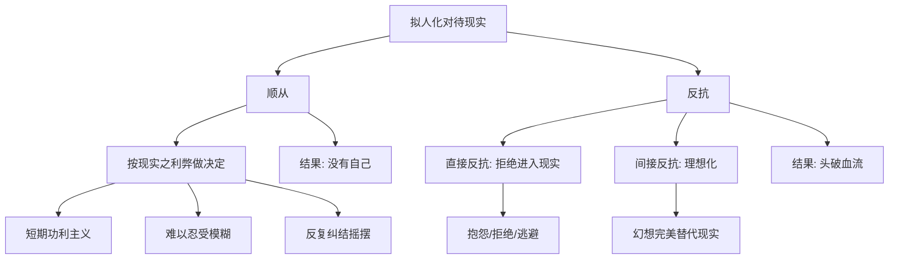

# 第43课：应对现实——你选择顺从还是反抗

上节课我们讲到，改变与现实的关系是形成新自我的重要环节。第一个改变是从"与现实融合"到"与现实分离"，第二个改变则是从**顺从和反抗现实**到**理解和利用现实**。这一课我们先详细审视前两种反应——顺从和反抗——以及它们各自的局限。

人的大脑倾向于用拟人化的方式理解现实。当现实顺利时，你觉得这是现实对你的认可；当现实不如意时，你愤怒指责抱怨，觉得现实背叛了你。因为这种拟人化倾向，我们常常以对待权威的方式来对待现实——最典型的反应就是顺从和反抗。

## 顺从现实：没有自我的选择

想象一个严厉的父母：如果你做的事顺他的意，就得到奖励；不顺他的意，就受惩罚。慢慢地你会学到：自己的想法和感受并不重要，重要的是根据现实的利弊得失来做决定。这时候人们会以为，顺从现实是唯一的选择。

顺从阶段的人，总是根据现实来做决定。他们的特点包括：

- **短期的功利主义思维**——因为只有短期的现实能给他们明确的信号
- **难以忍受模糊和不确定**——现实的信息是他们唯一的依据
- **不相信自己，只相信所谓的现实**
- **期待确定的许诺**——"我的投入会有更好的结果"，否则很难真正投入
- **反复纠结和摇摆**——分析每个选项的利弊得失，不断想"我是不是错过了什么"

顺从现实的人最大的特征不是理性，而是**很难做选择**。就算做了选择，也很难真的投入去做一件事。因为不容易投入，就没有办法得到自己想要的未来。

表面上看，顺从是为了获得更好的结果，但它实际上逃避了自我选择的责任，从而也避免了失败的痛苦。顺从现实的人有很多理由来解释自己为什么不成功，却很少真正理解自己行动的效用并做出调整。代价是把自己放到一个被动的、完全由现实决定的位置——**人变成了现实的提线木偶，就没有了自我。**

## 反抗现实之一：拒绝进入现实

当重要的自我想要保留，而这个自我在现实中无法安放时，有些人会走向另一个极端——反抗现实。

一个年轻人遭遇职场挫折被裁了，这本来是转变的开始。但他再也不愿意找工作，每天躲在家里打游戏。谈到外面的世界，他充满了各种抱怨——从抱怨工作到抱怨组织，最后抱怨那些对他的怨恨缺少共鸣的人。

我问他怎么才会重新考虑找工作时，他说：**"这个世界欠我一个道歉，它不值得我投入。"**

当我们受伤的时候，常常通过拒绝进入现实来防止自己进一步受伤。问题是，你把现实关在门外，也把自己关在了里面。

## 反抗现实之二：理想化

另一种反抗现实的方式更隐蔽——**理想化**。用幻想代替现实，用美化的幻想来贬低现实。

有时我会遇到这样的来访者：第一次见面把你夸得天花乱坠——"你比我遇到的所有的咨询师都聪明善良，遇到你我的问题有救了。"几次咨询后他们会说："你对我的帮助特别大，我一下子就好了。"

每当遇到这样的来访者，我会非常小心。因为他们说的不是我，而是他们头脑中理想化的咨询师形象，只不过他们把形象安到了我身上。一旦他发现我有不符合他形象的地方，又会愤怒地攻击我。他们用愤怒来提醒我——让我重新变成他们幻想中理想的样子。

我不得不用我的不同来提醒他们：我是一个他们幻想以外的现实。**只有真的接受与幻想不同的现实，他们才能看见我，我们之间才会建立真正的关系。**

理想化不止发生在咨询室。在亲密关系中，有些人总是爱上遥远的人——可当这个人变得现实起来，一点点小缺点就让关系崩坏。在寻找工作时，有些人要寻找理想化的有意义的工作——可当工作遇到现实的困难时，他们又很快失去兴趣。

理想化的人需要一个已经存在的完美现实来承接他们的生活，却没有办法进入不完美的现实去创造他们的生活。**因为完美的现实并不存在，他们就只能让自己的生活停留在幻想中，把现实隔绝在外。**

> [!TIP] 关键洞见
> 顺从现实让你没有自己，反抗现实让你头破血流。前者失去了自我，后者失去了现实。两种态度的共同根源，都是把现实当作一个需要你来回应和对抗的"权威"——而非一个可以理解和运用的"材料"。

## 堂吉诃德的困境

西班牙小说《堂吉诃德》里，那个叫堂吉诃德的乡绅喜欢读骑士小说，就带上农户桑丘一起去冒险。他生活的并不是骑士时代，可他偏要用骑士时代的做派生活。

他把一朵花献给想象中的贵妇——其实那是一个妓女。他跟想象中的巨人战斗——其实那些巨人是风车。他为了想象中的英勇，把自己撞得头破血流。

回到现实，他那些英勇的牺牲变得毫无意义。

你说他勇敢吗？他是真的勇敢——不向现实妥协需要巨大的勇气。你说他可悲吗？好像也可悲——人居然会为了幻想拒绝现实。

但也许总有一天，你不得不走出幻想的庇护所。重要的不是现实的对错，而是**你要怎么处理它**。

如果说理想化的自我只要幻想的土壤就够了，那真正的新自我，一定是在现实的土壤中才能成长起来。当你接受了这一点，并真的走进现实，也许你会发现——就算现实不是如你所愿，它也绝不是你的敌人。**现实只是现实。**

> [!WARNING] 两种反抗的伪装
> "拒绝进入现实"常常伪装成"我在坚持自我"——就像那个说"世界欠我一个道歉"的年轻人。"理想化"常常伪装成"我对生活有高标准"——就像那些不断寻找完美工作、完美关系的人。它们看起来都在保护自我，但实际上，它们保护的是幻想中的自我，而不是在现实中生长的自我。

> [!QUESTION] 自我检查
> 审视你现在面对的一个现实难题：
> 1. 你的反应更接近"顺从"还是"反抗"？或者两者交替出现？
> 2. 如果是顺从：你是否在用"现实就是这样"来回避自己做选择的责任？
> 3. 如果是反抗：你是在保护真正的自己，还是在保护幻想中的自己？
> 4. 如果既不顺从也不反抗——还有第三条路吗？

参考答案

顺从和反抗看起来是对立的，但它们的本质相同：都把现实当作一个"权威"来回应。顺从说"我服从你"，反抗说"我不服从你"——但两者都被这个"权威"牵制着。真正的转变不是选择顺从还是反抗，而是改变你对现实的根本认知：现实不是你的父母，不是你的敌人，它只是你创造生活的材料。那么，第三条道路是什么？下一课揭晓。

---

继续学习：[[0044-xian-shi-lian-jin-shu|第44课：现实炼金术——面对现实的第三条道路]] | [[reference/glossary|核心术语表]]