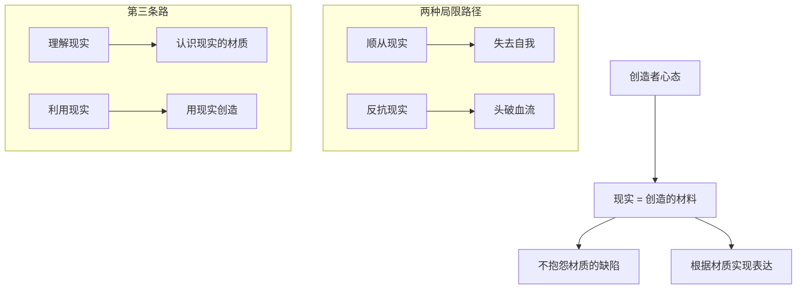
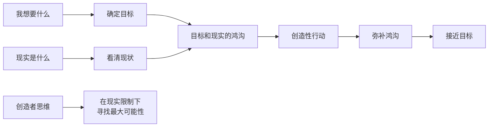

# 第44课：现实炼金术——面对现实的第三条道路

前面几课我们讨论了顺从现实和反抗现实的局限——顺从让你失去自我，反抗让你头破血流。那么，有没有第三条道路？

答案是：**理解和利用现实**。这条路的核心是放弃将现实拟人化的倾向，把现实看作你用来创造的材料。这种材料一定有不顺手的地方，也有很多缺陷——但你仍然需要根据你所在的现实，来实现你想要成为的自我。

当你从顺从和反抗中解脱出来，投入对现实的创造，你就获得了一个新的自我——**作为创造者的自我**。

## 二舅的木工：创造的隐喻

回到二舅的故事。在床上躺了三年后，他下床的第一件事是让父母买全套木工工具，开始学做木匠。

做木匠本身就是一种隐喻——二舅一生最擅长的是修补东西。他不仅通过修补东西让自己变得有用，也在潜意识里完成了修补自己人生的愿望。木工是一个创造性的工作，他可以投入其中，忘了自己。通过这样的工作，二舅既创造了很多家具和木工产品，又创造了一个新的自我——不同于"没有用的瘸子"，而是一个**有创造力的匠人**。

无论你拥有什么样的现实，你都可以成为现实的创造者。

## 创造者的两个核心

### 第一：想象你要实现的新自我

就像我们在新坐标中所讲的，这个新自我既不是为了世俗意义上的成功，也不是为了获得别人的赞扬和认可。它纯粹是因为——这个想要成为的自己，既连接着你过去的重要经验，又有你隐约感觉到的"我想要"。

这个新自我不需要很具体，你只需要对它有足够的热爱。当你想到这个自我的形象时，你会有一种由衷的欢喜——"如果那样就太好了"。也许你还不知道具体要做什么、怎么做，但你知道对什么感兴趣、什么会吸引你。你曾经体会过成为那样的自己所拥有的活力和创造力。

**这种热爱提供了足够的张力——它是创造最重要的动力。**

> [!TIP] 核心洞见
> 罗伯特·弗里茨在《最小阻力之路》中提出：创造一首动听的曲子和创造一个想要的人生，遵循同样的心理历程。艺术家的创造经验可以迁移到人生的打造上来。创造者不是等待灵感，而是主动构建"我想要什么"和"现实是什么"之间的张力——这种张力本身就是前进的动力。

### 第二：认识你面临的现实

如果说想要成为一个新自我是"概念"，那推动它实现的基础就是"现实"。现实里有资源，也有困难。

在转变期，我们尤其会面对一些很难面对的现实——困难、挫折、伤痛、失落。有时候我们不想面对现实，是因为不想面对这种痛苦。可问题是，**不面对现实并不能回避这种痛苦，它反而延长了痛苦。**

无论现实有多困难，面对和不面对它，它都存在。面对现实的意义在于——**我们能够利用它，去创造新的可能性。** 现实是创造的起点。

如果你对想要实现的新自我是认真的，那你越看清现实，越能做出判断：

- 什么样的行动对推动新目标的实现是真正有效的？
- 什么样的行动只是在逃避痛苦？

## 用目标思考现实

创造者和顺从者、反抗者的区别在哪里？

**创造者不会让现实来决定"我想要的自我"是什么。** 作为目标和创造的终点，这个想要实现的自我由你决定。创造者只根据现实来判断：我以什么样的方式和时机来实现我想要的自我，是更有效的？

让我们用目标来思考现实——先想"我要什么"，再想"我面临的现实是什么"，再想办法弥补目标和现实之间的鸿沟。

### 案例一：研究者的梦

一个学员一直梦想成为研究者，但申请博士没有成功，只能先找一份不太喜欢的工作，解决经济上的燃眉之急。他很苦恼，觉得自己为钱放弃了理想。

从创造者的角度，你不需要无视现实，而是正视现实。一个创造者会想：**"对，我想读书深造，可是现在没有钱。在这样的条件下，我怎么才能实现读书深造的目标呢？如果钱是创造的前提，那我就先去挣钱，为将来读书深造创造有利的条件。"**

这样一来，当他在挣钱的时候，他知道自己为什么这么做。

### 案例二：不要厌恨现实这片海

一个同学名校毕业，本来应该去做金融，但他不想——他想写小说。放弃别人眼里光明的道路去探索未知，这是一个转变。但他说起这个选择时显得愤世嫉俗，觉得大部分人的生活都普通冗长，不想跟普通人有什么联系，只想跑到哪里去隐居。

我跟他说：**"我当然支持你写小说，只是不要去记恨现实。就像你站在岸边，目标是远处的小岛，看着中间隔着茫茫大海——你怨恨大海为什么把你们隔开。可事实上，它能载你去那儿。我们的现实就是这样一个大海，不要去厌恨它，而要利用它。找到那艘船，它就能载你去你想去的地方。"**

> [!WARNING] 创造者的风险
> 创造者路线最大的风险是：你可能投入很多却没有达到目标。但请注意——**定义创造者的不只是他的作品，而是他一直在做的事。** 如果你一直在利用现实创造你想要的生活，那你就是生活的创造者。就算你是雕塑家，也会雕塑出一些让你不满意的作品——但那并不意味着你不是雕塑家。

## 创造者的回报

目标和现实的差距会带来焦虑，让你患得患失。但它也会改变你的生活，推动你努力向前。它是转变的动力，带你去一个你不熟悉的地方，去遇见一个你未知的自己。

这个过程中，你可能会因为痛苦而宁愿放弃梦想，把失败归咎于困难的现实——或者宁愿扭曲现实来欺骗自己，以缓解这种痛苦。

但作为创造者，你也会收获回报：在认清现实的基础上，你不断被现实限制，又总是能最大限度地寻找新的可能性来突破现实。目标和现实的鸿沟不断对你提出挑战，磨砺你的心智，推动你转变。

你的精神由此变得更有活力、更加强健。而当你为此努力的时候，其实你已经实现了一个自己——**作为创造者的自己。**

而最好的回报，就是那个在艰难中生长出来的自我。

> [!QUESTION] 自我检查
> 拿出纸笔，回答三个问题：
> 1. **你想要成为什么样的新自我？** ——不需要很具体，只需要描述一个让你有"如果那样就太好了"这种感觉的形象。
> 2. **你要面对的现实是什么？** ——客观地列出现实中的资源（你的优势、已有的条件）和困难（限制、障碍）。
> 3. **你可以做哪些事来弥补新自我和现实之间的鸿沟？** ——至少列出三件具体的事，无论多小。
>
> 注意：回答第一个问题时，不要让现实限制你。回答第二个问题时，不要让目标美化现实。回答第三个问题时，才是创造的开始。

参考答案

三个问题分别对应了创造者的三个要素：目标、现实、行动。很多人会把第一和第二个问题混淆——要么用现实来否定目标（"我没钱，所以不现实"），要么用目标来扭曲现实（"只要我想要，现实不是问题"）。创造者的思路是：目标由你决定，现实需要尊重，而行动就是弥合两者之间鸿沟的创造性过程。你不需要立刻填平这道鸿沟，你只需要开始往那个方向走——每一步都是在用现实创造你想要的生活。

---

继续学习：[[0045-xin-nian-dan-sheng|第45课：信念是如何诞生的]] | [[reference/glossary|核心术语表]]