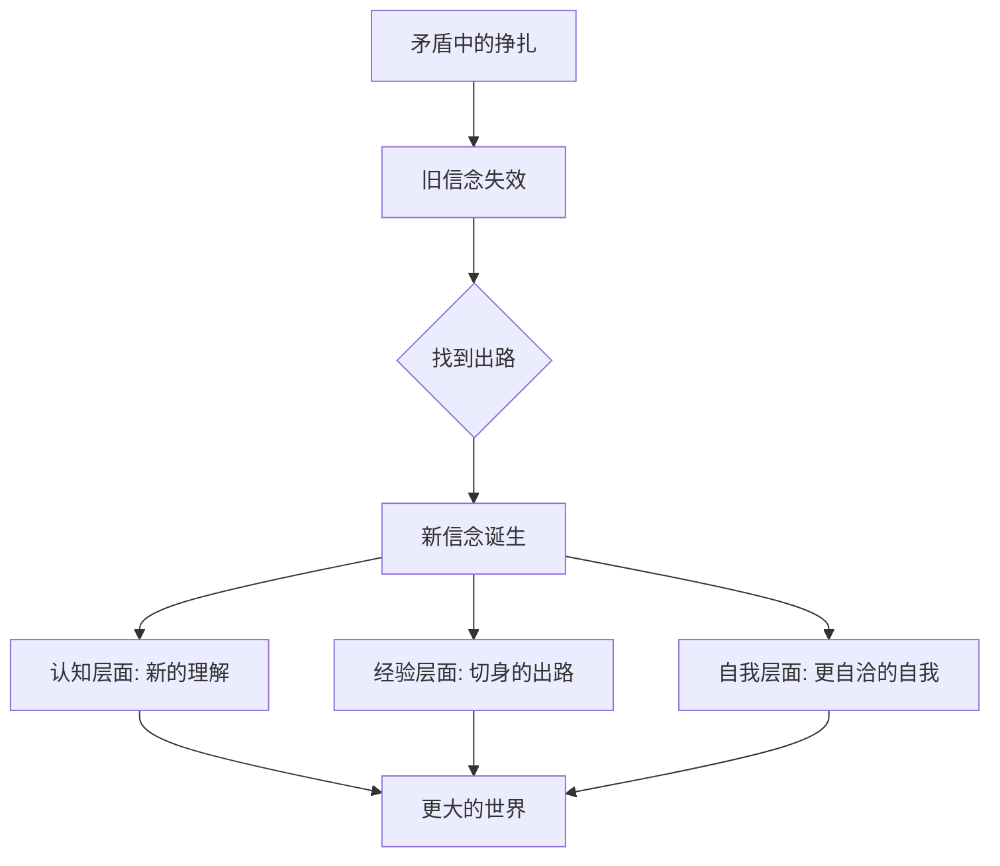

# 第45课：信念是如何诞生的

前面几课我们讲了如何建立新的评价坐标、如何处理与现实的新关系。从这一课开始，我们进入建立新自我的第三个环节——**创造新信念**。

你身边有没有那些特别安定的人？他们胸怀宽广，能接纳身边的变化起伏，哪怕遇到棘手的事也表现得云淡风轻、荣辱不惊。好像他们的世界很大，而困扰他们的事很小——同样变小的，还有他们个人的遭遇和得失。

这样的人常常经历过很多重要的转变。这些转变帮他们建立起了一些重要的信念——无论外部世界如何变化，这些信念变成了他们心里的锚点。

信念从哪来？它并不是凭空产生的，而是**心灵在转变中为自己寻找到的出路**。这个出路最初是为了解决变化中的自我和现实的矛盾，但当它诞生时，常常给你带来一个全新的世界。

## 桃花园的隐喻

陶渊明的《桃花源记》这样描述进入桃花源的过程：

> "林尽水源，便得一山，山有小口，仿佛若有光。便舍船，从口入。初极狭，才通人。复行数十步，豁然开朗。"

这是一种隐喻——信念诞生的过程，似乎都要先经历一个狭小的、挣扎的心灵空间，才能慢慢来到一个更大的世界。

## 信念的第一个特征：不发生在现实层面

信念是困境中的出路，而这种出路首先是**认知和心灵层面的出路**。

曾有人问：到了中年，岗位已经没有升值空间了，觉得很苦恼，想换工作又没有技能，看不到出路，该怎么办？

现实有时候会让我们失去一些可能性——但心灵永远会为我们保留一些可能性：

- 换工作是一种可能性
- 在平凡的工作中找到生活的意义，也是一种可能性
- 享受工作是一种可能性
- 通过努力工作挣钱去享受生活，也是一种可能性
- 拥抱变化是一种可能性
- 享受岁月静好，也是一种可能性

心灵拥有这样的创造性——它会不断创造新的信念，带我们到一个更加广阔的世界。

## 信念的第二个特征：适应矛盾的产物

信念是我们在矛盾重重的困境中为自己找到的出路。信念就是这条出路的语言化。

### 案例："成长比成功更重要"

一个朋友是个很理智的人，做选择时总是分析各种利弊得失。他原来在公司带一个团队，做得不错。有一天老板希望他去带一个新项目——这个项目重要，成功了会有很大突破，但也很困难，前两个主管都失败了。

他陷入了矛盾。他希望事业有所突破，但失败的可能性不小——一旦失败，别人就会质疑他的能力，而他又很在意别人的看法。他分析了各种利弊得失，咨询了很多朋友，都没有办法下定决心。

无奈之下他先去了新部门，但心没有安定下来，总在想退路。团队成员能感觉到他的不投入，大家充满怀疑，做事情也很不顺。

经过一段时间的挣扎，他告诉自己不能再这样下去了。他跟团队成员说："你们放心，我绝不会离开。只是我对新业务不够熟悉，希望大家能给我一些指导，我们一起全力把它做出来。"

他们聚焦到一个新方向进行尝试。运气不错，新方向有了不错的反馈。慢慢地，他接受了自己的新角色。

他是怎么下定决心的？他说：

> **"有一天我在读一本传记，读到一句话，忽然就想通了。那句话是——成长比成功更重要。我一下子就明白了：我之所以犹豫不决，是因为我一直担心最后的结果。可是我要问自己，努力投入这件事能帮我成长吗？答案是肯定的——那就好。"**

你是不是觉得这句话很鸡汤？也许它本来就只是他决心的总结，也许是这句话帮他下定了决心。但无论如何，这句话真的帮他从矛盾中解脱了出来，变成了他转变的出路。**"成长比成功更重要"——变成了他新的信念。**

几年以后，他又经历了几次职业变动，越来越成功，也越来越有应对变动的经验。回想当初，他说："那时候我还会瞻前顾后，如果是现在，我不会犹豫那么久，我会拎起包来就走。"

> [!TIP] 为什么道理我都懂，却过不好这一生？
> "成长比成功更重要"这句话很多人都读过，但为什么对它没有帮助？因为信念是特定困境中的出路，是适应矛盾的产物。如果你不在那样的困境里挣扎，没有用自己的转变经验、那种切身的痛苦去喂养它，那这句话对你只是一句遥远的道理——好听但没有用的鸡汤。**除非你真的挣扎着在心灵上找到了这条出路，它才能变成你的道理。**

## 信念的第三个特征：背后有一个更自洽的自我

一位女性创业者，原本有稳定的工作，辞职后做母婴产品创业。她有两个女儿。创业前她总是以家庭为重，创业后却无暇顾及女儿的生活，没时间陪女儿，也没时间出席家长会。

有一次，女儿哀怨地对她说："妈妈，我觉得我快要失去你了。"

女儿的悲伤让她痛苦内疚。虽然她已经尽量抽时间陪女儿、在物质上补偿她，但她心里总在想：**"我是不是为了自我的发展，牺牲了女儿的幸福？"**

我跟她说：其实妈妈能给女儿的不仅是陪伴，妈妈还能给女儿更多。你给女儿的是很珍贵的东西——你给了女儿一个榜样，让她知道女性也能去追求自己的事业、实现自己的价值。这样当有一天她也面临同样的选择，她会记得妈妈的选择，从而有勇气去选择自己的道路。

这番话深深打动了她，把她从女儿和事业的冲突中解脱了出来。以前她总觉得自己追求事业是为了自己、牺牲了女儿，现在两者统一了。

**"成为女儿的榜样"——变成了她的新信念。** 这个新信念不仅帮她走出了矛盾，还成了她新自我的基础——作为一个事业女性的自我。

## 信念是转变的副产品

信念为什么这么有用，又这么难获得？

因为它是**转变的副产品**。你需要在矛盾中挣扎、挣扎，才能找到属于你的出路。就像两个地壳板块在不停地挤压、挤压——挤压着，一座新的高山就诞生了。

如果你也在转变的困境中，可以问自己三个问题：

1. **我的困境在哪里？** ——是什么矛盾在拉扯着我？
2. **我原来的信念为什么没有办法帮我摆脱困境？** ——旧的思路什么地方走不通了？
3. **提供可能出路的新信念是什么？** ——什么样的新理解能让我走出这个矛盾？

> [!WARNING] 警惕"虚假信念"
> 有些"信念"听起来很好，但其实是逃避现实的借口——比如"平凡可贵"（可能是害怕竞争）、"随遇而安"（可能是懒得行动）。真正的信念是你在矛盾中挣扎出来的出路，而不是你为了避免挣扎而选择的退路。区分的方法是：这个信念让你更有力量去面对现实，还是让你更心安理得地逃避现实？

> [!QUESTION] 自我检查
> 回想你经历过的一次内心矛盾：
> 1. 当时的矛盾是什么——两个"想要"的冲突？还是"想要"和"现实"的冲突？
> 2. 你是通过什么方式走出这个矛盾的？
> 3. 如果现在回头看，那段经历是否让你形成了某个新的信念？
> 4. 这个信念是真正的"出路"，还是某种"逃避"？

参考答案

信念不是读来的道理，不是听来的名言，更不是别人告诉你的答案。它是在你亲身经历的矛盾中，被现实挤压、被痛苦喂养、被心灵锻造出来的产物。它之所以能成为你内心的锚点，不是因为它多正确，而是因为它"救过你"——它在你最无助的时候帮你找到了出路。所以不必羡慕那些看起来很有信念的人——你只需要诚实地面对自己的矛盾，属于自己的信念自然会在挣扎中诞生。

---

继续学习：[[0046-liang-zhong-xin-nian|第46课：两种新信念——如何创造属于你的新信念]] | [[reference/glossary|核心术语表]]