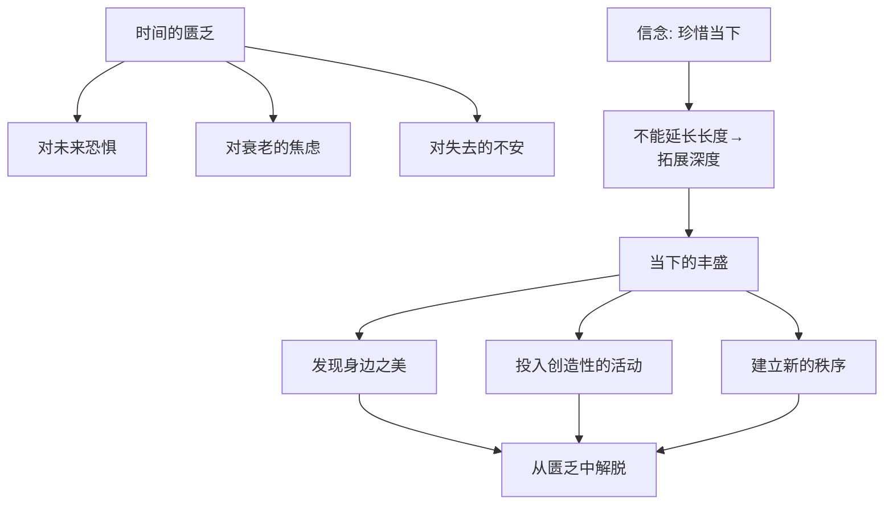
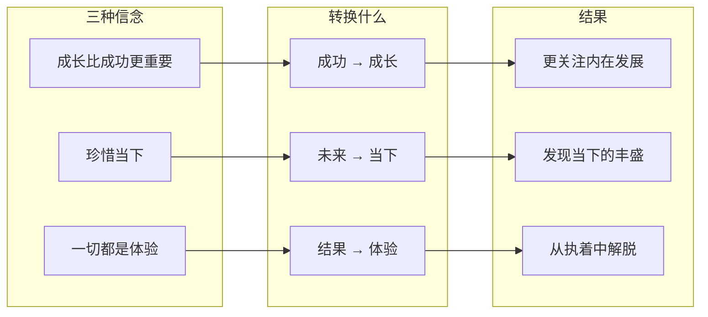

# 第46课：两种新信念——如何创造属于你的新信念

上节课我们讲了信念是如何诞生的——它是心灵在矛盾中为自己找到的出路。这一课我们继续深入，介绍两种重要的信念：**珍惜当下**和**一切都是体验**。通过它们，你能更清晰地看到信念诞生的完整过程。

神话学家、《英雄之旅》的作者坎贝尔在八十多岁时接受采访。有人问他："你想不想更年轻？"他想了想说："当然我想变回71岁——再年轻就不要了。"

"为什么是71岁？"

"因为我是从71岁开始，学会了不再执着于一定要完成什么目标，也不再在意社会的评价。我从71岁开始，才学会真正地珍惜当下。"

这段话里包含的两个信念——**珍惜当下**和**不再执着于目标**——能够帮助我们从很多人生的困境中解脱出来。上一课我们讲了"成长比成功更重要"，这一课我们来讲这两个。

## 信念一：珍惜当下——走出时间的匮乏

### 退休领导的困境

一个学员是单位的领导，很爱自己的事业，几乎把全部精力都投入其中。但现实是——他要退休了。

他做了很多心理建设：以后不会有那么多人注意我了，人走茶凉是正常的；以前没时间留给自己，现在可以闲下来了。可真当闲下来时，他却发现自己对以前想做的事完全没有兴趣。他陷入了巨大的空虚。

归根到底，他不能接受自己老了。往前看，什么都没有了——不再有升迁，不再有成绩，不再有激动人心的事发生，有的只是衰老和死亡。

他去参加一个正念禅修营，问师父怎么克服对衰老的恐惧。师父说：**"如果你看不到未来，那就看现在。你能看到现在的丰盛，就不会恐惧未来。"**

他回来以后捡起了年轻时的爱好——画画。画画的时候他忘了自己。他开始阅读、养花、到桂花下喝茶。他发现，当他珍惜当下的时候，他就待得住了，生活也开始变得有序起来。

> [!TIP] 核心洞见
> 珍惜当下是身处匮乏的人的出路。如果你不能通往未来的长度，那你至少可以通往当下的深度——这种深度同样是广阔而无限的，它需要有创造力的心灵去发现。

### 苏东坡的当下丰盛

中国文化偶像苏东坡，曾当过杭州太守，位高权重、好友成群。但因为仗义直言，被贬到湖北黄州。他带着家属生活贫苦——为了节约开支，每个月往房梁上挂一贯钱，这就是一个月的用度。

但在这样的困顿中，他创造了属于自己的丰盛。在千古名篇《赤壁赋》中，朋友感叹人生短暂，苏东坡却说：

> **"惟江上之清风，与山间之明月，耳得之而为声，目遇之而成色，取之无禁，用之不竭。"**

这就是当下的丰盛——这是认知最了不起的创造力。通过发现当下的丰盛，他从贫瘠的未来中把自己解脱了出来。

## 信念二：一切都是体验——走出对结果的执着

### 一段结束的婚姻

一个学员刚刚结束了一段婚姻。先生和她青梅竹马，曾经是她的全部。两个人度过了很多恩爱的时光，先生也给了她很多关照。但最终，他们因为各种原因分开了。

感情越好，离开就越艰难。她总是在想：

> **"我们一起经历过这么多美好的事情，为什么会是这样的结局？如果最终的结局是离开，那我们所经历的那些美好的瞬间又是什么呢？"**

当她这么想的时候，她发现——自己不仅失去了未来，也失去了过去。那个曾经无比真实的过去，因为结果的改变，好像变成了一个"错误"。

在最痛苦的时候，她看到一段话：

> **"人生就是一场体验，所有的价值都在这个体验里。"**

她忽然觉得自己解脱了——人生就是一场体验，无论结果如何，你所经历的事情都有它的价值。这个信念帮她找到了过去的意义，也给了她面对未来的勇气。

之前因为感情的挫折，她总想"我再也不谈恋爱了——既然感情这么好都会离婚，那其他的感情更是假的，何必呢？"现在她开始想：**既然都是体验，就让自己多一些新的体验。就算结果不确定，那又怎么样呢？**

这个信念虽然没有让她完全放下恐惧，但给了她新的尝试和勇气。

### 信念真正改变了什么

你有没有发现，"一切都是体验"作为一种新的评价坐标，帮我们**从外在的结果中解脱出来**，带我们到了一个更大更远的世界。

坎贝尔说：当我们在问人生意义的时候，其实在问的是——我们人生所经历的深刻的体验是什么。深刻的体验是意义感的来源，是生活的本质。体验重要的不是好或坏、快乐或痛苦，而是**深刻还是肤浅**。

如果是这样，还有什么比我们在转变中所经历的——告别旧自我、寻找新自我、在矛盾中寻找出路——更加深刻的呢？这就是转变的价值。

## 三种信念的共通逻辑

结合上一课的"成长比成功更重要"和这一课的两种新信念，你会发现它们的共同结构：**都是在矛盾中被挤压出来，完成新旧评价坐标的切换。**

| 信念 | 旧坐标 → 新坐标 | 对应困境 |
|------|-----------------|---------|
| 成长比成功更重要 | 外在成功 → 内在成长 | 害怕失败、太在意结果 |
| 珍惜当下 | 不确定的未来 → 丰盛的当下 | 时间匮乏、衰老焦虑 |
| 一切都是体验 | 结果好坏 → 体验深浅 | 失去后的意义危机 |

它们从不同的维度加强了自我。当这些信念成为你的一部分时，你会发现——自己面对的是一个更广阔的世界。你能变得更自信、更主动、更无畏、更不被外界左右。

**新信念伴随着自我转变的矛盾而生——它是新旧自我转变最珍贵的礼物。**

> [!WARNING] 两种信念的常见误用
> "珍惜当下"可能被误用为"安于现状"——不再追求任何改变。"一切都是体验"可能被误用为"什么都无所谓"——变成对痛苦的麻木。请区分：真正的信念让你更有力量面对现实，而不是让你更心安理得地逃避。苏东坡的"珍惜当下"是在被贬的困顿中创造出来的，不是他选择躺平的借口。

> [!QUESTION] 自我检查
> 对照三种信念，审视你当前的困境：
> 1. **成长 vs. 成功**：你最近在追求的"成功"，有多少成分是为了给别人看？如果把这个目标换成"这会让我成长吗"，你的选择会变吗？
> 2. **当下 vs. 未来**：你最近一次感到焦虑时，那个焦虑指向的是"还没发生的事"吗？如果此刻就是全部，你的感受会有什么不同？
> 3. **体验 vs. 结果**：如果你能做到"无论结果如何，这段经历都有价值"，你会更敢于尝试什么？

参考答案

这三种信念看似简单，甚至像"鸡汤"，但请记住：**鸡汤和信念的区别在于，前者是你读到的道理，后者是你亲自走出来的出路。** 如果你没有在矛盾中挣扎过，这些句子对你毫无意义。但如果你正在经历艰难的转变——你可能会发现，这些信念不是从书上来的，而是从你的痛苦里长出来的。它们之所以能成为你内心的锚点，不是因为它们正确，而是因为它们"救过你"。

---

继续学习：[[0047-ren-sheng-gu-shi|第47课：阶段和环节——如何讲属于你的人生故事]] | [[reference/glossary|核心术语表]]