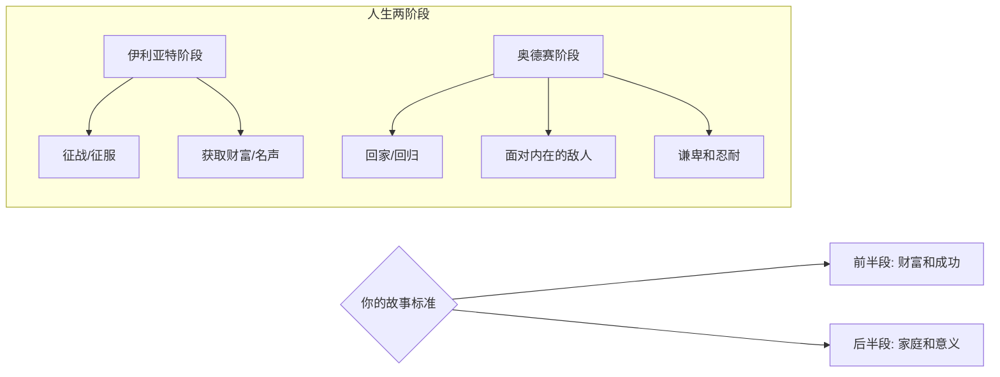
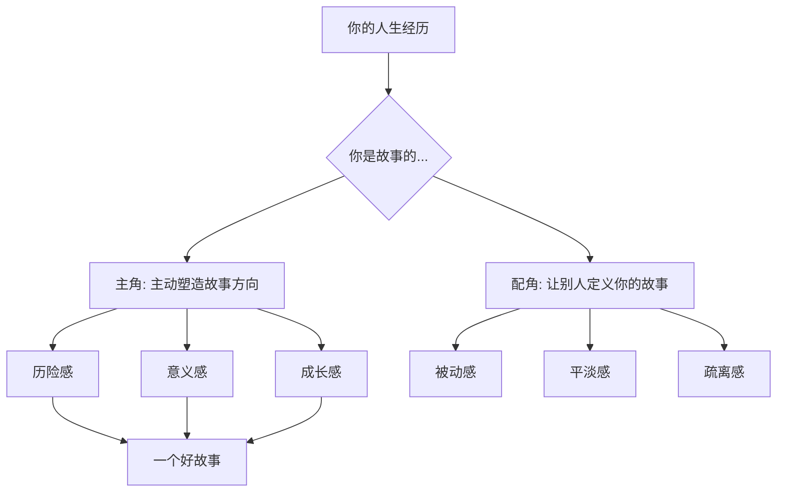

# 第47课：阶段和环节——如何讲属于你的人生故事

经历了新旧评价坐标的切换、重新理解现实、建立新信念的阶段，我们的课程终于来到了最后一个环节——**书写新故事**。

你是在故事里长大的。不认识字之前，父母给你讲故事；识字了，你开始自己读故事；再长大一点，你从小说、电视、电影里找那些跟你的人生发展阶段相对应的故事。你和故事里的主人公一起经历他的人生——或为他振奋，或为他惋惜。

但你也一定听过：故事都是假的，不要认真。这话对也不对。就情节而言，故事当然是虚构的；但就传递的信息而言，好的故事有它**心理上的真实性**——它能表现人在关系中真实的情感反应，能体现主人公通过克服困难、成长和蜕变所经历的心理历程。

而**转变是故事最重要的母题**。神话学家坎贝尔在他的"英雄之旅"中，把所有的英雄神话都看作心灵成长和转变的隐喻。

## 故事帮我们理解正在经历的事

有一个学员毕业时加入了一个互联网公司。在互联网公司蓬勃发展的时候，他却选择去美国读书。等他回来，那个公司已经发展成了国内巨头，原先的同事都身价倍增。

为了弥补损失，他选择创业。最开始风光过，融到过钱，但后来无法维持，不得不关门大吉。他觉得自己彻底失败了——他的故事范本里，只有积累大量财富才是成功的唯一标准。

为了拓展他的故事范本，我跟他讲了《荷马史诗》：

> 荷马史诗分为两部——《伊利亚特》和《奥德赛》。《伊利亚特》讲的是英雄征战的故事——英雄要去征服、去搏杀、去获得丰厚的战利品，让自己威名远扬。《奥德赛》讲的却是英雄回家的故事。英雄奥德修斯忽然发现，原来的一腔英勇再也不管用了——他要面对不可战胜的巨人、女妖的诱惑、无数阻碍他回家的迷途。他的敌人变成了他自己，他只能靠谦卑和忍耐逃过一劫又一劫。

故事的最后，奥德修斯率领的浩浩荡荡的船队一艘艘沉没，这个著名的英雄只能像无助的孩子一样抱着木头求生。最后木头也沉了，他抱着一根漂浮的无花果树，正是这根无花果树把他带回了家乡的沙滩。

他听进去了这个故事。他说：

> **"陈老师，我知道了。我的人生处在后半段，我不能只用财富衡量自己。我需要去寻找新的人生标准。"**

这个故事让他开启了不一样的英雄之旅。但这个故事不是我讲给他听的——这是荷马史诗作为远古的神话，一直要讲给世人听的。当你和神话故事建立了连接，它就变成了你的故事，你的经历也有了意义。

心理学家荣格说：**没有神话的人，就像浮萍一样——他与过去、与所继承的先辈的生活、与当代社会都没有真正的联系。**

## 故事帮我们理解将要经历的事

那位学员认同了《奥德赛》的故事，就会从这个故事里寻找答案。奥德修斯最终回家了，他也会想：那我是不是也要回家呢？回家意味着什么？是回归家庭吗？是去陪伴因为创业而被忽略的爱人和孩子吗？

那段时间，他每天送孩子上学、接孩子回家。有一天，在问自己新的人生意义时，他忽然想到了：

> **"我没有变成别人眼里成功的人，可是别人有什么重要呢？说到底，我要在乎的只是自己的家人。我想要成为孩子的英雄，我想要成为让孩子骄傲的爸爸。"**

想到这一点，看着旁边依赖他的孩子，他忽然热泪盈眶——他与这个目标有了深刻的情感连接。这个连接提示他：这是他的故事。

怎么成为让孩子骄傲的爸爸？他还不知道答案。但这个发现意义重大——它帮他把目光从外人转回到了自己真正在意的家人身上。**这是他的奥德赛。**

> [!TIP] 关键洞见
> 你可以问自己：你的经历最像故事里的谁？你为什么认同这个故事？当你跟一个故事建立了连接，它就帮你理解了正在经历的事——这个故事也就变成了你的故事。如果你认同了某个故事，你就会受它启发，它就会指引你的人生，慢慢变成你的命运。

## 用经历成就一个好故事

故事不仅帮我们理解正在经历的事——它还有第二个作用：**我们用自己的经历来成就一个好的人生故事。**

如果是这样，你就需要从故事的角度来思考人生。好的故事有自己的标准，而这个标准也变成了你的人生标准。你一边用选择推动故事的发展，一边不停地观察：

- 这是一个什么样的故事？
- 我喜欢这个故事吗？
- 我是故事的主角，还是不幸变成了故事的配角？

作家蒋方舟曾与我讨论现代人的信仰危机。她说：**"也许是因为我们现代人的人生，总是缺少一种历险感。没有这种历险感，生活就会变得平淡无奇。"**

从故事角度看，熟悉的生活因为属于传奇的一部分，而有了一种神圣感：

- 转行不只是转行——它是离开熟悉的村庄去往黑森林
- 理想不只是理想——它是你在努力寻找的圣杯或者宝藏
- 每一个在现实中挣扎着寻找出路的人——都是跟恶龙作战的英雄
- 恶龙也不只是现实的困难——它变成了我们要超越的人生的弱点

心理学家海德特在《象与骑象人》中说：**人格的核心并不是外在的特质，人格的核心其实是一个故事。故事赋予了经历意义，而我们从这个故事里寻找到关于"我是谁"的答案。**

> [!WARNING] 警惕"受害者故事"
> 同样一个故事，你可以用两种完全不同的方式来讲。比如经历了一次创业失败：你可以讲一个"命运对我太不公平"的受害者故事，也可以讲一个"英雄在挫折中重新认识自己"的成长故事。请注意：故事不是对事实的歪曲，而是对意义的建构。选择讲什么故事，就是在选择成为什么样的人。

> [!QUESTION] 自我检查
> 回顾你人生中最近一次重要的转变：
> 1. 如果用一部电影、小说或神话来比喻你这段经历——你会选什么？
> 2. 在这个故事中，你扮演的是什么角色——英雄、受害者、旁观者、还是守护者？
> 3. 如果让你为自己的人生故事写下一章的标题——你会怎么写？
> 4. 这个故事是"伊利亚特"式的（征战、获取），还是"奥德赛"式的（回家、回归）？你处在哪一段？

参考答案

故事不是生活的装饰品——它是你理解自我、赋予意义的基本方式。那位学员从"财富自由的成功故事"切换到"成为孩子骄傲的爸爸的奥德赛故事"，这不只是换了一个说法，而是换了一个人生坐标。**故事的力量不在于它多符合事实，而在于它把你放到了一个什么样的位置——你是故事的被动承受者，还是主动创造者？** 当你意识到你有权选择自己的故事，你就不再是命运的囚徒，而是人生的作者。

---

继续学习：[[0048-nu-li-yu-bu-shi-he|第48课：怎么区分"不努力"和"不适合"]] | [[reference/glossary|核心术语表]]