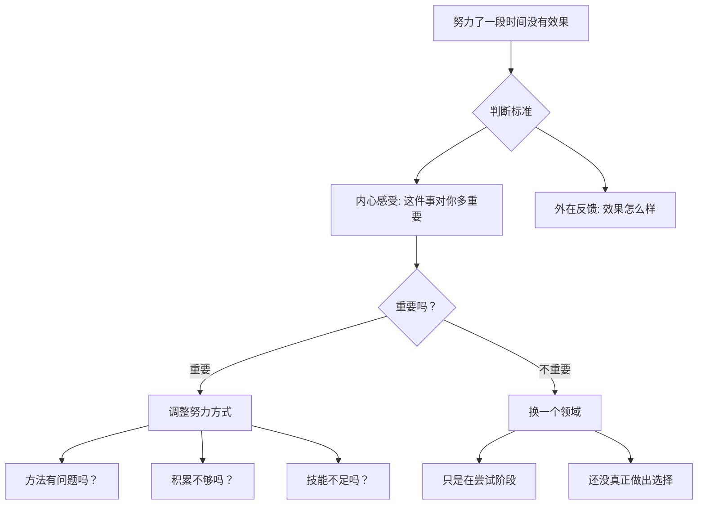

# 第48课：怎么区分"不努力"和"不适合"

经历过转变的人都会遇到一个问题：当你在新方向上努力了一段时间却发现没有效果——你究竟是不够努力，还是这个领域根本不适合你？这个问题的答案并不简单，但它关系到你是该继续坚持还是该换一条路。

## 两个标准：内心感受与外在反馈

判断是否该坚持一件事，有两个不同的标准。

**第一个标准是内心的感受**——这件事对你有多重要？你有多想做成它？你有多享受做这件事的过程？

**第二个标准是外在的反馈**——投入努力时，效果怎么样？有没有成功的体验？

这两个标准都很重要，它们相互影响。但它们是分先后的——**内心感受在前，外在反馈在后。**

## 从内心感受出发：重要就调整，不重要就换

如果这件事对你**很重要**，努力一段时间发现没有效果，你先想到的不是放弃，而是**调整努力的方式**。你会问自己：

- 这是我的方法有问题吗？
- 是我积累得不够吗？
- 是我还没有掌握足够的技能来应对这件事吗？
- 怎么才能更有效地掌握它？

你会把"努力了但没有效果"看作是对努力方式的反馈，而不是对"是否适合这个领域"的反馈。你会去改变努力的方式，让它更有效。

但如果这件事对你不重要，效果不好时你自然会想放弃——它不重要，就不值得你投入。

那么，怎么决定这件事是不是重要呢？**观察自己的选择。**

如果你选择了继续深入，就要问自己：我对这件事的投入程度，是否与这件事对我的重要性相匹配？

如果你选择了换一个领域，那就告诉自己：这件事并不重要，我只是在尝试阶段，还没有真正做出自己的选择。可以参考前面"容器"的课程，给自己一个容器不断尝试——这也很好，只是**不要在选择阶段停留太久**，否则你会一直没有办法深入。

> [!TIP] 关键区别
> "不适合"的典型信号是：你发现自己完全不想投入，即使投入了也觉得索然无味、毫无动力。"不努力"的典型信号是：你想投入、觉得重要，但遇到困难时第一反应是"我不行"而不是"我换个方法"。前者是关于"要不要做"的问题，后者是关于"怎么做"的问题。

## 选择伴随后悔：用新坐标重新评估

即使你分清了"不努力"和"不适合"，选择了改变——你仍然可能后悔。

走出改变人生的重要一步，是可能会后悔的。但别忘了：**不走出这一步，你也同样可能会后悔。** 哈佛大学心理学家丹尼尔·吉尔福特的发现：相比于做了选择，因为没有选择而错失一件事更让人后悔。

人站在选择的当下，是看不清模糊的未来的。这时候你需要问自己：**我做这个选择是为了什么？**

很多人选择转变，是因为内心有一个更重要的自我要去实现，而现在的现实并不能接纳这个自我。可是当他想是否会后悔时，用的却是旧的评价标准——"能不能挣更多钱""会不会更成功"。

那在这个过程中：

- 人的成长呢？
- 获得的新生命体验呢？
- 通过选择新道路所获得的艰难领悟呢？
- 带着这种领悟继续在生活中寻找的勇气呢？
- 因此而发展的新自我呢？

这些在新的评价坐标上的获得，算不算收获？你当初不就是为了这些收获，才做出选择的吗？

> 就像一个人原来打算去罗马，现在转到去耶路撒冷朝圣了——你不能问"去耶路撒冷能更快到罗马吗"，你只能问"去耶路撒冷，这是比罗马更值得走的道路吗"。

如果你想明白了这一点，就不会那么容易后悔。你只会在选择的道路上不断向前，直到新的评价坐标建立起来。

## 选择的另一个面向：承诺

选择不是不断地"试试这个、试试那个"。**选择与承诺是匹配的**——如果没有深入一条路的承诺，看起来你有很多选择，其实并没有真正做出选择，你只是用很多的选择逃避了真正的选择。

选择的意义在于：你愿意深入一件事或一段感情，为此舍弃一些东西。没有舍弃，就没有选择。

对亲密关系更是如此。当你选择跟一个人走得更深，你要接纳他的各种缺陷、协调不一致、修复关系中的伤害。最终得到的是把自己的生命跟另一个人紧密地连在一起——那时候你不再只是一个单独的个体，而变成了"你们"。

这部电影《世界上最糟糕的人》的主人公朱莉，能自由地选择学业和工作，但她总在深入之前就逃离。她有一个事业有成的男朋友想和她定下来，她的选择方式是跑出去和别人出轨，然后分手。这种对更深亲密关系的恐惧，变成了她需要克服的弱点。

恐惧的背后有很多可能：害怕失去自我、害怕发现对方真实的丑陋、害怕被抛弃、害怕受伤。无论是什么，既然这种恐惧妨碍了成长，就应该去面对和克服它——否则你的人生就会被恐惧支配。

> [!WARNING] 警惕"探索"的陷阱
> 用"我在探索"来逃避真正的承诺，是一种常见的陷阱。探索本身是好的——在转变初期，你需要容器来尝试不同的可能。但探索的目的是为了找到值得深入的方向，而不是永远停留在"试试看"的阶段。如果在一个方向上你已经投入了很久却始终无法深入，请诚实地问自己：我是在探索，还是在逃避？

## 最后一个问题：真的有人不在乎别人的评价吗？

很多人都想知道，为什么我们会如此在乎比别人强？这不是来自阶级或家庭环境，而是来自人类的本性。作为一种社会性动物，竞争和合作刻在我们的基因里。

但人之所以是高级动物，不只停留在本性里。你不仅追求比别人强，也在追求**超越自己的限制**。转变的意义就在于——把自己从外在的标准中解脱出来，更好地发展自己。

很少有人能完全做到不在乎别人的评价。但你也**不需要完全不在乎**——你只需要做到：

- 不会总是想着别人的评价
- 不会总是想着自己领先还是落后
- 能在一些重要的时刻，不随别人的评价起舞，而是追随自己的内心

拿我自己来说，我当然也在乎别人的评价，偶尔也会想"别的心理咨询师做得比我好"。可是当我走进咨询室，我就会忘了这些评价，也忘了自己。我会全神贯注地去倾听、去反应，和来访者一起经历悲喜，寻找可能的出路。

**如果你足够投入一件事，这件事里就有某种"神明"。通过这件事，你会忘了大众的评价。而你也通过做这件事，找到真正的自己。**

> [!QUESTION] 自我检查
> 想一想你目前正在犹豫要不要放弃的一件事（工作、学习、关系等）：
> 1. 撇开结果不谈，这件事本身对你有多重要？如果没有任何人知道你的选择结果，你还会想做吗？
> 2. 你遇到的是"方法问题"还是"方向问题"？如果是方法问题，你尝试过几种不同的方式？
> 3. 你是真的在"探索"，还是用"探索"在逃避"深入"？
> 4. 如果你的好朋友面临同样的情况，你会建议他坚持还是放弃？为什么？

参考答案

"不努力"和"不适合"没有绝对的标准，它最终取决于你的选择。但你可以通过内心感受来判断方向：如果这件事对你足够重要，你会自发地去调整方法而不是放弃；如果它对你并不重要，放弃也是合理的。区分的关键不在于"是否遇到了困难"，而在于"遇到困难时你内心真实的感受是什么"——是"我想找到新方法继续走下去"还是"我终于有理由离开了"。请诚实地面对这个感受。

---

继续学习：[[0049-jie-yu|第49课：结语——转变之后我们要去哪里]] | [[reference/glossary|核心术语表]]