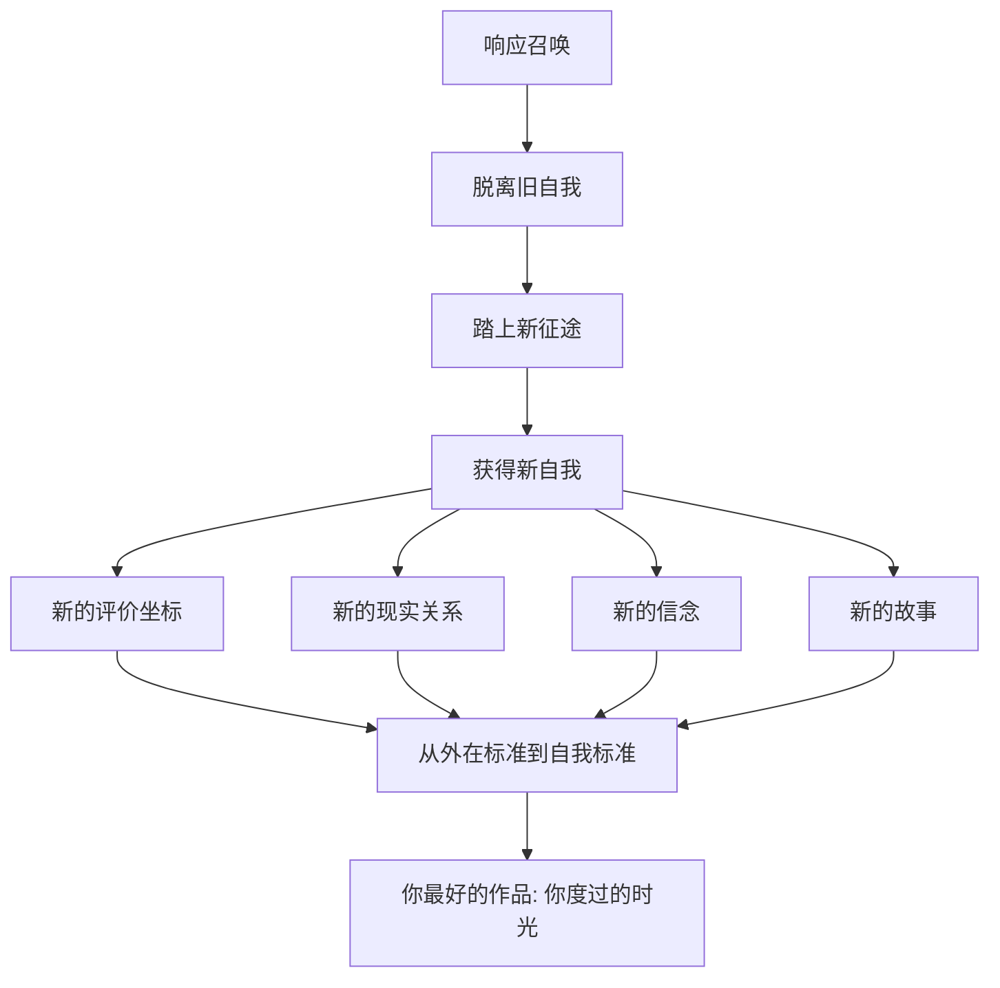

# 第49课：结语——转变之后我们要去哪里

经过五十节课的陪伴，自我转变课程终于要接近尾声了。最后一节课，我想跟你讲讲我的心里话。

如果你跟随课程一直听到现在，你一定已经发现了——如果你正春风得意，这门课并不见得马上就能用上。它是为那些曾经或正在经受挫折、经历失去、努力挣扎着寻找新自我的同学准备的。正是因为经历过这样的痛苦和挣扎，你才会知道转变的分量，才会理解课程最开始的那句话：

**转变从来不是解决一个具体的问题，而是经历一条完整的道路。**

## 完整的道路

这条完整的道路是什么呢？

- **响应召唤**——自我中懵懂的、不溶于环境和现实的那部分自我，推动着你做出选择
- **脱离旧自我**——你失去目标、身份、关系，到荒野中重新寻找自我的坐标
- **踏上新征途**——你从旧自我中最有力量的部分、你所认同的新群体、实践创造的新经验中，寻找新自我的信息
- **获得新自我**——你发现那个隐隐约约期待的新自我到底是谁，从废墟中逐渐找到新的评价坐标——这个坐标不再是外在世界的信号，而是你自己

这条道路本身就是一个关于转变的故事——有开始、有结尾、有中间曲折的经历。它为你提供一个故事的范本，让你理解自己走过的路，也是你未来要走的路。

这个故事是你的故事，也是我的故事，是很多经历过转变的人汇总凝结归纳出来的故事。单独来看，每个故事都不相同；但对比起来，你会发现这些不同的故事背后隐藏着相同的结构——**经历失去的痛苦，重新找回自己的故事。** 这是心灵突破环境的限制，经由"我想要"的指引，去实现自身成长的故事。

## 这门课背后的故事

我为什么对转变这个主题这么感兴趣？又为什么对转变期的失落有那么深的理解？

因为我**自己**也经历过转变。

几年以前，我从浙大离开，放弃了过几周就能分到的房子。我一边失落，一边努力理解在自己身上发生的事是什么。如今我已经忘了这些失落，进入了更大的世界，也习惯了这个更好的新自我，以至于有点不想再提起那个旧自我了。我唯一能记得的是两句话。

### 第一句话

当我意识到自己失去大学教师这个身份时，我对自己说：

> **"现在你所能依靠的，只有你自己的名字和你会的东西。"**

这也像是一个人从外在的失去，迁回到内心的旅程。每天在课程开头，我用不标准的普通话说"你好，我是陈海贤"——这个名字，就是我唯一能依靠的东西。

### 第二句话

当时我在想，假如接下来这半辈子我还能做一件事，我想做什么呢？

> **"如果我的余生只能做一件事，我大概会用来回答：怎么帮助人们从结束的痛苦中走出来，完成转变，走向新的生活。"**

这个问题首先是我自己的，但它同时也是很多人的。我想起了很多在转变中迷茫的来访者——当生活忽然被截断成两半，他们被留在生活的断层中，惊慌失措，无法自拔。以前我也知道转变的痛苦，但没法感同身受。而如今，我和他们站在一起了。

现在想起来，那时候我还太年轻，还不知道余生很长——余生我当然不会只做这一件事。但我记得它。这门课，就是对当时那个愿望的种子遥远的呼应。

## 它不只是运气

每次听到学员讲他们要离开原来的工作和关系、去寻找新自我，我都会吃惊一下——尤其当他们说走上这条路是受我的影响。因为我知道这条路的艰难，我会更慎重。我总是会一遍一遍不停地问他们：

- 转变真的是一条走得通的路吗？
- 有没有别的路可走？
- 是不是真的到了需要转变的时候？

我也会问我自己：当我要把转变的规律教给别人时，我的道路所印证的究竟是一种普遍的规律，还是只是因为我自己运气不错、获得了一些重要的机会，所以把它走通了呢？万一我混得不好，会不会对当初的决定又有不一样的看法？

当我这么问自己的时候，我知道了答案：**我相信它绝对不只是运气。这就是自我成长所要经历的一种普遍的规律。** 道路千万条，归根到底都是同一条——只是我们在不同的因缘下走上了它。

> [!TIP] 最后的关键洞见
> 如果你正经历转变——这个转变的故事会在慌乱中为你提供可以抓住的东西。但你一边抓着它，一边又会怀疑它：万一这个故事不成立呢？万一我从此一蹶不振、再也找不到新的自我了呢？不要因为这种疑惑而害怕讲你的故事。越是疑惑的时候，你越需要这个转变的故事。它会帮你整理新的经验，为你指引未来。**故事不是一开始就是真的——它是讲着讲着才变成真的。**

## 你最好的作品

一位经历过很多转变的企业家，经历过少年成名、一夜暴富，也经历过财富清零的人生低谷，晚年又重建了自己的事业。在讲他的一生时，他说：

> **"我赚的钱、我创立的公司、我的事业，其实都不算什么。我最好的作品，是我度过的时光。"**

这是一个只有经历过转变的人才有资格说的话。

所以 **——无论你现在处于什么样的境遇，面临什么样的选择，你现在或将来会经历什么样的转变——记住：你最好的作品也将是你度过的时光。** 希望你能创造属于你的美好的作品，用你度过的时光。

感谢加入自我转变五十讲。

未来的某一天，当你长出新的自我，我也长出新的自我——我们江湖再见。

> [!QUESTION] 最后的自我检查
> 回顾整个课程和你自己的转变历程：
> 1. 你最初是因为什么"响应召唤"的？那部分"不溶于环境"的自我是什么？
> 2. 你失去了什么——目标、身份、还是关系？
> 3. 你在"荒野"中找到了什么新的方向？
> 4. 你现在形成了怎样的新评价坐标？
> 5. 如果让你用一句话总结你的转变故事，你会怎么说？

一份来自陈海贤的祝福

转变是一条完整的道路，不是某个具体的解决方案。它从响应召唤开始，经历脱离旧自我的失落，到荒野中重新寻找，最终获得新自我。这个过程很艰难，但它是值得的——因为你最好的作品，就是你度过的时光。感谢你一路走到这里。未来的某一天——江湖再见。

---

查看：[[00-course-map|课程地图]] | [[reference/glossary|核心术语表]] | [[reference/transformation-map|转变地图概览]]