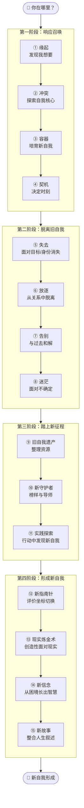

# 转变地图概览

## 各节点速查

### 阶段一：响应召唤

| 节点 | 核心问题 | 关键行动 | 常见困难 | 对应课程 |
|------|---------|---------|---------|---------|
| ① 缘起 | 我到底想要什么？ | 倾听内心的"我想要" | "我不知道自己想要什么" | 第01-06课 |
| ② 冲突 | 不同自我需要打架怎么办？ | 探索自我核心，明确保护性价值观 | 在环境要求和自我愿望之间摇摆 | 第07-09课 |
| ③ 容器 | 如何在安全环境中培育新自我？ | 创造时间容器和关系容器 | 急于做决定，缺乏耐心 | 第10-11课 |
| ④ 契机 | 决定时刻何时到来？ | 识别并利用偶然事件 | 害怕做选择，逃避决定 | 第12-15课 |

### 阶段二：脱离旧自我

| 节点 | 核心问题 | 关键行动 | 常见困难 | 对应课程 |
|------|---------|---------|---------|---------|
| ⑤ 失去 | 如何面对失去的痛苦？ | 突破思维窄化 | 陷入"求不得"的痛苦中 | 第16-17课 |
| ⑥ 放逐 | 如何面对孤独？ | 学会重新依靠自己 | 害怕脱离熟悉的关系和群体 | 第18-20课 |
| ⑦ 告别 | 如何真正放下过去？ | 整理过去，接受事实 | 总想回到过去 | 第21-24课 |
| ⑧ 迷茫 | 如何面对不确定？ | 在不确定中保持探索勇气 | 焦虑让人失去行动力 | 第25-30课 |

### 阶段三：踏上新征程

| 节点 | 核心问题 | 关键行动 | 常见困难 | 对应课程 |
|------|---------|---------|---------|---------|
| ⑨ 旧自我遗产 | 旧自我留下什么资源？ | 整理能力、品质和深刻体验 | 只看到失去，看不到资源 | 第31-33课 |
| ⑩ 新守护者 | 谁可以引领我？ | 寻找榜样、导师和新群体 | 孤立无援 | 第34-35课 |
| ⑪ 实践探索 | 如何发现新自我？ | 试错、小步子行动 | 想得多做得少 | 第36-38课 |

### 阶段四：形成新自我

| 节点 | 核心问题 | 关键行动 | 常见困难 | 对应课程 |
|------|---------|---------|---------|---------|
| ⑫ 新指南针 | 用什么标准做判断？ | 从他人评价切换到自我评价 | 习惯了被外界标准评判 | 第39-43课 |
| ⑬ 现实炼金术 | 如何面对现实？ | 超越顺从和反抗，成为创造者 | 在顺从和反抗间极端摇摆 | 第44-46课 |
| ⑭ 新信念 | 如何建立新信念？ | 从转变经验中提炼智慧 | 停留在痛苦的表面 | 第47-48课 |
| ⑮ 新故事 | 如何讲述新的人生故事？ | 将转变整合为连贯的叙述 | 无法赋予转变以意义 | 第49-51课 |

## 关键提醒

> [!TIP] 使用指南
> - **地图不是道路**：你的实际路径不会完全与地图相同
> - **不一定经历所有节点**：不同转变侧重点不同
> - **所有弯路都有用**：转变的心理历程没有弯路
> - **转变不止一种形式**：激烈的方式和内在的方式都是转变

## 核心原则

1. **新旧自我的更替是转变的本质**
2. **转变的动力来自自我与现实的矛盾**
3. **转变不是解决问题，而是走完一条完整的道路**
4. **不要在转变中寻找答案，而要寻找道路**
5. **所有弯路都算数**

---

> [[00-course-map|查看详细课程地图]] | [[reference/glossary|核心术语表]]