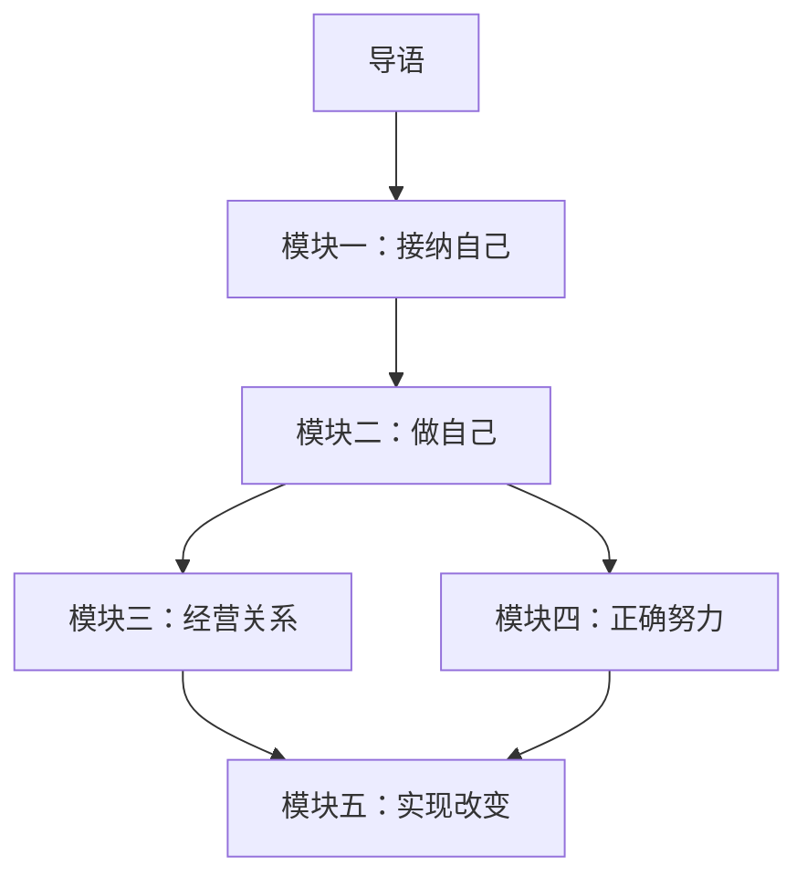

# 课程地图

## 学习路径总览

本课程共30课，分为五大模块。建议按顺序学习，因为后面的概念（如课题分离、成长型思维）常在前面的基础上展开。

## 模块依赖说明

- **模块一（接纳自己）** 是基础，后续所有模块都建立在对自我的理解之上
- **模块二（做自己）** 和 **模块三（经营关系）** 互为补充，一个向内一个向外
- **模块四（正确努力）** 需要模块一的自我接纳做前提，否则努力会变成自我攻击
- **模块五（实现改变）** 是课程的集大成者，需要前面所有模块的认知积累

## 各课内容一览

| 编号 | 课名 | 核心关键词 | 模块 |
|------|------|------------|------|
| 导语 | [[lessons/0000-yin-dao\|导语]] | 课程介绍、核心理念 | — |
| 01 | [[lessons/0001-zi-wo-ke-ze-yu-gui-yin\|自我苛责与归因模式]] | 习得性无助、归因维度 | 接纳自己 |
| 02 | [[lessons/0002-jie-shou-guo-qu\|接受过去的浑浑噩噩]] | 情绪ABC理论、合理化 | 接纳自己 |
| 03 | [[lessons/0003-jian-shao-nei-xin-dui-hua\|减少内心对话]] | 注意力转向、白熊效应 | 接纳自己 |
| 04 | [[lessons/0004-bai-tuo-gu-du-gan\|摆脱孤独感]] | 归属需要、情感隔离 | 接纳自己 |
| 05 | [[lessons/0005-nei-xiang-xing-ge\|性格内向不是缺陷]] | 内向/外向、敏感的优势 | 接纳自己 |
| 06 | [[lessons/0006-ke-fu-zi-bei-ti-gao-zi-zun\|克服自卑与提高自尊]] | 自尊三层次、六大支柱 | 接纳自己 |
| 07 | [[lessons/0007-zuo-zi-ji\|做自己的真伪命题]] | 自我的建构、标准 | 做自己 |
| 08 | [[lessons/0008-ren-sheng-mei-you-guo-du\|人生没有过渡]] | 黄金时代理论、当下 | 做自己 |
| 09 | [[lessons/0009-ke-ti-fen-li\|课题分离：应对父母期待]] | 课题分离、人生课题 | 做自己 |
| 10 | [[lessons/0010-bai-tuo-tao-hao-xing-ren-ge\|摆脱讨好型人格]] | 有条件的爱、学会拒绝 | 做自己 |
| 11 | [[lessons/0011-xue-hui-suo-qu-yu-ma-fan-bie-ren\|学会索取与麻烦别人]] | 自我知觉理论、给予即爱 | 经营关系 |
| 12 | [[lessons/0012-bu-yao-ju-xian-yu-fan-xing\|不要局限于反省和理解他人]] | 过度善良即傲慢 | 经营关系 |
| 13 | [[lessons/0013-ke-fu-she-jiao-ju-jin\|克服社交拘谨]] | 被看恐惧、进攻心态 | 经营关系 |
| 14 | [[lessons/0014-ren-ji-xi-yin-de-ji-ben-yuan-ze\|人际吸引的基本原则]] | 相像律、介质论 | 经营关系 |
| 15 | [[lessons/0015-zi-wo-yan-shen-mo-xing\|自我延伸模型]] | 新鲜感的本质 | 经营关系 |
| 16 | [[lessons/0016-you-dian-xi-yin-que-dian-qin-mi\|优点吸引，缺点亲密]] | 共享黑暗面 | 经营关系 |
| 17 | [[lessons/0017-gou-tong-ji-qiao\|沟通技巧]] | 非暴力沟通、共情 | 经营关系 |
| 18 | [[lessons/0018-rang-bie-ren-yuan-yi-shi-ni\|让别人愿意认识你]] | 价值展示、吸引 | 经营关系 |
| 19 | [[lessons/0019-nu-li-he-jin-qu-shi-xu-qiu\|努力和进取是需求]] | 放纵的虚无、管理欲望 | 正确努力 |
| 20 | [[lessons/0020-chang-qi-wen-ding-nu-li\|长期稳定努力]] | 20英里法则 | 正确努力 |
| 21 | [[lessons/0021-zhao-dao-re-ai\|找到热爱]] | 爱是动词、付出在先 | 正确努力 |
| 22 | [[lessons/0022-cong-ming-yu-nu-li\|聪明与努力]] | 固定型/成长型思维 | 正确努力 |
| 23 | [[lessons/0023-yue-nu-li-yue-jiao-lu\|越努力越焦虑]] | 短期目标、心流 | 正确努力 |
| 24 | [[lessons/0024-tong-bei-ya-li\|同辈压力]] | 冰山理论、鱼与鸟 | 正确努力 |
| 25 | [[lessons/0025-mian-dui-mi-mang\|面对迷茫与不确定性]] | 道路在迷雾中 | 正确努力 |
| 26 | [[lessons/0026-gai-bian-de-jue-xin\|不改变的决心]] | 原因论 vs 目的论 | 实现改变 |
| 27 | [[lessons/0027-bai-tuo-wan-mei-zhu-yi\|摆脱完美主义]] | 前进三步后退两步 | 实现改变 |
| 28 | [[lessons/0028-di-yi-xu-gai-bian-di-er-xu-gai-bian\|第一序改变与第二序改变]] | 系统内/外改变 | 实现改变 |
| 29 | [[lessons/0029-xin-nian-ji-zi-wo-shi-xian-yu-yan\|信念即自我实现的预言]] | 自我实现预言 | 实现改变 |
| 30 | [[lessons/0030-ru-he-shi-xian-zhen-zheng-gai-bian\|如何实现真正的改变]] | 积累、60分、练习 | 实现改变 |
| 结语 | [[lessons/0031-jie-yu\|结语]] | 总结与行动号召 | — |