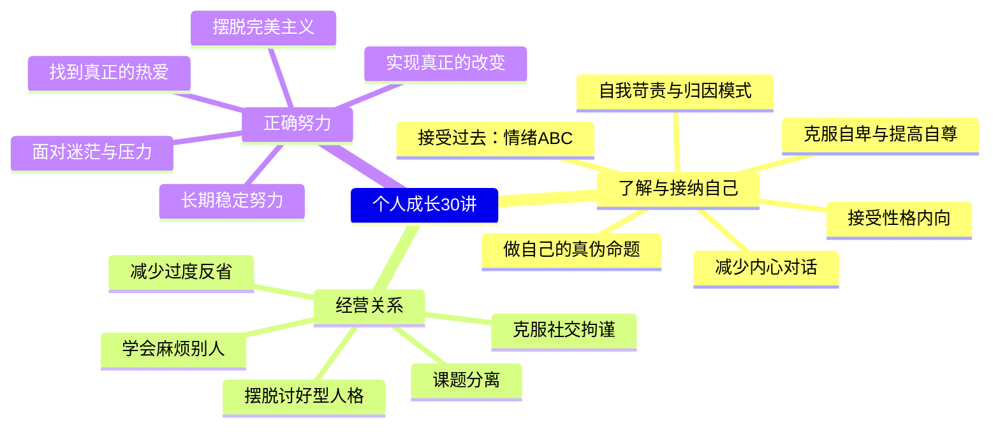
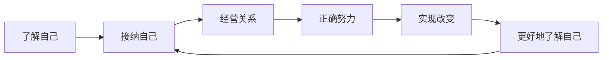

# 导语

## 课程缘起

大家好，我是冷冷。这个课程总共30节课，约10万字，接近6小时的音频内容。我没有亲自录制音频，因为我的声音音调偏高，听一两分钟尚可，作为课程听上十几二十分钟会显得聒噪。我自己听了都觉得"求求你，别说了"。

这个课程有点长，希望大家耐心一些，慢慢地听完。

> [!TIP] 核心理念
> 努力上进的方法固然重要，但**对自身的了解和接纳，与自己、他人和世界的融洽相处**，以及由此得来的平和可能更重要。在这个基础上，我们才能更好地努力。

## 课程立意

冷冷想要传达的是：如果以前有人能告诉她这些，她就不会度过那么多不快乐的日子，经历那么多迷茫、焦虑和艰难。这些思维和方法改变了她，也同样会改变你。

许多人在成长过程中习惯自我苛责、拼命努力却收效甚微，根本原因不在于不够努力，而在于不了解自己的思维模式和行为习惯。这个课程试图从根源上解决这个问题——不是告诉你"你要更努力"，而是帮助你理解"为什么你一直很努力却依然痛苦"。

> [!WARNING] 常见误区
> 我们习惯把"知道很多道理"等同于"改变"。但实际上，知道和做到之间存在巨大的鸿沟。这个课程的目标不是给你一堆新道理，而是帮你重新审视那些你以为"知道"但从未真正实践过的东西。

### 课程内容全景

## 核心理念的递进关系

课程的内容可以概括为一条清晰的递进路径：

这不是一条直线，而是一个螺旋上升的循环。每一次"了解 → 接纳"的循环，都会让你在下一个阶段站得更高、看得更远。

## 学习建议

冷冷特别强调：**你正在经历的，我都经历过。** 这些思维和方法改变了我，也同样会改变你。

> [!QUESTION] 思考题
> 在开始学习之前，请回顾一下：你目前在个人成长方面**最困扰的一个问题**是什么？你希望从这个课程中获得什么？请用一两句话写下来。这个答案将成为你整个学习旅程的锚点，在学完所有课程后可以回头看看是否有所改变。

参考示例

例如："我总是因为一点小事就全面否定自己，希望学会如何停止自我攻击，建立更健康的自我评价方式。"

## 课程结束语

接纳自己，经营关系，正确努力，实现改变。

---

继续学习：[[0001-zi-wo-ke-ze-yu-gui-yin|第01课：自我苛责与归因模式]]