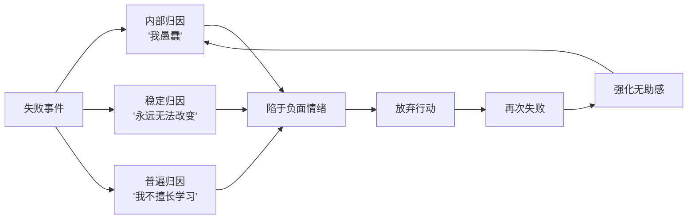

# 第01课：自我苛责与归因模式

## 自我攻击的典型表现

我们常常因为做错了一件事，就直接在整体上对自己进行全面否定："我果然真是没用""我连这点小事都做不好""我连最基本的关系都处理不好"。一件小事没做好，等于"我这个人有问题"。

明明知道"对事不对人"，却在对自己时完美演绎了"对人不对事"。

## 核心心理机制

### 自我价值公式

《拖延心理学》中理查德·比瑞博士指出，害怕失败的人有一个隐含假设：

**自我价值感 = 能力 = 表现**

也就是说，表现好 = 有能力 = 喜欢自己（高自我价值）；表现不好 = 没能力 = 糟糕（低自我价值）。表现好坏直接成了你是否有能力、是否有价值的衡量标准。

### 习得无助的归因模型

《变态心理学》中的习得无助模型指出，拥有习得无助思维的人在遇挫时有三种归因维度：

- **内部**：认为自己是愚蠢的，所以失败
- **稳定**：认为造成失败的因素永远存在，不会改变
- **普遍**：一道数学题没做好，就认为自己缺乏数学能力，甚至缺乏学习能力

### 内化的法官人格

自我攻击的人内心有一个内化了的、高高在上的法官人格。它的来源可能是童年时严厉的母亲、父亲或苛刻的班主任。那些有审判权的长辈所给予的有意或无意的恶意，是自我攻击最重要的成因。

> [!WARNING] 常见误区
> 与恶龙缠斗过久，自身亦会成为恶龙。恶龙已经内化成自我人格的一部分——这才是最可怕的地方。健康的队伍把能量对外发起抗争，而自我攻击的人甘于内耗、甘于自我谴责。

## 健康的归因方式

健康的归因维度恰恰相反：

- **外部**：这件事没做好，是因为事情本身有难度，不是因为我愚蠢
- **不稳定**：失败的原因是暂时的，可以通过修正行为避免
- **特殊**：没做好数学题，仅因不擅长这道题，不是不擅长数学或学习

## 改变方法

### 第一步：认识审判者已离场

你已经不是那个委屈地缩着肩膀、被大人们动辄批评的小孩子了。没有人再居高临下地审判你。**你是自由的**。让内心的"恶龙"也休息吧。

> [!TIP] 关键洞察
> 把自我攻击视为机会——比别人更容易意识到自己的不足，意味着有成长更快的可能性。冷静接受其中有益的部分，做出改变，而不是沉溺于自我谴责。

### 第二步：培养新的归因习惯

每次遇挫时，有意识地辨别自己是否陷入了"内部-稳定-普遍"的归因模式，并练习用"外部-不稳定-特殊"的视角重新看待问题。

**把"做错一件事"和"对自己的整体认知"这两件事分隔开**。你只是做错了一件事，并不意味着你这个人怎么样，去改变相应的行为就可以了。

### 第三步：整体上的自我接纳

> [!EXAMPLE] 案例
> 罗玉凤在凤凰网撰稿时写道："今天的我，已经是所有可能里最好的我了。"这句话看似在为失败找借口，实则蕴含着深刻的自我接纳。

越是自责，越是难以改变，越容易自暴自弃。**自我谅解才能把精力用于行动**，而不是跟愧疚、懊恼、后悔的情绪做斗争。内耗才是最耗人的。

有个容易被忽略的要点：**起点不仅仅是家境、学历这些物质条件，情感储蓄值同样是你的起点**。如果账户余额太低甚至是负的，即使你颇有天赋也比较努力，你也打不过别人——因为你要花费大量时间和精力去安抚内心的冲突。

> [!QUESTION] 思考题
> 想想最近一次你因为做错事而全面否定自己的经历。如果用"外部-不稳定-特殊"的归因方式重新审视这件事，你会对自己说什么？

参考思路

例如：项目搞砸了。旧归因："我就是能力不行，什么都做不好。"新归因："这个项目本身难度较大（外部因素），我当时对某个环节了解不够（不稳定的、可以弥补的），我在项目管理方面需要加强（特殊的），但这不代表我整个人不行。"

## 练习：用对待爱人的方式对待自己

如果你最爱的人搞砸了一些事情，你会忍心责怪他吗？不会。你会温柔地安慰他，告诉他没关系，找出一切积极的讯息。

**用对待你爱的人的方式来对待自己。** 无论发生了什么，你要和你自己站在一起。

## 总结

- 做错一件事不等于你这个人有问题
- 健康的归因是外部、不稳定、特殊的
- 审判者已离开，你是自由的
- 情感储蓄值是同样重要的起点
- 今天的你，已经是所有可能里最好的你了

接纳自己，经营关系，正确努力，实现改变。

---

继续学习：[[0002-jie-shou-guo-qu|第02课：接受过去]]