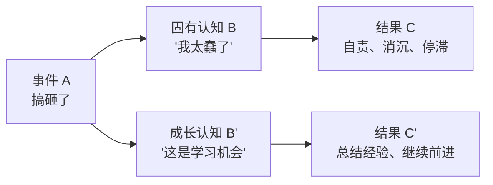

# 第02课：接受过去：情绪ABC与合理化叙事

## 问题的普遍性

几乎每天都会遇到冲突、搞砸一些事情。话没说对、表现不够好、因粗心导致问题……这时人容易反复想这件事，陷入尴尬、痛苦和自责。本节课与上一节从不同角度切入同一类问题。

## 情绪ABC理论

由美国心理学家阿尔伯特·埃利斯（Albert Ellis）提出：

- **A（Activating events）**：事件本身
- **B（Beliefs）**：你对事件的认知和看法
- **C（Consequences）**：你之后做出的行为

### 关键认知：情绪无法直接改变

事情发生后的情感反应是本能的——被批评了会羞愧，搞砸了会自责。**你不能通过告诉自己"我不需要自责"来达成改变**。

正确做法：**允许自己有任何负面情绪**。接受它们，不抵抗，情绪自会消散。

## 认知层面的转变：把搞砸的事情当学费

人是一种奇怪的生物，往往只有付出了代价才会真正改变。既然已经付出了代价，就要从中学到等值甚至超值的经验教训。

> [!TIP] 关键洞察
> 冷冷的心态："我**不要**吃亏，我要**赚回来**，我要学到尽可能多的东西。"依此想法，她能够接受自己犯错，同时总结尽可能多的经验，并告诉自己：幸好是在这件不那么严重的小事上犯错，帮我规避了未来在类似大事上付出更大代价的可能性。

## 接受长时间的荒废

### 由果推因的合理化叙事

高中浑浑噩噩，大学没有好好上课……每每回想都痛苦不堪。冷冷讲述了自己的故事：

> [!EXAMPLE] 案例
> 冷冷大一时是个"网瘾少女"，整天坐课堂最后一排玩手机，因此接触了QQ空间美文，开始写日志，收到同学鼓励，开启码字之路。大一的成绩一般让她不敢选资历深的教授做科创导师，转而找了年轻讲师，恰巧一位交换生被分给这位导师，在对方推动下加入了校杂志编辑部，一路从编辑做到主编。这段经历让她在大三萌生了跨考中文的想法，而编辑部做的三本杂志在考研面试中加了分。

**作痛恨愧悔的那些不思进取，一环扣一环，才让她走到了跨考文学这一步。**

> [!WARNING] 常见误区
> 由果推因的合理化工具有一个前提：**你已经有所改变了，当下的情况得到了一定的好转**。如果后来没考上中文系，所有因果假设都会坍塌。合理化不是自欺欺人，而是为了让自己从自责中走出来，继续向前走。

北大中文系教授李扬指出：精神病人建立不起对自己经历的合理化叙述。武志红也说：每个人**必须**把自己的核心经历合理化，不这样就没法生存下去。

### 避免补偿心理

一个读者留言：高中生活过得很失败，所以找工作总想当高中老师，为此放弃了很多好机会。冷冷告诉他：

**失去的东西是找不回来的，任何补偿行为都是无意义的。** 如果一直在补偿过去，也会失去现在。

> [!WARNING] 常见误区
> 去开始新的生活，是从 **0** 开始往前推进；去修复旧的伤口，是从 **-1** 开始缝缝补补，而且很难修复到 0。

《飘》中瑞德说："一些东西破碎了就是破碎了，我宁愿记住它最好时的模样，而不想把它修补好，然后终生看着那些破了的地方。"

## 真正的成长标志

接受这样一个现实：**人生中必然有无法和解的痛苦和缺憾，有令自己羞愧的经历，并且它们无可挽回，无法修复。**

> [!QUESTION] 思考题
> 回想一段你一直想"补偿"或"弥补"的过去经历。如果放弃补偿的念头，转而把精力投入到"从 0 开始"建设新的生活，你会做的第一件具体的事是什么？

参考思路

比如你后悔大学四年没有好好学习，现在想通过考研来"弥补"——这个动机是可以的，但不要把考研当成"还债"。更好的心态是：过去的四年已无法改变，但**从今天开始的每一天都是新的**，我学习是因为我想成为更好的自己，而不是为了弥补过去的缺失。

## 总结

- 情绪是本能反应，无法直接改变，**允许**它存在就好
- 认知可以改变——把失败当作交学费，总结经验
- 通过"由果推因"的合理化叙事接受荒废的过去
- 避免补偿心理，修复过去是从 -1 开始，不如从 0 开始建设
- 接受人生中必然有无法和解的痛苦和缺憾

接纳自己，经营关系，正确努力，实现改变。

---

继续学习：[[0003-jian-shao-nei-xin-dui-hua|第03课：减少内心对话]]