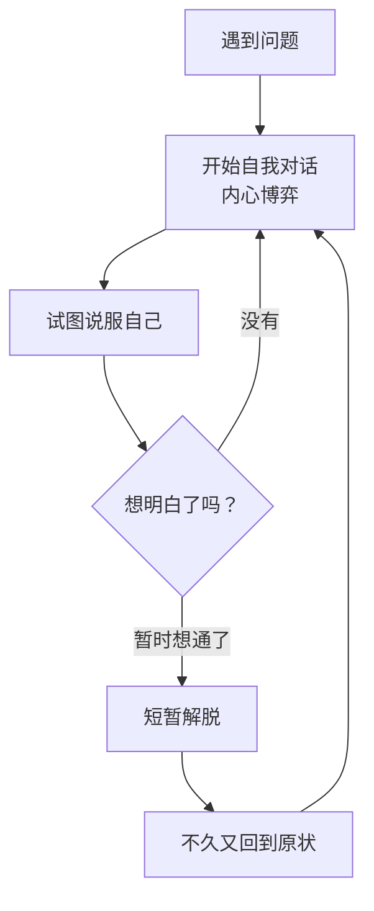

# 第03课：减少内心对话，把注意力转向外界

## 内心戏太多的困境

遇到问题的时候，很多人喜欢和自己对话。某件事没做好、人际关系受挫、想做某事不敢做、该做某事不想做……内心小剧场不断上演：自己责怪自己、试图安慰自己却无法原谅自己。

> [!WARNING] 常见误区
> 你以为通过"想明白"可以获得解脱，但结果恰恰相反——各种乱七八糟的想法在脑子里不断闪现，**越是试图挣扎，越是深陷其中，反而更焦虑了**。

武志红说：头脑的分析容易是一种固有的疑虑重重的循环，如果没有新信息的注入，思虑太多的人就总是在原地打转。

回想一下，你每一次的自我对话，是不是都以失败告终了？两个"你"两败俱伤，即使某个积极的"你"暂时胜利了，很快又恢复了以往的状态。

## 问题出在哪里

在很多情况下，**对自我、对内心感受和情绪波动过于关注，就是问题本身**。你越是去死磕一个问题，越是会走入死胡同。不是因为你没找到更完美的方法论或更高深的领悟，而是因为你的方向错了——你把足够的注意力留给了那些想法去被注视、剖析和计较。

## 解决方案：向外转

解决日常情绪和心理问题的方法，在另一面，**不是向内，而是向外**。不是针对问题本身去解决，而是跳出来，把认知资源寄托到别的事情上面。

> [!TIP] 关键洞察
> 当你专注于一个点时，是超近距离观察湖面，微小的波澜也像惊涛骇浪。当你站远一些，看向人群和世界，就会发现湖面其实很平静。

### 案例分析

**跑步的例子**：觉得跑步痛苦，是因为有足够的注意力去思考痛苦。把多余的注意力转移到听音乐或听书，痛苦感就大大降低。前者是向内的解决方式（说服自己忍受不适），后者是向外的解决方式（转移注意力）。

**恋爱的例子**：表白失败或失恋后，左思右想"为什么被这样对待""到底哪里出错了"，试图说服自己"没关系"，结果大彻大悟几个小时后又卷土重来。更好的方式是去找能够寄托时间和精力的事情——能带来愉悦感甚至价值感的事。

> [!WARNING] 常见误区
> 这不是逃避问题，也不是麻痹自己。把注意力转向外界，会让你的思维和心态都开阔起来。**你不去注视问题，问题反而自行了结了自己。**

## 将向外关注养成习惯

> [!EXAMPLE] 具体做法
> - 和人说话时，试着专注于对方的表情和内容，把握重点
> - 吃饭时，只关注饭菜好不好吃
> - 走路时，关注行人、栏杆、车牌号、标语
> - 从每一个细节去关注当下所处的外界信息

当你打开自己，让外界的信息涌进来，内心的焦躁就会平息很多。一个生活充实、能从自己专注的事情中获得愉悦感和价值感的人，更不容易被琐事和情绪击垮。

> [!QUESTION] 思考题
> 当下一次你陷入"内心小剧场"的时候（比如反复想某句话是不是说错了），你能做哪一件**具体的外向行动**来打断这个循环？

参考思路

- 立刻起身去倒一杯水，专注感受水温、杯子的触感
- 打开一首歌，听完并注意其中的乐器声
- 给一个朋友发消息，问对方"今天怎么样"
- 翻开一本书，读一页并复述内容

关键是：**不要停留在思想上，用行动和感官把注意力拉向外界**。

## 总结

- 自我对话常常以失败告终，越挣扎陷得越深
- 对自我过于关注本身就是问题
- 解决方法不是向内想明白，而是向外转移注意力
- 把向外关注养成日常习惯，打开自己，让外界信息涌进来
- 不去注视问题，问题反而自行了结

接纳自己，经营关系，正确努力，实现改变。

---

继续学习：[[0004-bai-tuo-gu-du-gan|第04课：摆脱孤独感]]