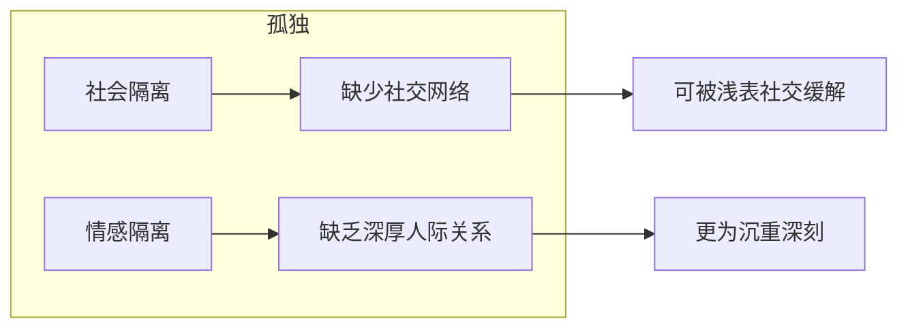
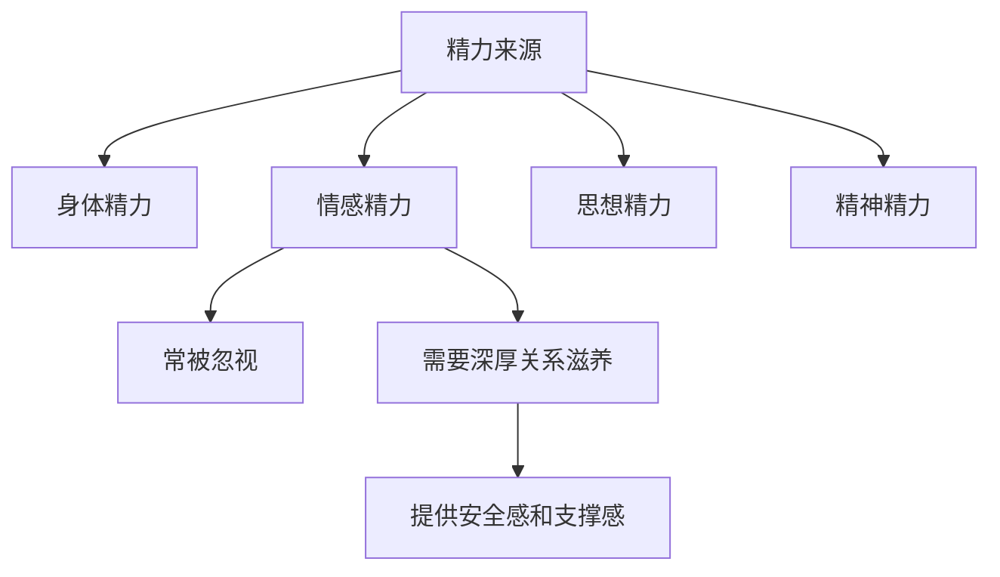

# 第04课：摆脱孤独感

## 孤独的本质

当我们想拥有当前所没有的、与他人更多更亲密的接触时，就会产生孤独感。

> [!TIP] 关键洞察
> **孤独与独处不是一回事。** 在完全独处的状态中，我们通常也能感到满足。独处只是物理上的相对隔绝，而非情感的隔绝。

## 两种隔离

心理学家罗伯特·维斯（Robert Weiss）把孤独分为两个层面：

**情感隔离**导致的孤独是沉重深刻的、根本性的。但如果能让自己寄身于社交网络之中，也可以获得有效的安抚。

## 为什么有人主动选择独处

《挪威的森林》中有句话："哪里有人喜欢孤独，不过是不喜欢失望。"

只要和他人在一起，就一定会有偏好和需求的冲突。社交需要沟通、妥协、让步。**当一件事的奖赏意义大于代价时，我们才会主动追寻它。** 如果关系带来的价值无法抵消代价，追求"独处"（而非孤独）也就在所难免。

## 摆脱孤独的两种途径

### 1. 情感反馈——深厚的人际关系

即使时常独自行动，只要你有建立深刻安全的人际关系（恋人、朋友或家人），就可以在很大程度上摆脱孤独感。

> [!TIP] 关键洞察
> **有恒关系者有恒心。** 如果你拥有一段稳定的高质量关系，你就会笃定平和，能够更安心地放手去做事。你的背后始终有无形的力量和勇气在支撑你。

### 2. 个人价值反馈——精神上的自足

如果能够从学习、工作中找到个人价值，从与自己的相处和互动中找到乐趣，内心也会觉得充实。

叔本华说：独处的时候，每个人都只能反求于自身，而免于痛苦的手段莫过于拥有丰富的内在。

## 情感能量的重要性

精力管理理论指出，人的精力有四种来源：**身体、情感、思想和精神**。情感精力是我们在努力时最容易轻视的部分。

> [!WARNING] 常见误区
> 很多人为了某个远大目标，会告诉自己"减少无用社交，以免浪费时间"。但当你放弃日常中那些看似不重要的社交活动时，你会陷入**失去秩序的混沌虚无**中。

## 不要放弃浅表社交

面对面的社交与线上聊天完全不同——前者是流动的，有眼神、语气、表情的沟通和博弈。

当大部分时间是一个人的时候，你会被自己的情绪填满——孤独、焦虑、恐惧。你过度关心内心感受，成为一个孤立的、封闭的风暴地，飓风时有发生却无人问津。

> [!EXAMPLE] 案例
> 冷冷考研时为了节省时间，把自己封闭起来，不跟任何人来往。后半程复习中，心里变得越来越脆弱、焦虑。无论怎么调整心态都没用。后来她开始每天和人聊聊天、面对面说笑，状态很快就好起来了，也更能学进去了。

**进入人群、进入有秩序的日常生活**——就像一个人走上拥挤的公交车，无论路途多么颠簸都不会倒，因为周围的秩序在支撑着你。

> [!QUESTION] 思考题
> 你目前生活中，是否有"为了努力而放弃社交"的情况？不妨试着在本周安排一次面对面的社交活动（哪怕只是和同学一起吃饭散步），观察一下之后几天你的情绪和效率有什么变化。

参考思路

可以设立一个简单的"社交能量"实验：
- 本周安排至少 3 次 15 分钟以上的面对面社交（一起吃饭、散步、聊天）
- 记录每天的"孤独感"评分（1-10）和"学习/工作效率"评分
- 对比之前孤单日子里的评分，看看是否有变化

大部分人会发现：适当的社交不仅没有"浪费时间"，反而改善了情绪和效率。

## 总结

- 孤独分为社会隔离和情感隔离，后者更为沉重
- 孤独与独处不同——独处时可以感到满足
- 摆脱孤独的途径：情感反馈 + 个人价值反馈
- 深厚的人际关系是情感精力的重要来源
- 不要为了努力而放弃所有社交——面对面的社交是最简单有效的预防抑郁的方法

接纳自己，经营关系，正确努力，实现改变。

---

继续学习：[[0005-nei-xiang-xing-ge|第05课：性格内向不是缺陷]]