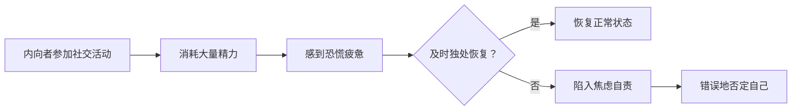

# 第05课：性格内向不是缺陷

## 社会对内向外向的双标

社会推崇外向的人——张扬自信、喜欢社交、落落大方。而内向者被妖魔化：孤僻、不合群、需要被治愈。

从小到大，师长说："这孩子性格太内向了，不爱说话，应该多向谁谁谁学习。"我们被灌输的观念是——**内向是不好的**。

## 真相：内向与外向都是合理存在

当内向者尝试像外向者一样不断社交时，只会变得更慌张、精疲力竭。然后又开始自责："为什么总是这么拘谨？是因为不自信吗？是因为太自卑吗？"

真相是：内向和外向都是一种性格，都是合理的存在。

> [!TIP] 关键洞察
> 养花要了解它的习性——喜阴还是喜阳。强迫喜阴的植物每天暴晒，只会使其快速死亡。内向是一种**性格**，而不是需要分高低优劣的**品质**。

### 核心区别

- **内向者**：享受独处，从独处中获得精力和安宁
- **外向者**：喜欢社交和热闹，从人群中获得活力

当然这不是绝对的——外向者也需要独处，内向者也需要社交。

> [!EXAMPLE] 案例
> 冷冷本科时有个形影不离的好朋友，两人闹矛盾的唯一原因就是对独处和陪伴的需求不同。对方觉得好朋友应该一起吃饭、逛超市、去图书馆；冷冷承受过多"一起行动"后就找借口躲开。她需要社交，但只需要适量。超过那个度，就会觉得"太逼仄了"。

## 内向者不必强迫改变

如果强迫自己表现成外向的人，脱离本性的表现会**削弱你的精力**。但生活中难免需要像外向者一样行事——这没关系，只要及时给自己独处的时间和空间恢复即可。

> [!WARNING] 常见误区
> 内向者容易认为自己需要"治愈"，需要学着变得外向。但内向是一种无法改变的秉性——在对人格特质的塑造中，起主导作用的是基因，而非环境或经验。要学习的是**准许自己成为自己**。

## 内向者的天赋优势

内向者的敏感多思、容易焦虑——这些"缺陷"同时携带了巨大的馈赠：

| "缺陷" | 天赋 |
|--------|------|
| 敏感、易受伤 | 更高的同理心、共情能力 |
| 想太多、内心戏丰富 | 强大的联想能力、创造力 |
| 谨小慎微、没安全感 | 深度思考、写作、记忆能力 |

> [!TIP] 关键洞察
> 冷冷说：我身上那些所谓的"性格缺陷"，也同时带给了我很多益处。敏感和"nice"是一体两面的存在——因为自己容易受伤，所以更加照顾他人感受。越是想压抑它、改变它，越会遇到大反抗力。不如接受它，主动去利用。

因为内向，冷冷在知乎和微信公众号上分享了许多学习和心理方面的文章，引起了很多人的共鸣。这些成果都建立在她"想太多"（联想能力）和共情能力之上。

> [!QUESTION] 思考题
> 如果你是一个内向者，想想你最讨厌自己的哪个"内向特质"（比如敏感、不爱说话、容易紧张）。试着列举这个特质可能带来的三个积极方面，并思考如何主动利用它。

参考思路

例如"不爱在公开场合发言"：
1. 你在小范围沟通时更深入，能建立更高质量的关系
2. 你不轻易表达，所以每次发言都经过深思熟虑，更有分量
3. 你更善于倾听，而这正是很多人都缺乏的能力

这些特质不是缺点，只是在错误的标准下被定义为"不够好"。**接纳它们，就是接纳你自己。**

## 总结

- 内向和外向都是性格，不是需要分高低优劣的品质
- 内向者从独处获得精力；脱离本性会削弱你的精力
- 内向是一种无法改变的秉性，要准许自己成为自己
- 内向者的敏感、多思同时带来了同理心、联想力和创造力
- 你的所有特质没有绝对的好与坏，主动利用它们

接纳自己，经营关系，正确努力，实现改变。

---

继续学习：[[0006-ke-fu-zi-bei-ti-gao-zi-zun|第06课：克服自卑与提高自尊]]