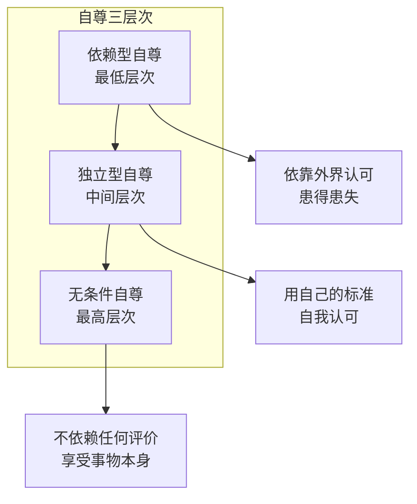

# 第06课：克服自卑与提高自尊

## 重新认识自卑

人人都会自卑，程度不同而已。重要的是**你在自卑之后做了什么**，而不是你是不是自卑。自卑是人性应有的一部分——它意味着你能意识到自己哪里做得还不够。

对于**可以改变**的缺点：通过改善提升自信；对于**无法改变**的缺点：让自己拥有其他不可替代的优点。瑕不掩瑜。

当各方面特质超过一定"及格线"之后，**长板效应**开始起作用——你最突出的一两个特质直接决定了他人及你自己对你的评价基调。

## 自信与优秀没有必然联系

> [!WARNING] 常见误区
> 我们总以为：收入不够高、不够好看、不够瘦——所以才自卑。我们把自卑当成**结果**。但很多时候，**一个人是因为自卑才自卑的**。同样地，自信的人不是因为特别优秀才自信，而是因为自信，所以对很多不够好的方面根本不会在意。

## 自尊的三个层次

心理学将自尊分为三种：

### 依赖型自尊
从外界的认可中获得自信。你所在圈子的认可决定你的自我价值——容易患得患失，上一秒自信下一秒沉入谷底。即使客观上做得不错，还是觉得自己不够好。

### 独立型自尊
用自己的标准来要求自己，外界评价不太能影响你。达到自己的标准就对自己满意。

### 无条件自尊
认可自我价值不取决于任何评价，是一种超然的态度，能享受事物和人生本身。

现实中，三个层次共存于一个人身上，理想状态是依赖型最少、无条件最多。能做到独立型自尊占主体已经相当不错。

## 提高自尊的六大支柱

纳萨尼尔·布兰登（Nathaniel Branden）在《自尊的六大支柱》中提出了六个重要方法：

### 1. 有意识地活着
保证做任何事时意识是清醒的——知道自己在做什么、为什么做、会带来什么结果。而不是出于将就、凑合、逃避、跟风。

> 对自身的掌控感，是自尊的重要来源。

### 2. 自我接受
允许自己有"人的天性"——害怕、想吃甜食、想逃避、情绪化。允许自己是普通人，会犯错、会失败、会不如别人。接受而不责怪。

### 3. 自我负责
意识到**你才是自己的主人**，为自己的一切负责。

### 4. 自我肯定
把自己的需求和想法摆到和他人同等地位，不为迎合别人而牺牲自我，学会拒绝不合理的需求。

### 5. 有目的的生活
不要抱着"我要变更好"这样虚幻的目标，要具体——"一个月后高分通过考试""三个月内跑完300公里"。目标以及完成目标的过程会带给你价值感。

> [!TIP] 关键洞察
> 一个人没有目标的时候，状态往往很糟糕。"什么都可以做，也什么都可以不做"的自由不是真正的自由——它让人陷入自我怀疑。

### 6. 说到做到
对自己承诺的事说一不二（"我8点开始学习""晚上9点去跑步"）。每一次你对失信都是在对自己说"我的话无关紧要"。

> [!QUESTION] 思考题
> 在这六个方法中，选择当前最困扰你的一个，制定一个本周可以执行的具体行动。例如，如果你的问题是"说到做不到"，这周可以对自己许一个很小的承诺（比如每天看10页书），并严格执行，观察对自己自信心的影响。

参考思路

"说到做到"是六个方法中最基础也最重要的一环。
- 选择一个小承诺：比如"今晚9点前写完日记"
- 完成后在日历上打勾
- 连续7天后问自己：我对自己言而有信的感觉如何？

很多人会发现：仅仅是完成这些微小承诺，就能显著提升对自己的正面评价。

## 总结

- 自卑和自信都不直接取决于"优秀程度"——自信是一种可习得的思维方式
- 自尊三层次：依赖型 — 独立型 — 无条件自尊，三者共存
- 提高自尊的六方法：有意识活着、自我接受、自我负责、自我肯定、有目的的生活、说到做到
- 你值得拥有美好的关系和事物，值得被人爱护和喜欢

接纳自己，经营关系，正确努力，实现改变。

---

继续学习：[[0007-zuo-zi-ji|第07课：做自己的真伪命题]]