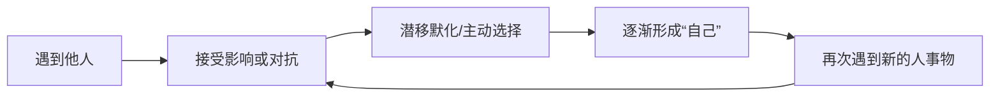
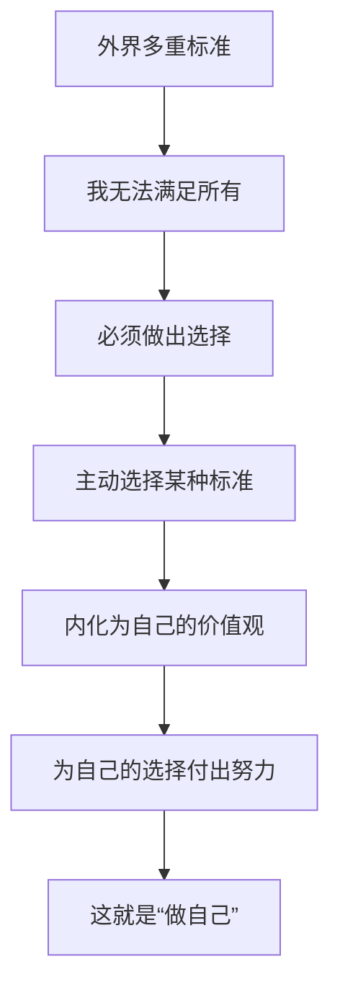

# 第07课：做自己的真伪命题

## "做自己"的常见误解

"做自己就是不要在意外界的评价"——我们遇到的大部分烦恼都源于在意别人的看法。

在意别人是否认同自己的想法，是否觉得自己差劲，是否质疑自己的选择。每次发现自己在意时，就会烦躁、气愤。但什么是"做自己"？

> [!WARNING] 常见误区
> 我们认为，如果被他人的看法影响并选择了妥协，就不是在做自己，而是在做"别人"。但这个前提本身就有问题。

## 做自己是一个伪命题

### "自己"从何而来？

如果说真的存在一个"自己"，他从什么时候开始出现的？共识是：自己一定在发展变化——想法、价值观、思维都在不断更新。

"自己"是在一个与外界隔绝的真空环境中自由生长的吗？**不是**。

> [!TIP] 关键洞察
> 所谓"自己"，是由我们遇到的**每个人**组成的。你认识了很棒的人，就想学习对方的好品质；遇见百年难得一遇的奇葩，就会避免成为那样的人。**所谓自己，不过是将众多他人的想法进行混杂和融合之后的自己。**

学校、家庭、补习班、邻居、文化活动……我们听到的一切话语，以及我们与这些话语之间的对抗或顺从，最终定义了我们这个人。

### 个性需要"他人"的折射

司汤达说：**一个离群索居的人可以得到一切，但独独没有个性。** 个性诞生在他人对自己的反应之中。

我们对自己和外界的概念必须依托于标准而存在——美或丑、善或恶、努力或堕落。标准会造成限制，但我们必须有标准，否则无法在合理框架内行事。

## 做自己也是一个真命题

> [!WARNING] 常见误区
> 有人认为：和氏璧没有得到楚王认可，其价值就降低了吗？以此证明"不必在意外界评价"。但和氏璧的价值本身符合当时及现在世人关于"价值"的标准——它不因楚王一人的好恶而改变。

**我们是否优秀、选择是否明智、做事是否有意义，本就需要某种标准来衡量。** 没有外界看法，我们寸步难行，根本无从选择。

## 标准的非黑即白困境

标准不是非黑即白的，尤其那些有很多主观因素影响的标准。我们常常在矛盾的多重标准中做抉择——就像"忠孝两难全"。

> [!EXAMPLE] 案例
> 父子二人与一头小毛驴的故事：两人都牵着驴——不对；一人骑驴一人走路——不对；两人都骑——又不对。无论你做什么，你都是错的。但另一方面，**无论你做什么，你也是对的**。

考研是对的，不考研也是对的。考公务员是对的，创业也是对的。任何一个选择，你都能找到支持它的权威依据和反对它的权威依据。

## 真正的"做自己"

> [!TIP] 关键洞察
> 如果在对他人的看法的**顺从与对抗**中，你有**主动选择**，并逐步**内化成自己的价值观**，那么也可以说是在做自己。

重要的是：**你自己选择了哪种标准，并且相信自己的选择，为此付出努力。** 在这个层面上，我们可以选择"做自己"。

> [!QUESTION] 思考题
> 回忆一个你曾因"太在意别人看法"而纠结的决定。如果按照"主动选择标准并坚持"的思路重新理解这件事，你是否能从这个决定中找到你**主动选择**的部分？那个选择背后反映了你的什么价值观？

参考思路

比如你选择跨考一个冷门专业，家人朋友都不理解。
- 被动版本："我在意他们的看法，觉得压力很大，不敢坚定选择"
- 主动版本："我意识到不能同时满足所有人的期待。我**选择**坚持跨考，因为对我而言，追求自己热爱的领域比获取世俗认可更重要——这是我现在认同的价值观。"

同一个选择，不同的解读方式。主动选择和内化，就是"做自己"。

## 总结

- "做自己"是伪命题——"自己"是被无数他人建构出来的
- 个性诞生于他人对自己的反应之中
- 但"做自己"也是真命题——你在顺从与对抗中主动选择并内化
- 标准众口难调，无论你做什么都会有人反对
- 重要的是你选择了哪种标准并为之努力，在这个层面上，你做什么都是对的

接纳自己，经营关系，正确努力，实现改变。

---

继续学习：[[0008-ren-sheng-mei-you-guo-du|第08课：人生没有过渡]]