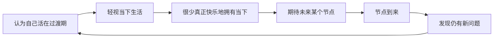

# 第08课：人生没有过渡

## 核心概念：过渡心态

你是否常常把眼下的生活视为一种"过渡"，认为当前的日子只是抵达某个目标之前必须要忍受的阶段，却从不把它当做生活本身来展开？这种态度在人群中极其普遍，但它带来的后果也相当严重。

> [!WARNING] 过渡心态的陷阱
> 当你把当前的生活定义为"过渡"时，你实际上是在告诉自己：**我真正的生活还没有开始**。你活在未来的想象中，却错过了正在发生的每一天。

### 过渡心态的典型表现

- **等待节点型**：等考完这个试，等我毕业，等找到工作，等我瘦下来...真正的生活才会开始
- **忍受当下型**：这段日子太痛苦了，先凑合着过，等熬过去就好了
- **否定过去型**：急于否定人生中的某段经历，迫不及待想要离开

冷冷分享了自己的亲身经历：在哈工大读化学系的四年，她得追过且过，浑浑噩噩。毕业时同学们抱头痛哭，她却一次都没哭过，心里只想着"快点让我离开这个地方"。她把考研准备期视为"从此岸通往彼岸的桥梁"，认为等考上中文系，理想生活才会真正开始。

## 黄金时代理论

电影《午夜巴黎》中，男主角吉尔认为20世纪二三十年代的巴黎是最好的时代。但导演伍迪艾伦通过穿越剧情揭示了一个深刻的道理：**黄金时代理论**是指认为别的时代比现在生活的时代更好，这是那些无法应对当前生活的人所产生的浪漫主义缺陷。

> [!TIP] 关键洞见
> 你之所以认为某段时间是黄金时代，是因为那不是你真实的生活。每个时代的人都有相似的对于黄金时代的遐想，正如身处当下却将真正的生活寄期望于未来的我们。

当冷冷终于进入中文系，来到她以为的"黄金时代"后，她发现每个阶段都有相应的、只多不少的问题需要解决。**当未来成为现在，生活的内核并无任何不同。**

## 如何打破过渡心态

### 1. 认识到"这些障碍正是你的生活"

有一段话深刻地揭示了这一点：**"很长一段时间，我的生活看似马上就要开始了，真正的生活，但是总有一些阻碍阻拦着...最后我终于明白，这些障碍正是我的生活。"**

任何一个你视为"过渡"的阶段，比如漫长的读书生涯、加班、忙碌、高强度学习，都只是你**主观定义**了它的过渡性质。正是因为这种轻视，你很少真正快乐地、充实地拥有你的人生。

### 2. 接受每一段经历的价值

冷冷后来回想在哈尔滨的四年，虽然依然厌恶化学课程和实验，但她不再否定那段时光。她在那里见识了真正的冬天，认识了有意思的人，写了文章，读了书，做过杂志主编，勇敢地去跨考中文系。**那不是任何阶段的过渡，那是她的生活本身，是她的人生本身。**

> [!EXAMPLE] 案例：从否定到接纳
> 冷冷曾急于否定大学毕业前的四年，把考研准备期视为纯粹的过渡。但后来她意识到，正是那些日子里的经历——写文章、做杂志、跨考的决定——一环扣一环地塑造了今天的她。学会接纳每一段经历，而不是将其否定为"过渡"，才能真正拥有完整的人生。

### 3. 停止等待，开始生活

不要等待某个节点再开始"真正的生活"。你现在所身处的、拥有种种问题和矛盾的、等待着被度过的现在，和你所假想的未来的理想生活，并没有什么差别。

## 思考题

> [!QUESTION] 自我反思
> 回顾你过去的一年，是否有某些阶段被你定义为"过渡期"？如果从今天开始，你不再把任何一段日子视为过渡，而是把它当作生活本身来对待，你的行为和心态会发生什么变化？

参考思路

- 试着列出被你定义为"过渡"的具体时间段和理由
- 思考这些时间段中，你错过了哪些本可以珍惜的人和事
- 想象如果从现在开始就把每一天当作"生活本身"，你会做出哪些不同的选择
- 冷落的经历告诉我们：**未来成为现在时，一切并无不同**。与其等待，不如此刻就开始认真生活。

## 总结

我们常常把眼下的生活视为过渡，这些日子或忙碌或痛苦，我们把它视为从此岸通往彼岸的桥梁，但绝不是我们认可的生活本身。黄金时代并不存在，每一个阶段都有相应的只多不少的问题需要解决。你真正的生活，就是现在。

**接纳自己，经营关系，正确努力，实现改变。**

---

**相关课程：** [[0001-zi-wo-ke-ze-yu-gui-yin|第01课：自我苛责与归因]] 探讨如何停止自我攻击 | [[0003-jian-shao-nei-xin-dui-hua|第03课：减少内心对话]] 探讨如何将注意力转向外界