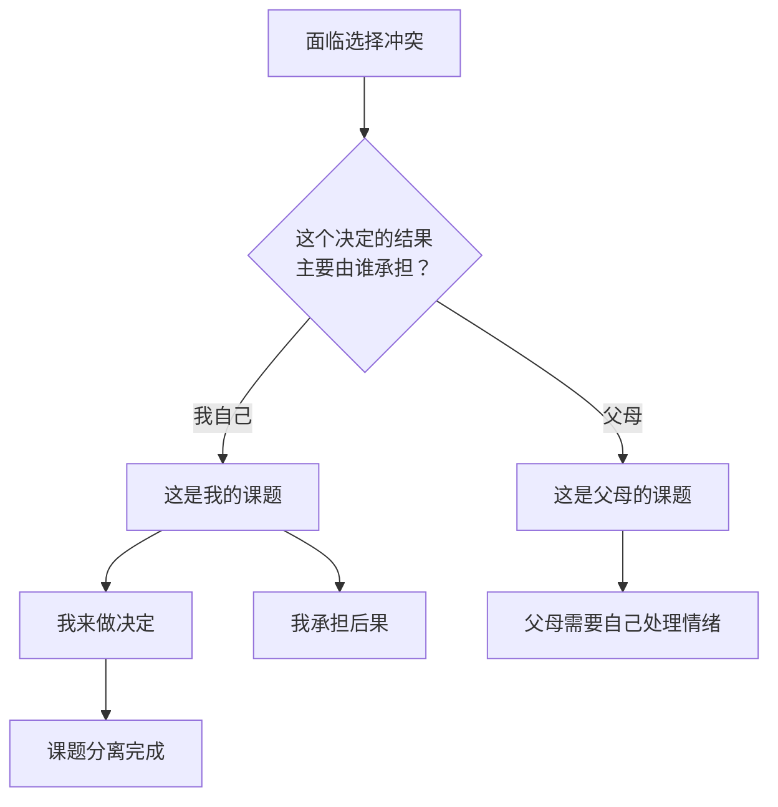

# 第09课：课题分离：应对父母期待

## 核心困境：父母的期待与自我的冲突

在升学、工作、婚姻等重大人生选择上，父母的意志常常是影响我们决策的一个巨大因素。他们希望你考公务员，希望你回到身边，希望你早点结婚生子——并且常常以要求甚至强迫的形式表达出来。

我们爱父母，也希望他们开心，但问题在于：**当父母的期待与自己的意愿发生冲突时，该如何平衡？**

> [!WARNING] 爱的捆绑
> "我这辈子就是为了你活的"、"我做的一切都是为了让你幸福"——这类表达带有隐秘的期待成分，目的是让自己有权利干涉甚至决定孩子的人生课题。这不是否定父母的爱，而是承认这种爱中包含着复杂的控制成分。

## 课题分离：这是谁的课题？

《被讨厌的勇气》一书中提出了一个关键概念——**人生课题**。简单来说，就是弄清楚"这个事到底是谁的事"。

### 如何区分课题？

只需一个标准：**某种选择所带来的结果，最终要由谁来承担？**

- 我的作业是我的课题，批改作业是老师的课题
- 我选择什么专业、什么工作、与谁在一起——最终承担后果的是我，所以这是我的课题
- 父母因为我违背他们的期待而感到失望——这种情绪是父母的课题，不是我的课题

### 课题分离不是冷血

这里需要澄清一个重要的误解：课题分离并不意味着完全不管父母的感受。**这世界并不存在彻底解决问题的可能性**，人只能在复杂的形式中尽力寻找到某种微妙的平衡。

当某个决定对你的影响程度远远多于你的父母时，这个课题更多是需要你来负责。你可以说："这是我的课题，我拥有它的决定权。由此带来的失落乃至失望，是属于我父母的课题——虽然我也不想，但也只好这样。"

这就是世界和人间的法则。

## 如何赢得话语权

课题分离的理念很重要，但光有理念还不够。冷冷给出的建议是：

### 1. 态度在先——让父母看到你的决心

首先让父母看到你**决意独立处理人生课题的态度**。这需要你坚定地表达自己的立场，而不是在冲突面前退缩。

### 2. 行动在后——用结果证明自己

更为重要的是，**通过自己的行动让父母意识到你可以处理好自己的课题**。当你的决定不断带来好的结果，父母会给予越来越多的自由，你会拥有越来越多的话语权。

> [!TIP] 关键策略
> 冷冷分享了自己的经验：她的意愿也不是刚好都走在父母期待的轨迹上，而是随着她从小到大所做的一切决定都有了不错的结果，父母才给予了越来越多的自由和信任。这是一个良性循环：**态度在先，行动在后，渐入佳境。**

## 课题分离的广泛运用

课题分离的思维不仅仅适用于与父母的关系，还可以应用到生活的方方面面：

- **考研场景**：别人复习得怎么样、你能不能考上，都不是你要考虑的课题。你的课题只有：学该学的，做该做的，在能努力的地方都尽量努力
- **拒绝别人**：不敢拒绝是因为你试图承担别人的课题。每个人在这世上都要经受困难，那是属于他们的痛苦，不应该由你来负责
- **亲密关系**：把自己作为重要的课题——有自己的人生方向、兴趣爱好，内心和生活都充实。把他人作为课题的重心会导致追逐，把自己作为课题的重心才能更好地对待他人

> [!QUESTION] 思考题
> 在你目前的生活中，有哪些事情是你在替别人承担课题（比如过度在意别人的情绪，或试图解决本不属于你的问题）？如果从现在开始你只负责自己的课题，你会做出哪些改变？

参考思路

1. 回想最近一次你因为担心让别人失望而妥协的场景——那是谁的课题？
2. 区分"关心他人"和"替他人负责"的边界：你可以关心父母的感受，但不意味着你要为他们的感受负责
3. 实践课题分离的关键一步是：**允许别人失望**。那不是你的错，那是他们需要处理的情绪

## 总结

父母对子女有很多期待，有些与我们的主观意愿冲突。要改善这种困境，关键在于做好**课题分离**：弄清楚哪些选择的结果最终由自己承担，那就勇敢地为自己做决定。父母的失望情绪是他们自己的课题。同时，用行动证明自己能够处理好人生课题，才能逐渐赢得更多的话语权。

**接纳自己，经营关系，正确努力，实现改变。**

---

**相关课程：** [[0010-bai-tuo-tao-hao-xing-ren-ge|第10课：摆脱讨好型人格]] 进一步学习如何建立健康的边界