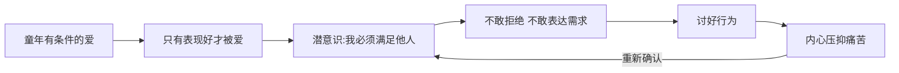

# 第10课：摆脱讨好型人格

## 什么是讨好型人格？

朋友向你提出需求，你就是无法说出"不"，即使这会给你带来很大的困扰。你首先想到的不是"我是不是被冒犯了"，而是"他会不会不高兴"。你很难开口表达自己的需求，怕给别人添麻烦。

> [!WARNING] 讨好型人格的核心特征
> - 对他人需求无底线地满足
> - 对自己需求无止境地让步
> - 害怕冲突，遇事第一反应是息事宁人
> - 社交中的行为本质上是"表现"而非"表达"

**表达**是对自己各方面特质进行自然而然、不卑不亢的展示。**表现**则是习惯于在任何时候做出讨好的姿态，目的是取悦、迎合、急于被认可。

## 讨好型人格的根源

为什么你会认为**别人的感受比你的感受更重要**？

归根结底，这一切看似不合逻辑的行为，是为了安抚那个**在童年时期得到的是"有条件的爱"的孩子**。研究表明，我们年幼时别人对待我们的方式，与我们对自己的认识之间有着密切的联系。如果你只有表现好、只有听话、只有按别人的想法去做，才会得到爱——这会成为你的思维定势，让你在人际关系中以"主动付出、不提要求"的思路来维系感情。

## 如何改变讨好型人格？

### 第一步：打破"全能掌控者"的自恋

以不拒绝别人、不表达自己为手段来维系关系，实际上是一种**自恋**——你把自己当做全知全能的掌控者，试图以一己之力照顾到方方面面的心情。但冲突必然存在，而你不是全能的掌控者。

> [!TIP] 核心认知转变
> 你有权利让别人失望，有权利不对其他绝大部分人负责。如果有人觉得失望，那是他们要处理的情绪，**不是你的责任**。你无需对别人的情绪负责——这正是上一课所说的课题分离。

### 第二步：从小事开始练习说"不"

《可爱的诅咒》一书中建议：在说"不"之后，把事态后续的进展和自己的感受都记录下来。你会发现，你从前所担忧的后果事实上**基本不会发生**。别人的感情没那么容易被伤害，你们的关系没那么轻易被破坏。

### 第三步：学会生气

如果你对一个人总是无底线地包容，你的好永远都在那里，那对方就很难认真对待你。**学会生气，并且让对方知道**，可以逐渐明确你们相处的规则，是经营健康关系的重要手段。

### 第四步：勇敢表达需求

和学会拒绝一样，把自己曝光在所恐惧的场景之中，循序渐进：

1. 不要放弃任何表达正常需求的机会
2. 表达需求时，话要少，要简洁有力
3. 即使心里害怕，也要在语气上不卑不亢
4. 需求表达完就立刻停止，不要画蛇添足

> [!EXAMPLE] 练习计划
> **第一周**：每天找一件小事练习说"不"（比如拒绝一个不想要的邀约）
> **第二周**：每周至少一次明确表达自己的需求（比如点菜时说出真实喜好）
> **第三周**：当感到被冒犯时，尝试表达不满（比如"你这样说让我不太舒服"）
> 每次练习后记录感受，观察实际结果是否如你所担心的那样糟糕。

## 为什么一定要改变讨好型人格？

明明是老好人，习惯主动付出牺牲自己，却常常无法得到尊重、无法被珍惜？

原因在于：**别人如何定义你的价值和高度，很大程度上取决于你对自己的态度**。如果你自己都看不到自己的价值，习惯于把自己放低，那没有人会正视你的价值。你所秉持的对自己的认可度，基本上就是别人对待你所遵循的最高标准。

> [!QUESTION] 思考题
> 回想最近一次你因为怕别人不高兴而委屈自己的场景。如果当时你选择了尊重自己的感受，最坏的结果会是什么？这个结果真的无法承受吗？

反思提示

- 讨好行为的背后是一种恐惧：害怕不被喜欢、不被爱、被抛弃
- 但事实是：**被爱的根源是你自身的价值，而不是你的讨好或迎合**
- 想被别人如何对待，就先如何对待自己；想被人爱，先爱自己
- 每一次说"不"，都是在告诉自己和他人：我的感受同样重要

## 总结

讨好型人格的根源在于童年有条件的爱，让人形成了"只有满足别人才能被爱"的思维定势。改变需要三个阶段：认识问题（你不需要为别人的情绪负责）、行为实验（从小事开始拒绝和表达需求）、认知重建（你的价值不取决于讨好）。想被人爱，先爱自己。

**接纳自己，经营关系，正确努力，实现改变。**

---

**相关课程：** [[0011-xue-hui-suo-qu-yu-ma-fan-bie-ren|第11课：学会索取与麻烦别人]] 进一步学习平衡的付出与索取 | [[0012-bu-yao-ju-xian-yu-fan-xing|第12课：不要局限于反省]] 停止过度自我反省