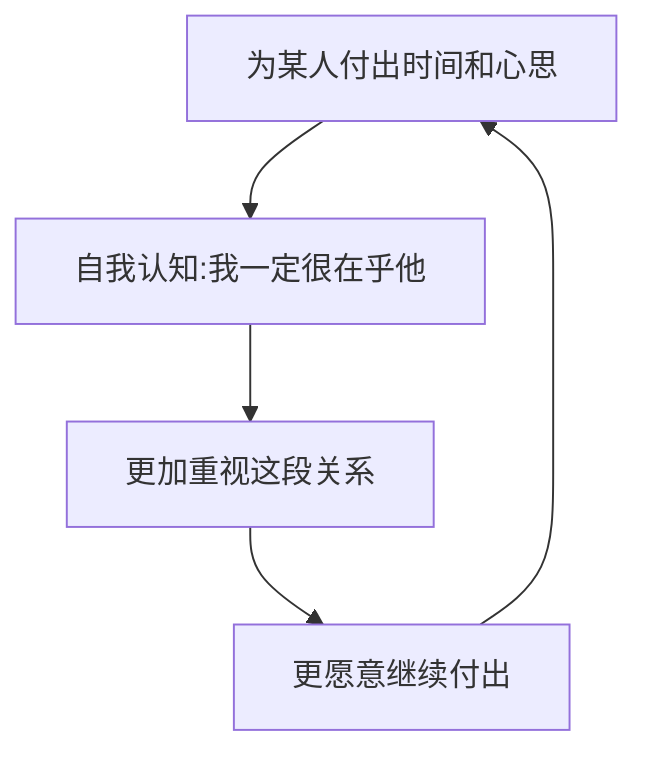

# 第11课：学会索取与麻烦别人

## 核心悖论：独立与连接的平衡

从小到大，我们接受的教育推崇独立——"能自己做的事情就不要麻烦别人"。独立当然好，但冷冷提出了一个反思：**独立了这么多年，把自己封闭在自行解决问题的系统中，实际上切断了很多与他人建立深刻连接的机会。**

### 为什么麻烦别人反而能增进关系？

托尔斯泰有一句话揭示了人际关系的深层规律：**"我们并不因为别人对我们的好而爱他们，而是因为自己对他们的好而爱他们。"**

> [!WARNING] 颠覆常识的真相
> 你以为不麻烦别人是美德，但事实是：**不愿意麻烦别人，反而失去了很多与他人拉近关系、增进感情的机会。**

## 理论支撑：自我知觉理论

心理学上的**自我知觉理论**告诉我们：我们的观念往往是建立在行为基础之上的——我们怎么做，我们就会怎么认为。

哈佛幸福课的Tal举了一个例子：他的好朋友在儿子刚出生时并没有感觉到对他的爱，甚至为此感到愧疚。但从他开始照顾儿子——喂奶、散步、洗澡——他对儿子的爱就逐渐被培养出来了。**照顾的行为让他据此认为："我一定很爱这孩子。"**

> [!TIP] 核心原理
> 你对一个人、一件事付出的时间、心思和情感，**决定了这个人、这件事对你的意义**。

### 小王子的玫瑰

《小王子》中有这样一段话：正因为你为你的玫瑰花费了时间，这才使你的玫瑰变得如此重要。**"他单独一朵，就比你们全体更重要，因为他是我浇灌的，因为他是我的玫瑰。"**

**给予会让你更爱一个人。给予和爱是一对相互促进、互为因果的事物。**

## 让被需要成为一种爱的表达

冷冷分享了一个关于母亲寄东西的故事：她妈妈喜欢从家里给她寄吃的穿的，她总说"不用不用"。后来有朋友告诉她：让父母开心的方式是，过一阵就跟爸妈说"我想吃你们寄一点"。父母一边嫌弃地唠叨着，一边高高兴兴地赶紧寄。

> [!EXAMPLE] 生活中的应用
> 让家人、朋友、恋人感觉到自己**是被需要的**，能够给予和付出，是我们表达爱的另一种正确且不可或缺的方式。**我们给予他人很重要，但学会让他人给予我们可能更重要。**

## 过度付出的陷阱：为什么好人得不到珍惜？

"对人特别好、不计较付出"看似高尚，但实际效果往往适得其反。

### 免费的东西没人珍惜

有两件价值相当的衣服，一件是赠品，一件是花钱买的。你对待前者的态度一定不如后者珍惜。人际关系也是如此：**你对别人过多的主动付出，降低了别人得到你的好的门槛，你在别人眼里的价值也会随之降低。**

> [!WARNING] 过度付出的代价
> 无原则的、过多的、不求任何回报的主动付出，**不是美德**。你的本意是与对方建立更友好、对等的关系，却做了南辕北辙的事情。

### 适时适度的索取才是美德

在他人心中的重要程度，除了你自身的价值之外，还取决于**他人为你付出的时间和心思**。索取是指勇于表达合理需求，而不是一味索取。你勇于索取，说明你认为自己是值得被付出的——你自己认同的事情，别人才更可能认同。

## 实践建议

1. **从小事开始"麻烦"别人**：借一本书、请对方推荐一个电影、请教一个小问题
2. **让亲友有机会为你付出**：接受他们的好意，表达真诚的感谢
3. **平衡付出与索取**：一段健康的关系，双方的付出应该是大致对等的
4. **为自己的付出设定边界**：不要过度付出到让对方觉得你的好是廉价的

> [!QUESTION] 思考题
> 你是否习惯于只付出不索取？尝试本周内主动"麻烦"一位朋友帮你做一件小事，观察对方的反应和你的感受。发生了什么？你从中学到了什么？

观察提示

- 注意对方被"麻烦"时的反应——很多人其实很乐意被需要
- 感受你自己开口求助时的不适感——那是旧思维模式的惯性
- 事后感谢对方，并观察你们的关系是否有微妙的变化
- 记住：**人与人之间的交情是麻烦出来的**——适度地麻烦别人，是增进感情的催化剂

## 总结

不愿意麻烦别人会切断与他人建立深刻连接的机会。给予让你更爱一个人，也让对方更重视你。但过度付出会降低你在他人心中的价值。学会平衡：既不过度付出，也不拒绝索取。让彼此都有机会为对方付出，关系才能健康持久。

**接纳自己，经营关系，正确努力，实现改变。**

---

**相关课程：** [[0012-bu-yao-ju-xian-yu-fan-xing|第12课：不要局限于反省]] 从另一个角度理解合理的人际边界