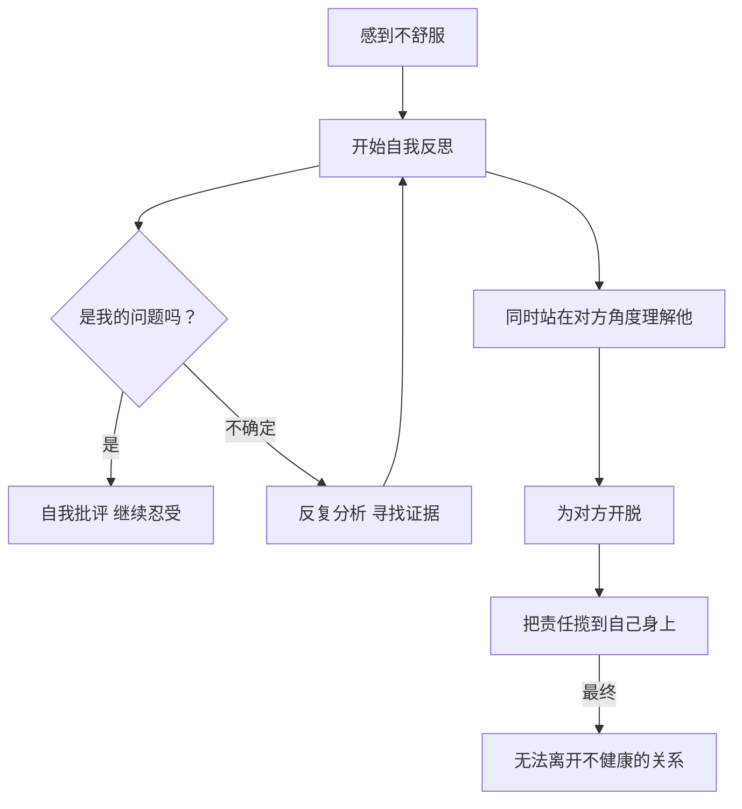
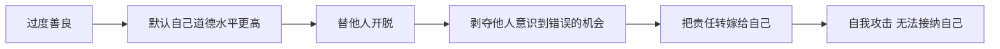

# 第12课：不要局限于反省和理解他人

## 两种过度反省的表现

### 表现一：急于向别人解释

如果你性格敏感多思，与人交际时的一个常见表现就是**喜欢解释**——对自己做出的决定、经历，主动进行详细或简略的解释，心里急切地想：你可别误会我哦，其实我不是这样的人哦。

但事实是：**绝大多数你需要描述来龙去脉的事件，都是你自己的事情，你根本不需要向别人解释。** 每一次你用不够确定的语气向他人解释，都是在潜意识中寻求对方的理解和认可。

> [!WARNING] 过度解释的代价
> 当你开口解释的时候，你把某种权利交到了对方手中，把自己放到了一个被动的位置。你失去了坚定，失去了底气。那些气场笃定的人，基本上不过多解释自己。

### 表现二：执着于向自己解释

在跟别人相处时，如果觉得不舒服、没被真诚对待，你一定要找到充足的证据证明确实是对方的问题，才敢做出远离或绝交的决定。你反复分析，确保自己在道德上是基本完美的，确定自己没错，才可以离开。

你要求自己做那个**"完美受害者"**。

## 相信你的感受

> [!TIP] 关键真理
> 你自己的感受最重要。学会相信和尊重你的感受，这就是和别人相处中所应秉持的**最大标准**。如果你觉得被冒犯了、不开心、不舒服，那就是被冒犯了。

不要总是站在对方的立场为他开脱。你家人可以告诉你一句话：**"你不要总是试图理解对方，觉得他是因为什么理由不得不这样做。如果事情的结果是我们不能接受的，我们就是可以不原谅他。"**

一个人不可能方方面面都是不好的。你所感到的些许好肯定是存在的，但某些情形中，人际关系遵循**短板理论**——最短的那块板，在付出一定努力之后你还是接受不了，你就可以离开。

## 过度善良是一种傲慢

喜欢反省自己的人，必然会习惯理解别人。即使知道对方身上存在很多问题，也总是站在对方的角度为他找到原因、为他开脱。

但电影《狗镇》给了我们一个警醒：

> [!QUESTION] 尼可的傲慢
> 电影结尾，尼可要原谅镇子上所有伤害她的人。她的父亲说：**"你傲慢，就因为我原谅他们？"** 父亲的回答是：你说这话的时候多么不可一世——你有成见觉得没有人可以取得像你一样高的道德水平。你为他们脱罪，我想象不出比这再傲慢的了。

**以善良的名义去试图理解和原谅他人，是默认自己拥有高于别人的道德水平。** 每个人都为自己犯下的错付出代价的权利，而你用你的傲慢剥夺了他们意识到自己错误并进行改正的可能性。

## 如何改变？

### 1. 减少不必要的解释

下一次在与陌生人或朋友交流时，在你有些急切地说明细节之前，问自己：**我是不是在解释这件事？我需要向别人解释吗？**

认清有些事情你只需要对自己负责，不需要得到他人的认可。这是变得自信强大的重要一步。

### 2. 相信自己的感受

你是自己人际关系的唯一法官。如果你觉得不舒服，那就不舒服。不需要找到完美证据才能做出决定。**你有不理解、不原谅的权利。**

### 3. 对自己公平

你用来要求自己的标准，也应该一视同仁地用于他人身上。不要对自己苛责、对他人宽容到不公平的地步。

> [!EXAMPLE] 实践练习
> **本周挑战：**
> 1. 觉察自己每天做了多少次"不必要的解释"，试着减少一半
> 2. 当感到不舒服时，先问"我的感受是什么"而不是"我是不是想多了"
> 3. 允许自己不理解、不原谅某个人——注意，这不代表你是个坏人

关于"过度善良"的深层反思

你可能一直以"善于理解他人"为傲，但这背后隐藏着一种隐秘的道德优越感。你通过不断为他人开脱来维持自己"好人"的自我形象。打破这个模式的关键在于：

1. **公平原则**：用要求自己的标准去要求别人
2. **感受优先**：你的不舒服本身就是足够的理由
3. **离开的权利**：你不必等到成为"完美受害者"才能离开一段关系

## 总结

过度解释会将主动权交到别人手中，让自己失去底气。过度自我反省让你在人际关系中无法做出果断决定。过度善良本质上是一种道德傲慢——你需要用的标准也应该一视同仁于他人。学会相信自己的感受，你有不理解和不原谅的权利。

**接纳自己，经营关系，正确努力，实现改变。**

---

**相关课程：** [[0010-bai-tuo-tao-hao-xing-ren-ge|第10课：摆脱讨好型人格]] 进一步学习建立边界感