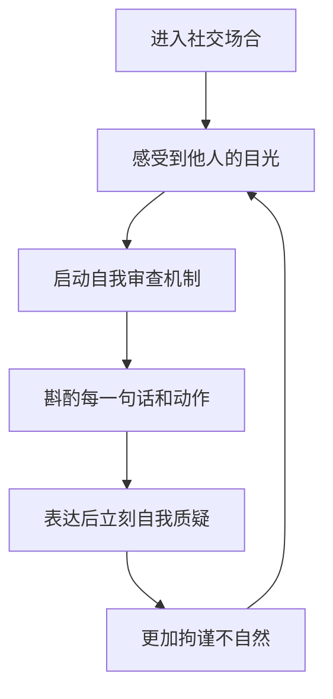
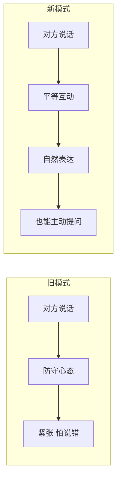

# 第13课：克服社交拘谨

## 社交拘谨的本质

当你在公共场合中，四面八方飘来一些目光在你身上停留片刻时，你会不会不自在？甚至不知道该如何走路、眼神该放在哪里？

你恐惧的并不仅仅是"被看"，关键是与被看捆绑在一起的——**他人在审视你，他在评价你**。于是你变得僵硬，肢体动作畏缩扭捏。

> [!WARNING] 社交拘谨的核心问题
> 你的问题不是缺乏社交技能——当你在熟人面前、或不在乎对方怎么想的场合中，你表现得十分自然。真正的问题是：**对于被看、被审视、被评价的恐惧。**

## 自我审查机制

如果你见过那种落落大方的人，你会发现他们的共同点是——没有太多"自我审查"。冷冷的朋友张女士在长辈面前天真烂漫地讲话，甚至有些不得体的话也不以为意。因为她的成长环境包容开放，没有太多死板规矩束缚，所以她也没有长出相应的自我审查机制。

而你呢？任何情景之下，都要对自己的言语、表情、行为斟酌再三，才敢有选择、有节制地表达。表达完之后又立刻生出对自己的质疑和否定。这就是——**自我审查机制过强**。

而那些发于自然、不加太多修饰和隐藏的样子，实际上更吸引人。因为他们自在磊落，即使有瑕疵——比如笑得崩坏、说话没有太经过大脑——但非常真实鲜活可爱。

## 白熊效应

越是提醒自己"别紧张、要放松自信一点"，越是做不到。这就是**白熊效应**——越是告诉自己不去想白熊，越是会不停地想到白熊。

所以，直接告诉自己"减少自我审查"是行不通的。

## 解决方案：把目光投向外界

解决问题的关键不在于盯着自己试图改正，而在于：

> [!TIP] 核心方法
> **你不仅仅是在被看，你也在看别人。** 你不是作为孤立的个体在被群体看，而是你作为个体，也拥有看别的个体的权利。这是一种平等的、相互看、相互审视的关系。

你从前的习惯是**主动放弃了去看他人、评价他人的权利**，把目光和注意力全都投向了自己。和别人在一起时，你注视的是自己的一言一行，心里还在给出评价——这当然会让你恐惧。

现在你要做的是：**把目光投向外界，把注意力转向你与之互动的那个人。**

- 去看看这广场上有多少人，他们在做什么
- 去观察他们有怎样的表情和动作
- 当你去看别人的时候，你就不会老想着如何看自己了
- 你就会自然而然地变得落落大方

> [!EXAMPLE] 日常练习
> **在公共场合（餐厅、咖啡馆、教室）：**
> - 有意识地观察周围的人——他们的穿着、表情、动作
> - 注意环境中的细节——墙上的装饰、窗外的景色
> - 当你把注意力投向外界，对自己的过分关注就会自然减弱
>
> **在与人聊天时：**
> - 把精力放在对方身上——他在说什么？他的表情是怎样的？
> - 你不是在防守，而是在进行一场有来有往的互动
> - 你也可以进攻——提出你的问题，表达你的看法

## 聊天时的紧张

在与人聊天时紧张，是因为你在潜意识里把聊天当成了一场**防守战**。你觉得对方说的每句话都是在向你发问，你需要完美接住。你预先把自己放在了一个需要完美应对的位置上，非常被动。

但其实，**聊天不是一场考试，你不是在被考核。** 这是一场有来有往的平衡互动。你也可以进攻——提出你的问题，去了解你想知道的信息，表达自己的看法。当你这样做时，你就会自然很多。

> [!QUESTION] 思考题
> 回想一个你感到社交拘谨的场景。如果用"我也在看别人"的视角重新看待那个场景，你的感受会有什么不同？下一次你可以具体做什么来把注意力转向外界？

实践指南

1. **场景识别**：注意自己在哪些场合最容易拘谨（人多的聚会、与权威人物交谈等）
2. **提前准备**：进入场景前提醒自己"我也在看他们"
3. **练习观察**：刻意将注意力放在对方的衣着、表情、说话内容上
4. **主动提问**：准备2-3个开放式问题，在冷场时抛出
5. **接纳不完美**：即使说错话也没什么大不了——那些发于自然的小瑕疵反而更可爱

## 总结

社交拘谨的本质是对被审视的恐惧，源于过强的自我审查机制。改善的关键不是告诉自己"别紧张"，而是把注意力从自身转向外界——你不仅仅在被看，你也在看别人。聊天不是防守，而是有来有往的互动。把目光投向外界，你自然会变得落落大方。

**接纳自己，经营关系，正确努力，实现改变。**

---

**相关课程：** [[0014-ren-ji-xi-yin-de-ji-ben-yuan-ze|第14课：人际吸引的基本原则]] 进一步学习如何与人建立连接